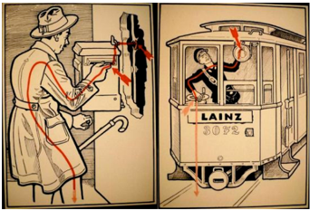
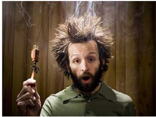

# 1.1 Factores eléctricos sobre las personas

Tags: #eli214
SECCIÓN 1.1

## Factores eléctricos sobre las personas

Como factores eléctricos se entenderá tanto a las diversas variables eléctricas presentes en la red, como a los efectos que éstas producen en las personas al estar expuestas de forma 'accidental' directa o indirecta.

De forma relevante se tiene a la 'Intensidad de corriente' como la variable principal que incide en las lesiones durante un accidente eléctrico. Las consecuencias del paso de la corriente por el cuerpo pueden ocasionar desde lesiones físicas secundarias (golpes, caídas, etc.), hasta la muerte por fibrilación ventricular.

Una persona se electriza cuando la corriente eléctrica circula por su cuerpo, haciéndose parte del circuito eléctrico.

La electrocución se produce cuando dicha persona fallece debido al paso de la corriente por su cuerpo, ya sea por fibrilación ventricular , tetanización y/o asfixia .

En otros casos donde no se ha producido muerte, pero la intensidad de corriente ha sido elevada se pueden producir quemaduras , que si se dan con profundidad pueden llegar a ser mortales si afecta a un órgano o derivar en amputación si llegó a carbonizar una parte no vital del cuerpo.

Por ello, a continuación se describen algunos conceptos que caracterizan a la reacción humana al paso por el cuerpo de una cierta intensidad de corriente.

