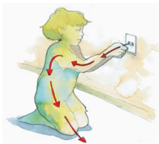

# 1.1.1 Umbral de percepción

Tags: #eli214
## 1.1.1. Umbral de percepción

Es el valor mínimo de intensidad de corriente que provoca en una persona una sensación , ya sea como un 'cosquilleo' , 'hormigueo' , 'picadura' , entre otras.

Cuando la intensidad de corriente es del tipo alterna , la sensación por el cuerpo se percibe durante todo el tiempo de exposición. Por otro lado, cuando la intensidad de corriente es continua , el cuerpo solamente percibe una sensación cuando hay variaciones en la intensidad, típicamente ya sea en el instante de aplicación o conexión, como en el instante de interrupción o desconexión. Pese que en continua no se siente el paso de la corriente, existe un importante efecto térmico indeseado , que se puede entender con facilidad al modelar a un ser humano como una resistencia considerando el efecto Joule ( I^2*R ).

La Norma IEC479-1 1994 considera como umbral de percepción a 0 , 5mA rms en corriente alterna y a 2 , 0mA en corriente continua, independiente del el tiempo de exposición.

