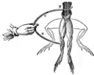
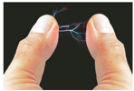

Tags: #eli214

Es el valor mínimo de la intensidad corriente que provoca en una persona una contracción muscular.

Los experimentos de Luigi Galvani (1737-1798) mostraron la relación existente entre la electricidad y el músculo de un ser animal vivo o que alguna vez lo estuvo, permitiendo concebir de forma general a nuestro sistema nervioso como un enorme dispositivo eléctrico que actúa en este caso sobre un sistema bio-mecánico . Principalmente se demuestra que el estado base de un cuerpo animal es uno relajado y ante una excitación por medio de estímulos electroquímicos ya sean internos (voluntad) o externos, se pasa a un estado de contracción .

