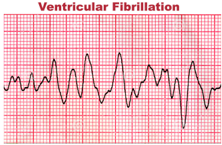
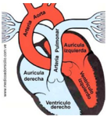
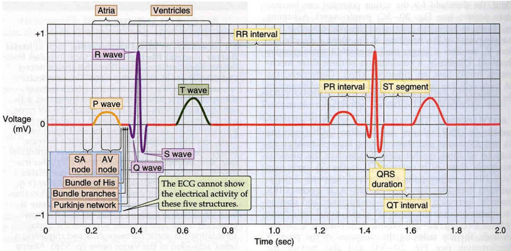

# 1.1.4 Umbral de fibrilación ventricular

Tags: #eli214
## 1.1.4. Umbral de fibrilación ventricular

Es el valor mínimo de la intensidad de corriente que lleva a un trastorno del ritmo cardíaco a un ritmo ventricular rápido, irregular, de morfología caótica, que lleva irremediablemente a la pérdida total de la contracción cardíaca, lo cual se traduce en una falta total del bombeo sanguíneo y posibilidad de muerte si esta situación perdura.

La fibrilación ventricular está considerada como la causa principal de muerte ante una descarga eléctrica. Aproximadamente un ciclo cardíaco dura 400ms , lo cual pone de manifiesto que habrá mayor peligro si la corriente se aplica por más de un ciclo cardíaco. Por tanto en un sistema de 50Hz , 20 ciclos eléctricos correspondería a 1 cardíaco.

Una protección diferencial estándar, ante una corriente de falla de 1p . u . (valor nominal) opera aproximadamente a 300ms y ante una corriente de 5p . u . opera aproximadamente a 40ms .

'Opera' significa que el dispositivo trabaja bien y abre eléctricamente el circuito para proteger a una persona.

Al modelar nuevamente a una persona como una resistencia eléctrica , se puede entender que habrán mayores intensidades de corriente por el cuerpo si: el camino entre electrodos es de corta longitud y el área transversal mayor. Esto se torna más peligroso aún si la corriente pasa de forma directa por el corazón o algún otro órgano vital.

De este modo no será lo mismo, ni el mismo riesgo, si una persona recibe una descarga eléctrica en una mano cerrando el circuito por los pies ( descarga longitudinal ), que si la descarga fuese entre ambas manos o entre una mano y el pecho ( descarga transversal ).

Figura 1.1: Ciclo cardíaco

