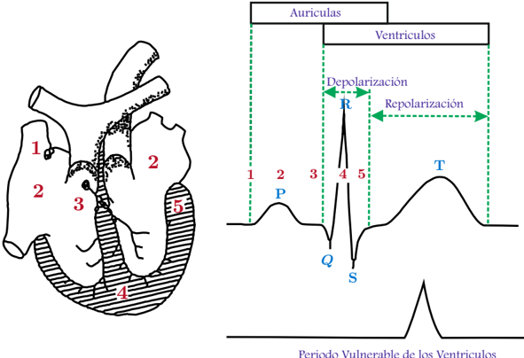

# 1.1.5 Período vulnerable

Tags: #eli214
## 1.1.5. Período vulnerable

Es el período en el cual el ciclo ventricular es más susceptible o vulnerable a se ser afectado por acción de la corriente eléctrica, siendo a penas entre el 10 -20 % del ciclo cardíaco, durante el cual las fibras del corazón están en estado no homogéneo de excitabilidad.

Periodo Vulnerable de los Ventriculos

Figura 1.2: Ciclo cardíaco y periodo vulnerable

