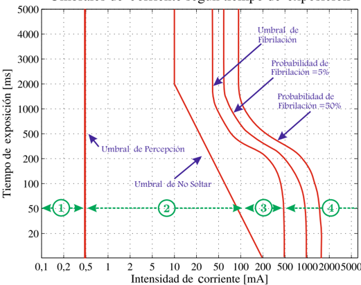
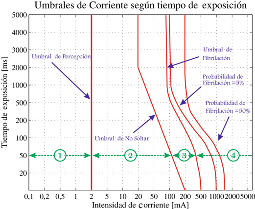

# 1.1.6 Curvas inversas

Tags: #eli214
## 1.1.6. Curvas inversas

Las presentes curvas presentan la relación inversa entre la intensidad de corriente que el cuerpo es capaz de soportar versus el tiempo de exposición para algunos de los fenómenos fisiológicos antes nombrados y valores límites. La palabra 'inversa' refleja que si el nivel de la intensidad de corriente que fluye por una persona 'aumenta' , el tiempo debe 'disminuir' para no sufrir o experimentar un cierto daño.

Figura 1.3: Intensidad de corriente alterna en valor efectivo ( 40 -100Hz ) versus tiempo

Figura 1.4: Intensidad de corriente continua versus tiempo

Si se estudian los efectos de la tensión eléctrica se aprecia que la principal consecuencia es establecer una corriente en función de la impedancia/resistencia del cuerpo humano, que tiene un comportamiento no lineal y dependiente de una serie de factores. Así si la impedancia es demasiado baja, la intensidad de corriente será elevada y de riesgo vital si no se actúa con la suficiente velocidad.

Las tensiones de seguridad aceptadas a modo de consenso son: 24V para emplazamientos húmedos y 50V para emplazamientos secos.

SECCIÓN 1.2

## Efectos de una descarga eléctrica sobre las personas

Los principales efectos de la intensidad de corriente por el cuerpo, sujeto tanto a su nivel como al tiempo de exposición por las reacciones térmicas y químicas del organismo, se detallan a continuación.

## 1.1.6. Curvas inversas

Las presentes curvas presentan la relación inversa entre la intensidad de corriente que el cuerpo es capaz de soportar versus el tiempo de exposición para algunos de los fenómenos fisiológicos antes nombrados y valores límites. La palabra 'inversa' refleja que si el nivel de la intensidad de corriente que fluye por una persona 'aumenta' , el tiempo debe 'disminuir' para no sufrir o experimentar un cierto daño.

Figura 1.3: Intensidad de corriente alterna en valor efectivo ( 40 -100Hz ) versus tiempo

Figura 1.4: Intensidad de corriente continua versus tiempo

Si se estudian los efectos de la tensión eléctrica se aprecia que la principal consecuencia es establecer una corriente en función de la impedancia/resistencia del cuerpo humano, que tiene un comportamiento no lineal y dependiente de una serie de factores. Así si la impedancia es demasiado baja, la intensidad de corriente será elevada y de riesgo vital si no se actúa con la suficiente velocidad.

Las tensiones de seguridad aceptadas a modo de consenso son: 24V para emplazamientos húmedos y 50V para emplazamientos secos.

