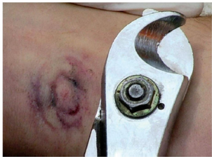

Originada por el efecto químico de la corriente en el cuerpo, dado que ésta traslada iones ácidos hacia el punto que actúa como polo positivo de potencial, dando lugar a una escara seca, negruzca, deprimida, de forma similar al punto de contacto eléctrico que la persona tocó.

