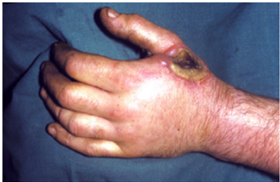
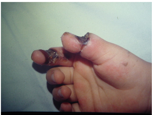
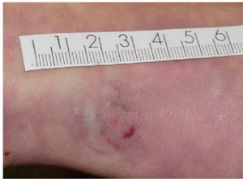
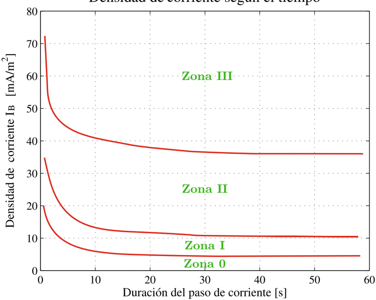
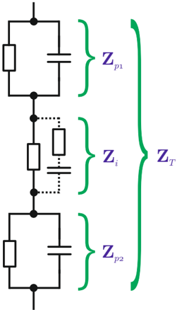
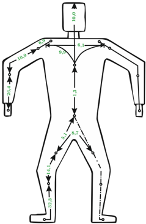
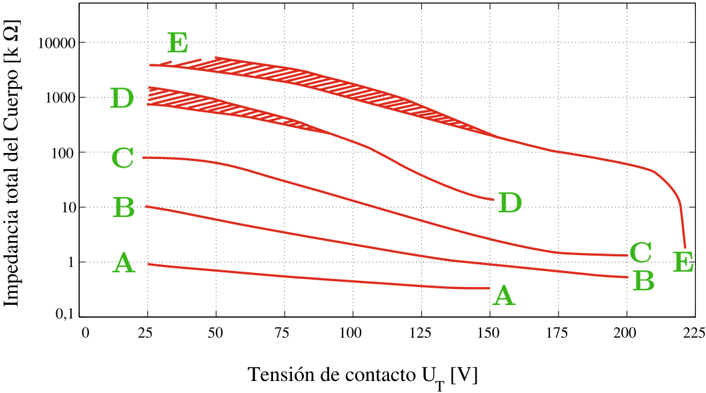
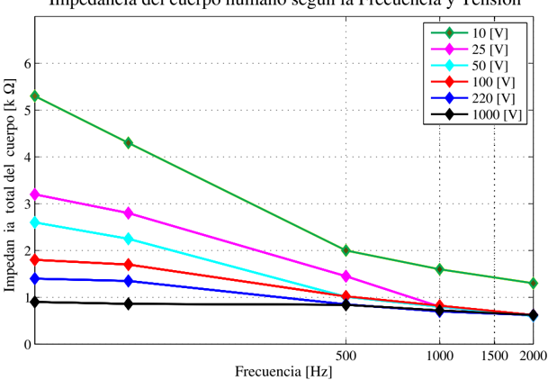
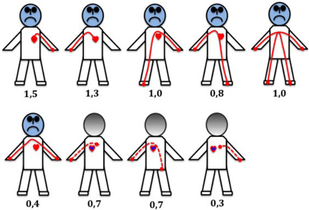

# 1.2.2 Quemadura eléctrica

Tags: #eli214
## 1.2.2. Quemadura eléctrica

La quemadura se produce por la acción de diferencias de potencial por sobre 100V , donde por los niveles de corriente, se eleva la temperatura quemando localmente al cuerpo e incluso produciendo carbonización. Una quemadura interna claramente es de mayor complejidad que una superficial, ya que compromete órganos, pudiendo producir desde hemorragias severas hasta necrosis de tejidos.

Estudios sobre las alteraciones de la piel humana en función de la densidad de corriente que circula por un área determinada ( mA / mm 2 ) versus el tiempo de exposición a esa corriente, han manifestado 4 zonas características, que se aprecian a continuación.

Figura 1.5: Zonas de alteraciones en la piel por densidad de corriente versus tiempo de exposición

- Zona 0: habitualmente no hay alteración de la piel, salvo que el tiempo de exposición sea de varios segundos, en cuyo caso, la piel en contacto con el electrodo puede tomar un color grisáceo con superficie rugosa.
- Zona I: se produce un enrojecimiento de la piel con una hinchazón en los bordes donde estaba situado el electrodo.
- Zona II: se provoca una coloración parda de la piel que estaba situada bajo el electrodo. Si la duración es de varias decenas de segundos se produce una clara hinchazón alrededor del electrodo.

Zona III: se puede provocar una carbonización de la piel.

Con intensidades de corriente elevada e importantes superficies de contacto, se puede llegar a la fibrilación ventricular sin alteraciones en la piel.

SECCIÓN 1.3

## Impedancia del cuerpo humano

Si bien es relativamente sencillo imaginar los caminos por los que se circula una corriente por el cuerpo humano y concebir al cuerpo como una resistencia o una impedancia, es complejo el poder definir con exactitud un valor específico, dado que hay dependencia de una serie de variables dentro de las cuales se pueden ejemplificar:

| * Diferencia de potencial eléctrico.   | * Temperatura ambiente.   | * Superficie de contacto. * Presión de contacto.   |
|----------------------------------------|---------------------------|----------------------------------------------------|
| * Frecuencia.                          | * Temperatura corporal.   | * Pureza de la                                     |
| * Tiempo de exposición.                | * Humedad de la piel.     | epidermis.                                         |

Las diferentes partes del cuerpo humano tales como la piel, los músculos, la sangre; presentan para la corriente eléctrica comportamiento resistivo y capacitivo. Para lo cual, durante el paso de la electricidad, la impedancia equivalente de nuestro cuerpo ( Z T ) se puede resumir aproximadamente a la suma de tres impedancias en serie, de valores no triviales de determinar y normalmente casi innecesario:

Figura 1.6: Esquema eléctrico de la impedancia del cuerpo (UNE-20572-1:1997)

La impedancia de la piel varía incluso en un mismo individuo dependiendo de factores externos, con distintos valores para tensiones menores a 50V ca . A partir de ese nivel de tensión, se tiene estadísticamente que la impedancia de la piel decrece rápidamente, llegando a ser muy baja si la piel está perforada o si se perfora o quema por acción de la corriente.

Por efectos prácticos la impedancia interna del cuerpo puede considerarse esencialmente como resistiva, donde por diferencia relativa de sección, la resistencia de brazos y piernas es mucho mayor que la del tronco.

Otra de las variables fundamentales al caracterizar al cuerpo como una impedancia resistiva es la trayectoria de la corriente, definida esencialmente por el tramo más corto entre los dos electrodos que se presenten. La siguiente figura muestra un comparativo

- 1 Impedancia de la piel en la zona de entrada ( Z p 1 ).
- 2 Impedancia interna del cuerpo ( Z i ).
- 3 Impedancia de la piel en la zona de salida ( Z p 2 ).

de la forma aproximada de como cambia la impedancia interna con la trayectoria de la corriente, dando el 100 % a la circulación mano-pie o mano-mano .

Figura 1.7: Impedancia del cuerpo humano como función de la trayectoria (UNE-20572-1:1997)

Se presenta a continuación la tabla 1.1 para estimar la impedancia del cuerpo humano con trayectoria mano-mano, con piel seca a superficie de contacto de 50 a 100cm 2 para solicitación alterna de frecuencia industrial ( 50 -60Hz ) y la tabla 1.2 para solicitación en continua.

Tabla 1.1: Estimación de la impedancia del cuerpo humano frente a corriente alterna, trayectoria mano-mano, piel seca, superficie de contacto importante

| Tensión de contacto   | Valores de la impedancia [Ω] no sobrepasadas por el x%de la población   | Valores de la impedancia [Ω] no sobrepasadas por el x%de la población   | Valores de la impedancia [Ω] no sobrepasadas por el x%de la población   |
|-----------------------|-------------------------------------------------------------------------|-------------------------------------------------------------------------|-------------------------------------------------------------------------|
| [V]                   | 5%                                                                      | 50%                                                                     | 95%                                                                     |
| 25                    | 1.750                                                                   | 3.250                                                                   | 6.100                                                                   |
| 50                    | 1.450                                                                   | 2.625                                                                   | 4.375                                                                   |
| 75                    | 1.250                                                                   | 2.200                                                                   | 3.500                                                                   |
| 100                   | 1.200                                                                   | 1.875                                                                   | 3.200                                                                   |
| 125                   | 1.125                                                                   | 1.625                                                                   | 2.875                                                                   |
| 220                   | 1.000                                                                   | 1.350                                                                   | 2.125                                                                   |
| 700                   | 750                                                                     | 1.100                                                                   | 1.550                                                                   |
| 1.000                 | 700                                                                     | 1.050                                                                   | 1.500                                                                   |
| Val. asintótico       | 650                                                                     | 750                                                                     | 850                                                                     |

Tabla 1.2: Estimación de la impedancia del cuerpo humano frente a corriente continua, trayectoria mano-mano, piel seca, superficie de contacto importante

| Tensión de contacto   | Valores de la impedancia [Ω] no sobrepasadas por el x%de la población   | Valores de la impedancia [Ω] no sobrepasadas por el x%de la población   | Valores de la impedancia [Ω] no sobrepasadas por el x%de la población   |
|-----------------------|-------------------------------------------------------------------------|-------------------------------------------------------------------------|-------------------------------------------------------------------------|
| [V]                   | 5%                                                                      | 50%                                                                     | 95%                                                                     |
| 25                    | 2.200                                                                   | 3.875                                                                   | 8.800                                                                   |
| 50                    | 1.750                                                                   | 2.990                                                                   | 5.300                                                                   |
| 75                    | 1.510                                                                   | 2.470                                                                   | 4.000                                                                   |
| 100                   | 1.340                                                                   | 2.070                                                                   | 3.400                                                                   |
| 125                   | 1.230                                                                   | 1.750                                                                   | 3.000                                                                   |
| 220                   | 1.000                                                                   | 1.350                                                                   | 2.125                                                                   |
| 700                   | 750                                                                     | 1.100                                                                   | 1.550                                                                   |
| 1.000                 | 700                                                                     | 1.050                                                                   | 1.500                                                                   |
| Val. asintótico       | 650                                                                     | 750                                                                     | 850                                                                     |

En la figura siguiente se muestra el comportamiento de la impedancia del cuerpo en función de la tensión y la superficie de contacto.

Figura 1.8: Impedancia del cuerpo humano como función de la tensión ( 50Hz ) y la superficie

donde:

A: superficie 8 . 000mm 2 .

B: superficie 1 . 000mm 2 .

C: superficie 100mm 2 .

D: superficie 10mm 2

.

E: superficie 1mm 2 .

Finalmente en la figura 1.9, se aprecia una caracterización del valor de la impedancia del cuerpo humano en función de la tensión y la frecuencia.

Figura 1.9: Impedancia del cuerpo humano como función de la tensión y la frecuencia

SECCIÓN 1.4

## Factor de corriente de corazón

El factor de corriente de corazón permite calcular la corriente que pasa por el cuerpo (I B ) , que represente el mismo peligro de fibrilación ventricular que la corriente de referencia (I ref ) caracterizada como aquella que va desde la mano izquierda a los pies, tal que:

$$I _ { B } = \frac { I _ { r e f } } { F }$$

donde los factores F se ilustran e indican a continuación:

Figura 1.10: Impedancia del cuerpo humano como función de la tensión y la frecuencia

Tabla 1.3: Factor F de corriente de corazón para distintas trayectorias de la corriente

| Trayecto de la corriente                     | F   |
|----------------------------------------------|-----|
| Mano Izq. a pie Izq., a pie Der., a dos pies | 1,0 |
| Dos manos a dos pies                         | 1,0 |
| Mano Izq. a mano Der.                        | 0,4 |
| Mano Der. a pie Izq., pie Der., dos pies     | 0,8 |
| Espalda a mano Der.                          | 0,3 |
| Espalda a mano Izq.                          | 0,7 |
| Pecho a mano Der.                            | 1,3 |
| Pecho a mano Izq.                            | 1,5 |
| Glúteos a mano Izq., a mano Der., dos manos  | 0,7 |

Los factores de corriente de corazón menores que uno ( 1 ) son los casos de mayor peligro por dejar más expuesto al corazón.

SECCIÓN 1.5

## Seguridad eléctrica en las instalaciones

La electricidad es bien energético que permite múltiples aplicaciones, pero en su proceso de generación, transporte, distribución y uso final se requieren procedimientos y equipos que garanticen la seguridad de las personas y de otros bienes materiales.

Riesgo: ' Contingencia o proximidad de un daño '.

La primera acción para mitigar el riesgo de las personas en las instalaciones eléctricas es la actitud de las personas:

* Actitud hacia el riesgo, que es la existencia del peligro en condiciones controladas.
* Actitud frente a la seguridad y respeto por las normas preestablecidas.
* Actitud hacia los procedimientos de diseño, mantenimiento y operación al momento de trabajar, junto a la normativa técnica vigente.

La segunda acción es disponer de equipos/herramientas seguros y de calidad, cuya operación debe coincidir con el objetivo de su construcción, junto con que se cumplan los requisitos mínimos que la normativa técnica internacional establece.

Algunas referencias: IEC 60439 Tableros de baja tensión. IEC 61643 Protección contra sobretensiones transitorias. IEC 60947 Equipos de protección en baja tensión.

## 1.2.2. Quemadura eléctrica

La quemadura se produce por la acción de diferencias de potencial por sobre 100V , donde por los niveles de corriente, se eleva la temperatura quemando localmente al cuerpo e incluso produciendo carbonización. Una quemadura interna claramente es de mayor complejidad que una superficial, ya que compromete órganos, pudiendo producir desde hemorragias severas hasta necrosis de tejidos.

Estudios sobre las alteraciones de la piel humana en función de la densidad de corriente que circula por un área determinada ( mA / mm 2 ) versus el tiempo de exposición a esa corriente, han manifestado 4 zonas características, que se aprecian a continuación.

Figura 1.5: Zonas de alteraciones en la piel por densidad de corriente versus tiempo de exposición

- Zona 0: habitualmente no hay alteración de la piel, salvo que el tiempo de exposición sea de varios segundos, en cuyo caso, la piel en contacto con el electrodo puede tomar un color grisáceo con superficie rugosa.
- Zona I: se produce un enrojecimiento de la piel con una hinchazón en los bordes donde estaba situado el electrodo.
- Zona II: se provoca una coloración parda de la piel que estaba situada bajo el electrodo. Si la duración es de varias decenas de segundos se produce una clara hinchazón alrededor del electrodo.

Zona III: se puede provocar una carbonización de la piel.

Con intensidades de corriente elevada e importantes superficies de contacto, se puede llegar a la fibrilación ventricular sin alteraciones en la piel.

