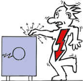
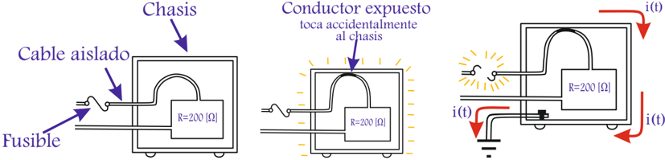

Tags: #eli214

Los principales riesgos eléctricos a considerar según el nivel de tensión y potencia tanto para las personas como para los equipos son:

* Contacto directo.

* Incendio.

* Arco externo ( arc flash ).

* Contacto indirecto.

## 1.5.1.1. Contacto directo:

Para prevenir y evitar el contacto directo de las personas con la electricidad, principalmente se debe considerar el alejar las partes activas de la instalación del contacto fortuito, principalmente con las manos.

En primera instancia tenemos el recubrimiento de los conductores o partes activas con material aislante como por ejemplo el aislamiento de cables. No se consideran como materiales aislantes apropiados: la pintura, los barnices, las lacas o productos similares, dado que son solamente para aislar elementos eléctricos entre sí.

## Contacto Eléctrico Directo

Contacto Eléctrico Indirecto

Otro medio de prevenir, es la interposición de obstáculos como lo son desde las barreras hasta los tablero eléctricos cuya función principal es impedir por alejamiento el contacto.

Si hubiera un contacto eléctrico directo o indirecto se tienen como respaldo las protecciones eléctricas . Desde el punto de vista domiciliario, se tienen dos tipos de protecciones: Automáticos (Termomagnéticos) que protegen principalmente a los equipos y los diferenciales que protegen principalmente a las personas 1 .

Aunque las instalaciones tengan protecciones contra los contactos directos, hay ocasiones en que no funcionan como corresponde por falta de mantenimiento o cuidado.

## 1.5.1.2. Contacto indirecto:

El contacto indirecto a la electricidad, tal como su nombre lo indica es ponerse en contacto accidental con la fuente de electricidad, pero por un medio secundario

1 Otro tipo de protección son los FUSIBLES (Tapones), descartados domiciliariamente.

* Arco interno.

altamente conductivo como lo son las carcasas de los equipos, que normalmente no deben estar a potencial, pero que si se da el caso de forma muy frecuente sobretodo en condiciones de humedad, contaminación, conductores eléctricos cercanos a partes móviles, entre otros; en sí descuidados de mantenimiento.

La forma básica de prevención es mediante la conexión a tierra de los equipos en la carcasa, así garantizar que en la manipulación externa se trabaja a un potencial eléctrico seguro ( casi nulo ) y que en caso de un desperfecto la corriente tenderá a cerrar su camino directamente a tierra y no por la persona que opera ( Principio del divisor de corriente ).

Conceptualmente las variables a considerar son: potencial cero en carcasas , sistemas aislamiento complementarios , uso de tensiones no peligrosas y limitar la duración del contacto por corriente mediante dispositivos de corte o protecciones .

## Conozca respete los valores nominales :

Suponga que de las figuras anteriores la fuente es del tipo alterna de 200V , por lo cual en la carga habrá una intensidad de corriente de 1A . Si suponemos que la fuente de tensión mantiene su valor efectivo con una variación muy pequeña en el tiempo ese sería su valor nominal.

La carga presenta un modelo de impedancia constante conocido y medido de 200Ω , que suponiendo variaciones leves de la temperatura y otros factores hará que se mantenga constante en el tiempo y tal valor será su valor nominal.

En este caso la corriente se adapta en función de la carga y la tensión aplicada, por lo cual el conductor al menos debe tener una sección que permita el paso de 1A sin sobrecalentarse, ni derretir su aislamiento y el aislamiento debe soportar los 200V con un factor de seguridad de al menos 5. Por tanto, las especificaciones del conductor fijan la corriente nominal de transmisión la cual debiera ser mayor o igual a la que requiere la carga a tensión nominal.

En este ejemplo se puso en serie (entre la fuente y la carga) un fusible que es un conductor de menor sección que permite tranquilamente el paso de hasta 10A (valor de ejemplo) y sobre ese valor por temperatura se quema, corta y abre el circuito.

Si el conductor expuesto hace contacto con una carcasa aislada, toda la carcasa queda a potencial, si lo toca una persona de impedancia de 200Ω hará un divisor de corriente perfecto y circulará por la persona 1A , por la carga 1A y por tanto la fuente entregará

2A y el fusible no se enterará de la falla.

Si la carcasa está aterrizada y además tuviera una impedancia de carcasa de 1Ω , circulará una corriente de cortocircuito teórica a tensión nominal de 200A , el fusible se abre y desconecta a la carga de la red, mejor aún si una persona toca la carcasa, estará libre de una posible descarga eléctrica.

## 1.5.1.3. Uso del procedimiento del trabajo

Cada vez que se realiza un trabajo que contempla el uso y manipulación de la electricidad, es fundamental y en casi todas partes del mundo por Ley, el tener un procedimiento de trabajo garantiza el tomar conciencia sobre los actos a realizar con fin de un propósito, que siguen una secuencia lógica, mostrando los posibles los riesgos y la forma segura de operar.

Cualquier trabajo eléctrico debe considerar dentro de su procedimiento un análisis tanto de los riesgos eléctricos como mecánicos y cualquier otro que se tenga presente, dado que dado que estos factores pudieran complementarse ante un accidente eléctrico. Ejemplo: contacto directo más caída distinto nivel.

La metodología básica para trabajar en una instalación eléctrica o en su proximidad que conlleve un riesgo eléctrico, es la realizada sin energía , salvo los siguientes casos:

1. Las operaciones elementales, tales como conectar y desconectar equipos en instalaciones de baja tensión, con material eléctrico aislado y enchufes acordes para ello.
2. Los trabajos en instalaciones con tensiones de seguridad, siempre que no exista posibilidad de confusión. Ejemplo: trabajos en baja tensión con línea viva sin cables con código de color.
3. Las maniobras, mediciones, ensayos y verificaciones cuya naturaleza así lo exija, tales como la apertura y cierre de interruptores o también limpieza de aisladores de alta tensión en líneas de transmisión.
4. Los trabajos en proximidad de instalaciones cuyas condiciones de explotación o de continuidad del suministro así lo requieran. Ejemplo: trabajos en líneas de transmisión circuito 1, mientras el circuito 2 está funcionando.

Se deben tener en cuenta los siguientes principios para trabajar en instalaciones:

1. La aplicación de métodos de trabajo especificados.
2. La forma de proceder en cada trabajo.
3. La formación del personal.
4. Respeto a las señalizaciones.

