El Neutro , desde el punto de vista del sistema de distribución en baja tensión domiciliario, es un conductor proveniente del secundario de un transformador estrella, que sirve para proporcionar el cierre del circuito donde son conectadas cargas monofásicas.

En instalaciones domiciliarias el neutro tiene aislamiento de color blanco.

La Tierra es un conductor que proviene directamente de la tierra física, la cual debe de tener muy baja resistencia. Su función principal es la de proveer seguridad y protección a las personas y a los equipos conectados a la energía eléctrica contra descargas de tensiones y corrientes indeseables ya sea provenientes del exterior, como producidas internamente por mal funcionamiento.

En instalaciones domiciliarias el cable tierra tiene aislamiento de color verde, amarillo o amarillo verde; sin embargo en muchas instalaciones de mayor potencia es simplemente un cable desnudo de calibre mayor que circunda las carcasas y recorre las instalaciones.

Según la Norma Chilena NCH Elec. 4/2003 , establece que:

* Conductor de la fase 1: Azul .
* Conductor de la fase 2: Negro .
* Conductor de la fase 3: Rojo .
* Conductor de neutro y tierra de servicio: Blanco .
* Conductor de protección: Verde o verde/amarillo .

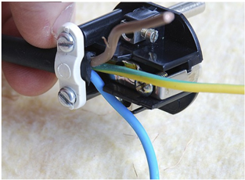

F1

F2

F3

N

Trifásico

En algunos cables fabricados con otras Normas, el terminal azul suele ser el neutro , el café o negro el de fase y el verde/amarillo se mantiene como tierra . Si bien ante la confusión, eléctricamente daría lo mismo en un equipo usar el cable de fase como neutro y el de neutro como fase , normalmente el cable de fase está más protegido de la intervención humana (no experta) y es por eso que en otros países los enchufes están hechos aprueba de este error.

Poste

F1

N

Monofásico F1

F2

N

Bifásico F1

F2

F3

N

Mufa

Entrada

a medidor SECCIÓN 1.6

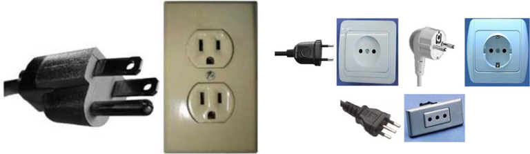

## Sistemas de puesta a tierra

Un sistema de puesta a tierra es un conjunto o arreglo de conductores conectados a tierra, específicamente enterrados a una cierta profundidad y a una cierta área de cobertura, cuya función principal es proporcionar un camino definido con impedancia suficientemente baja para el regreso de la energía eléctrica en caso de una falla eléctrica.

(a) Malla puesta a tierra.

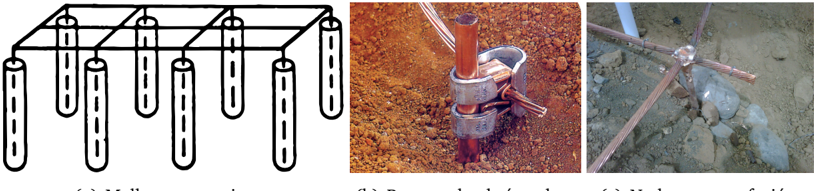

- (b) Barra y alambrón cobre.

Figura 1.11: Sistemas de puesta a tierra.

Falla se entenderá por un evento en el cual se unen accidentalmente dos puntos de potencial distinto, que produce una circulación anómala y elevada de corriente (simétrica o asimétrica en las fases), la cual debiese ser interrumpida por los elementos del protección. Bajo este punto de vista también se pueden considerar los efectos de las descargas eléctricas atmosféricas en las redes eléctricas.

Las función del sistema de puesta a tierra es la de limitar a un valor seguro la elevación de potencial en todo un sector específico que normalmente son de libre acceso para personas y animales, tanto para bajo condiciones normales y anormales del funcionamiento del circuito. El potencial de tierra se eleva en términos bastante simples por el paso de una corriente a través de la impedancia que presenta el terreno, pudiendo causar accidentes si una persona u objeto de conductividad relativamente alta se expone a puntos distintos de potencial, por ejemplo ante la separación de los pies, llamada exposición a la tensión de paso .

(c) Nodo en termofusión.

Figura 1.12: Tipos de riesgos durante una falla eléctrica

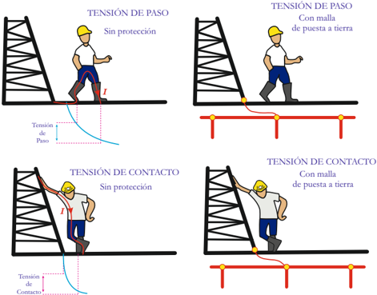

Figure 13-Typical situation of extended transferred potential Figura 1.13: Falla en una subestación

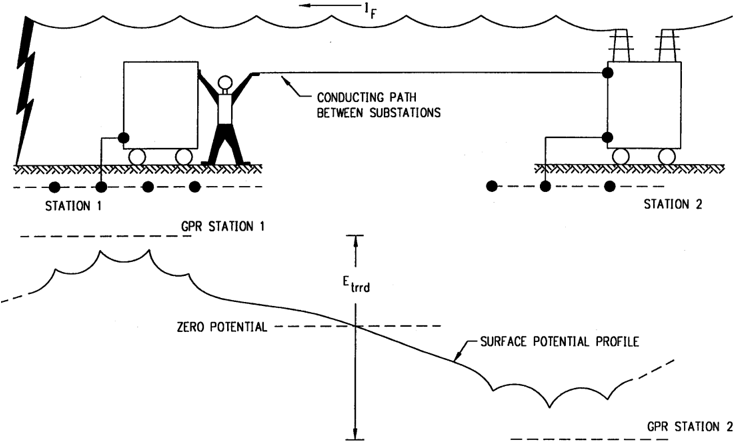

La Norma IEEE Std. 80-2000 'Guide of safety in AC substation grounding' entrega una guía general sobre los sistemas de puesta a tierra en subestaciones eléctricas, que claramente presentan una visión mucho más compleja que la puesta a tierra domiciliaria.

La Norma IEEE Std. 80-2000 establece para el 99 , 5 % de las personas de un peso referencial de 50kg , que pueden tolerar y/o sobrevivir a la siguiente relación entre la corriente I B y tiempo t [s] de exposición:

$$I _ { B } = \frac { 0 , 1 1 6 } { \sqrt { t } } \ [ A ]$$

Para personas de 70kg se tiene análogamente:

$$I _ { B } = \frac { 0 , 1 5 7 } { \sqrt { t } } \ [ A ]$$

La corriente que puede circular por el cuerpo, en alguno de estos casos estará dada por:

$$I _ { B } = \frac { V _ { T h } } { Z _ { T h } + R _ { B } } \ \left [ A \right ]$$

Luego, el desafío para poder estimar el riesgo está en la determinación de la tensión e impedancia Thévenin , según los casos críticos que en resumen pueden ser por: Tensión de contacto o tensión de paso .

Tensión de contacto: Tensión que aparece entre el punto de contacto directo equipotencial de la superficie típicamente metálica de las estructuras y/o carcasas, respecto los puntos de apoyo a piso o tierra de la persona que hace de 'puente' entre los puntos antes mencionados. En este caso los equivalente de Thévenin se da en función de los puntos de contacto H-F según los siguientes circuitos equivalentes, donde: R g resistencia de la puesta a tierra y R f resistencia de los pies o punto de contacto a tierra (uno (1) de ellos solamente). En una subestación normalmente R g ≪ R f .

Figura 1.14: Tensión de contacto

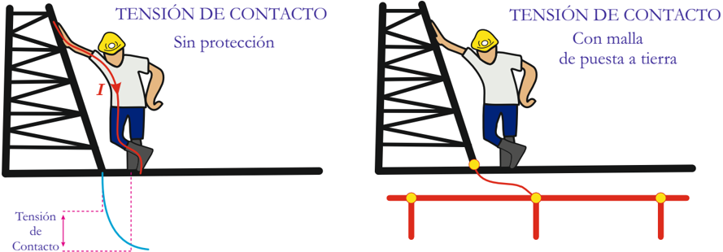

Figura 1.15: Contacto directo, según IEEE Std. 80-2000

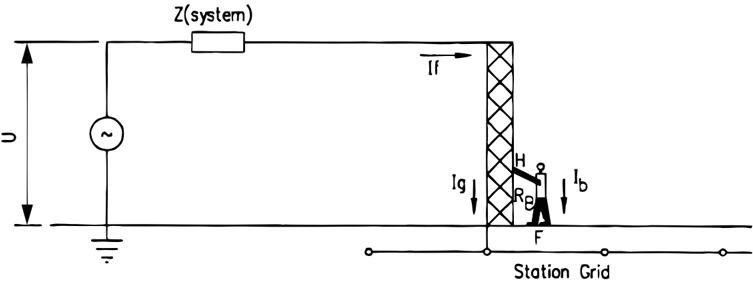

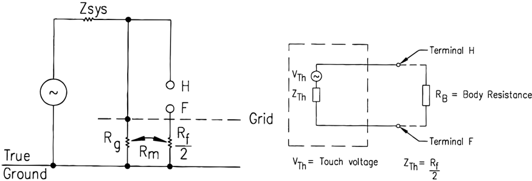

Por tanto la tensión de contacto tolerable (según el tiempo) puede ser determinada como:

$$V _ { c o n t a c t o } = ( Z _ { T h } + R _ { B } ) \times I _ { B } \approx \left ( \frac { R _ { f } } { 2 } + R _ { B } \right ) \times I _ { B } \ \left [ V \right ]$$

Tensión de paso: En este caso los equivalente de Thévenin se dan en función de los puntos de contacto F1-F2 dada la posición de los pies y la posible distribución de tensión que exista.

Figura 1.16: Tensión de paso

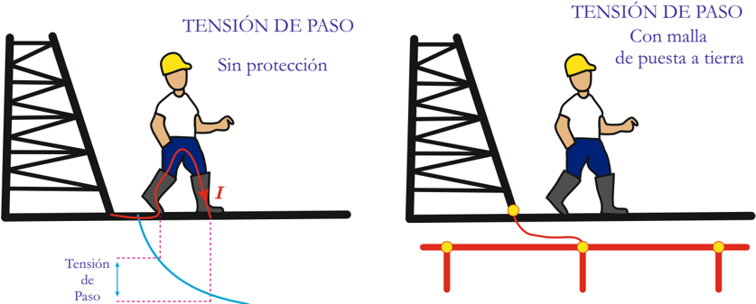

Figura 1.17: Contacto de paso, según IEEE Std. 80-2000

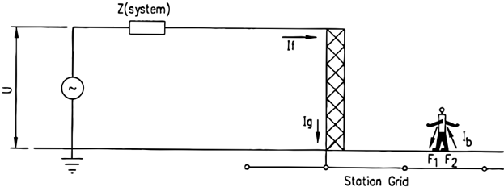

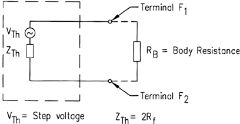

Por tanto la tensión de paso tolerable (según el tiempo) puede ser determinada como:

$$V _ { p a s o } = ( Z _ { T h } + R _ { B } ) \times I _ { B } \approx ( R _ { f } \times 2 + R _ { B } ) \times I _ { B } \ \ [ V ]$$

