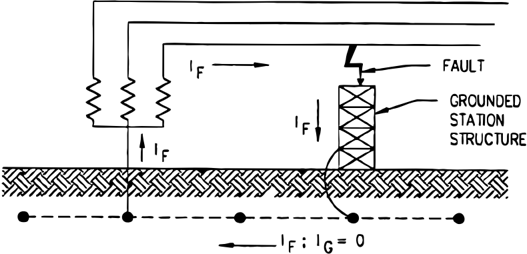
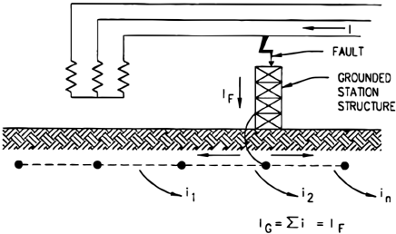

# 1.6.1 Conexión a tierra de las carcasas y estructuras

Tags: #eli214
## 1.6.1. Conexión a tierra de las carcasas y estructuras

Cada vez que se tengan equipos de un consumo importante de potencia y energía, se exige por seguridad la conexión a tierra de su carcasa o armazón, así se tendrá el equipo a un potencial seguro ante el contacto humano y con otros equipos. Por otro lado ante la acción de una descarga eléctrica el punto de retorno más cercano será la carcasa, evitando que se cierre un circuito eléctrico por alguna persona cercana, lo cual tiende a actuar como un divisor natural de corriente.

En subestaciones será siempre necesario, pero con los cuidados de no estar expuestos a las tensiones de paso.

Figura 1.18: Circulación de corrientes por malla de tierra, con neutro a tierra

Figura 1.19: Circulación de corrientes por malla de tierra, sin neutro a tierra

SECCIÓN 1.7

## Protecciones eléctricas domiciliarias

Protección eléctrica define aquellos elementos con capacidad de corte o interrupción de corriente que la misma protección detecte como peligrosa, ya sea para una persona o para un equipo. Básicamente y desde un punto de vista domiciliario contamos con dos tipos: Interruptor termomagnético e interruptor diferencial , cuyos usos están ampliamente desarrollados en alterna, pero que en continua deben tomarse ciertas precauciones en la característica del sistema físico de apertura del circuito o corte de corriente . Igualmente también contamos con un tercer tipo de protección llamada fusible el cual tiene la característica que una vez que se activa no se puede volver a utilizar.

La diferencia en la interrupción entre una corriente en alterna y una continua es el hecho que la primera presenta pasos por cero, mientras que la continua al ser permanente en el tiempo, no basta con que el contacto eléctrico se abra para garantizar que la corriente se detenga, pudiendo muchas veces sostenerse el arco a través del medio gaseoso sin necesidad que se tengan niveles de tensiones altos involucrados.

## 1.6.1. Conexión a tierra de las carcasas y estructuras

Cada vez que se tengan equipos de un consumo importante de potencia y energía, se exige por seguridad la conexión a tierra de su carcasa o armazón, así se tendrá el equipo a un potencial seguro ante el contacto humano y con otros equipos. Por otro lado ante la acción de una descarga eléctrica el punto de retorno más cercano será la carcasa, evitando que se cierre un circuito eléctrico por alguna persona cercana, lo cual tiende a actuar como un divisor natural de corriente.

En subestaciones será siempre necesario, pero con los cuidados de no estar expuestos a las tensiones de paso.

Figura 1.18: Circulación de corrientes por malla de tierra, con neutro a tierra

Figura 1.19: Circulación de corrientes por malla de tierra, sin neutro a tierra

