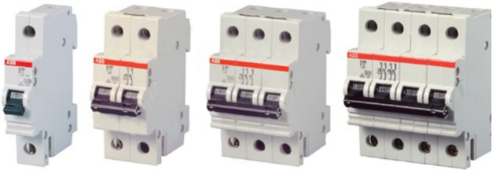
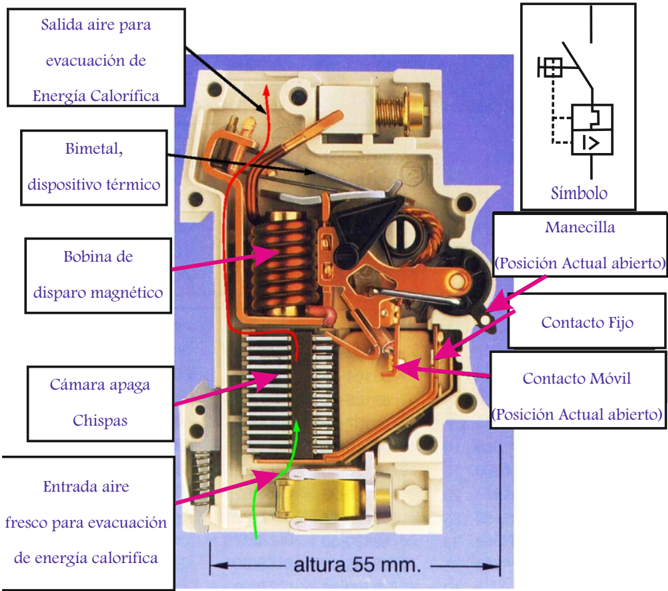
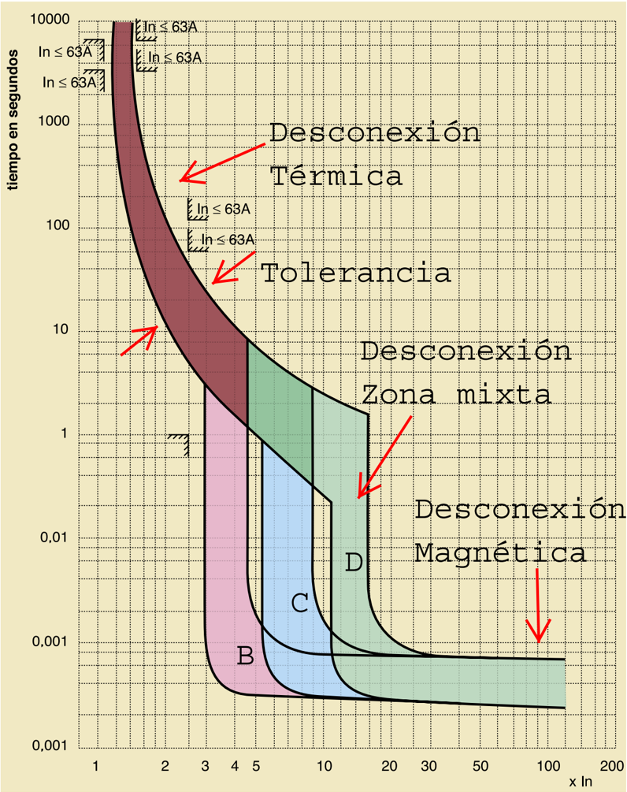

# 1.7.1 Interruptor termomagnético

Tags: #eli214
## 1.7.1. Interruptor termomagnético

Dispositivo capaz de interrumpir la corriente eléctrica de un circuito cuando ésta sobrepasa ciertos valores máximos, definidos como valores por sobre los niveles de funcionamiento nominal . Su funcionamiento se basa en dos de los efectos producidos por la circulación de corriente eléctrica en un circuito: el magnético y el térmico (efecto Joule ). Por ende, el dispositivo consta de un electroimán que actúa ante niveles de corriente instantáneos elevados y una lámina bimetálica , que actúa ante niveles de corriente permanente levemente superiores al nominal. Ambos elementos están conectados y coordinados en serie.

Figura 1.20: Protección-interruptor termomagnética

En cuanto al funcionamiento se tiene:

Magnético: Al circular la corriente por el electroimán, se crea una fuerza que mediante un dispositivo mecánico adecuado, que tiende a abrir un contacto que está

normalmente cerrado. La apertura se dará solamente si la intensidad de corriente que circula por la carga sobrepasa el límite fijado, que típicamente está comprendido entre 3 y 20 veces respecto al valor nominal (según la letra B , C , D ,...), con un tiempo de actuación de aproximadamente unas 25 milésimas de segundo.

Esta es la parte está destinada a la protección frente a los cortocircuitos, donde se produce un aumento muy rápido y elevado de corriente.

Al operar por sobrecorriente, si la causa se ha retirado, es casi inmediata su reconexión la cual no es automática y debe por tanto reponerse manualmente.

Térmico: El bimetal al calentarse por encima de un determinado límite asociado a corriente permanente, sufre una deformación del tipo flexión dado que estos dos metales tienen distintos coeficientes de dilatación térmicos, lo cual produce la apertura un contacto normalmente cerrado.

Esta parte es la encargada de proteger de corrientes que aunque son superiores a las permitidas por la instalación, no llegan al nivel de intervención del dispositivo magnético, situación que es típica de una sobrecarga . Una sobrecarga es cuando el consumo va aumentando conforme se van conectando cargas, lo cual trae consigo que se supere el límite térmico de los conductores que a largo plazo se traduciría en una falla al ir derritiendo el aislamiento, generando la posibilidad de incendio.

Al operar por sobreconsumo un bimetal, si la causa se ha retirado no es instantánea la factibilidad de reconexión , debiendo esperar que el bimetal se enfríe y recupere su forma.

Figura 1.21: Protección-interruptor termomagnética

ACI˜N

`ˆV&gt;Àʏ&gt;

Àի̜À

`ˆV&gt;ÀÊi

Vˆ&gt;Ê`i

œ°Ê`i

“`ՏœÃ

£Ç]xʓ“

ä]x

ä]x

ä]x

£

œ

*

̜

Ê

฀

«ÌœÀ]Ê

œ°Ê`i

“`ՏœÃ

£Ç]xʓ“

£

£

ˆÃ«&gt;ÀœÊ“&gt;}˜j̈VœÊi˜ÌiÊÎÊÞÊxÊÛiViÃÊ

En general, se tiene que este tipo de protección es destinada principalmente a la seguridad de los equipos , dado que si consideramos que la impedancia humana en contacto directo con la tensión de nivel domiciliario, no tiende a elevar la corriente por sobre los 10A (valor mínimo nominal de un termomagnético). Luego, si se recuerda que los niveles sensibles para el ser humano son del orden de los mA , un nivel de operación sobre los 10A sería ineficiente para salvar una vida. #URVA฀# ˆÃ«&gt;ÀœÊ“&gt;}˜j̈VœÊi˜ÌiÊxÊÞÊ£äÊÛiViÃÊ &gt;ÊVœÀÀˆi˜Ìiʘœ“ˆ˜&gt; #URVA฀$ ˆÃ«&gt;ÀœÊ“&gt;}˜j̈VœÊi˜ÌiÊ£äÊÞÊÓäÊÛiViÃÊ &gt;ÊVœÀÀˆi˜Ìiʘœ“ˆ˜&gt;

N

#URVAS฀TIEMPO฀ ฀CORRIENTE฀TIPO฀# Figura 1.22: Curvas de protección-interruptor termomagnética (Ejemplo)

Las curvas de disparo de un termomagnético o disyuntor permiten apreciar y evaluar la coordinación de apertura de los elementos de protección térmico y magnético que se disponen eléctricamente en serie ( selectividad interna ) que en función del nivel de corriente sobre el nominal fija y define el tiempo de operación y apertura.

Usos:

- Curva B: Disparo de 3 -5 × I N , para generadores, cables de gran longitud, etc (Sin peaks de corriente).

Curva C: Disparo de 5 -10 × I N , para aplicaciones generales de alumbrado, equipos domésticos, etc.

- Curva D y K: Disparo de 10 -20 × I N , para transformadores, motores, cables, elementos que con grandes peaks corriente transitoria de arranque o conexión.

Curva Z: Disparo de 2 , 4 -3 , 6 × I N , para protección de circuitos electrónicos sensibles.

Curva MA: Disparo de 12 × I N , para protección arranque de motores y casos específicos sin protección térmica.

