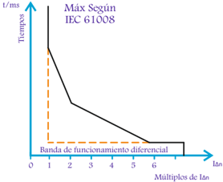
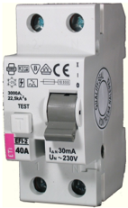
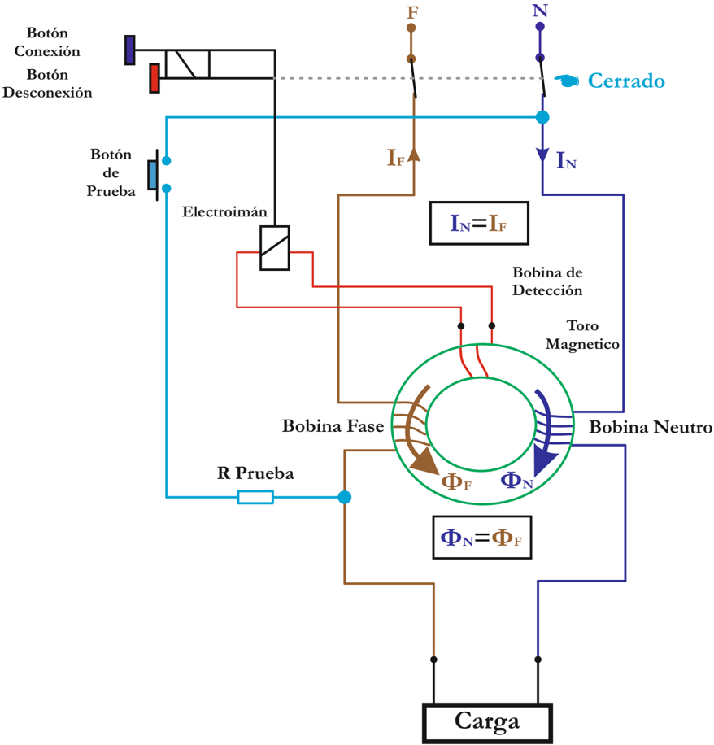

# 1.7.2 Interruptor diferencial

Tags: #eli214
## 1.7.2. Interruptor diferencial

Es un dispositivo electromecánico que se coloca en las instalaciones eléctricas de corriente alterna con el fin de proteger a las personas de los contactos directos e indirectos .

Este dispositivo actúa conjuntamente con la puesta a tierra de enchufes, carcasas y/o masas metálicas de todo aparato eléctrico.

Su principio de funcionamiento es abrir un contacto normalmente cerrado , cuando al medir simultáneamente la corriente de línea de una fase ( protección diferencial monofásica ) y la corriente de retorno por el neutro, se sense una diferencia más grande que la sensibilidad que el equipo trae configurada ( típicamente 30mA ), donde la velocidad de respuesta o tiempo de apertura será una función inversa relacionada con las veces que la corriente de fuga 2 supere a la sensibilidad que tiene la protección.

Figura 1.23: Curva de protección diferencial

Figura 1.24: Diferencial

2 Se le llama corriente de 'fuga' y no de 'falla' , por ser una condición insegura para una persona, pero tolerable por el sistema.

Figura 1.25: Esquema circuital protección-interruptor diferencial

La protección diferencial y la termomagnética deben en lo posible ser usadas de forma simultánea.

## CAPÍTULO 2

## ERRORES Y ANÁLISIS DE DATOS

SECCIÓN 2.1

## Prolegómenos

## 1.7.2. Interruptor diferencial

Es un dispositivo electromecánico que se coloca en las instalaciones eléctricas de corriente alterna con el fin de proteger a las personas de los contactos directos e indirectos .

Este dispositivo actúa conjuntamente con la puesta a tierra de enchufes, carcasas y/o masas metálicas de todo aparato eléctrico.

Su principio de funcionamiento es abrir un contacto normalmente cerrado , cuando al medir simultáneamente la corriente de línea de una fase ( protección diferencial monofásica ) y la corriente de retorno por el neutro, se sense una diferencia más grande que la sensibilidad que el equipo trae configurada ( típicamente 30mA ), donde la velocidad de respuesta o tiempo de apertura será una función inversa relacionada con las veces que la corriente de fuga 2 supere a la sensibilidad que tiene la protección.

Figura 1.23: Curva de protección diferencial

Figura 1.24: Diferencial

2 Se le llama corriente de 'fuga' y no de 'falla' , por ser una condición insegura para una persona, pero tolerable por el sistema.

Figura 1.25: Esquema circuital protección-interruptor diferencial

La protección diferencial y la termomagnética deben en lo posible ser usadas de forma simultánea.

