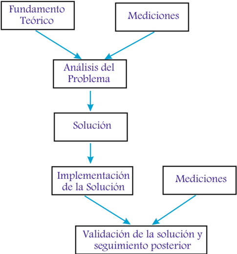

# 2.1.1 Definiciones

Tags: #eli214
## 2.1.1. Definiciones

Metrología: Es el arte de medir y saber interpretar el resultado de una medición que ha sido realizada por otros.

Medir: Comparar con algo (unidad) que se toma como base de comparación.

La importancia de 'saber medir 1 ' se basa en: el análisis y solución de problemas técnicos, diseño y fabricación de equipamiento eléctrico, obtención de datos para una correcta simulación, medición de parámetros fundamentales para el diagnóstico del estado de un sistema, etc.

