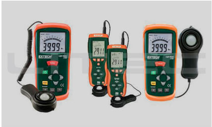
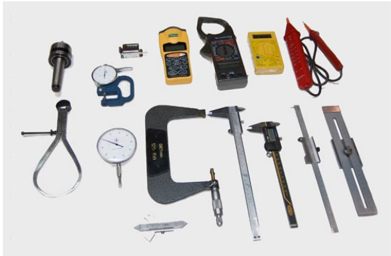
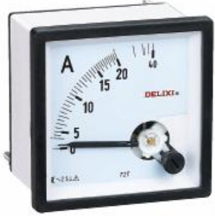

# 2.1.2 Elementos que intervienen en una medición

Tags: #eli214
## 2.1.2. Elementos que intervienen en una medición

Al momento de efectuar una medición de alguna variable, se tendrá siempre al menos dos elementos principales como lo son: El instrumento de medida y el operador que usará tal instrumento; donde cada uno de estos elementos es una fuente de error de forma independiente en su interacción.

Funcionalmente se tiene:

Instrumentos: Comparan la variable medida con una unidad patrón. Las principales causas de errores posibles pueden ser deficiencias en el sistema detector/sensor, uso de equipos intermedios, indicador incorrecto, etc.

Operador: Selecciona el instrumento acorde con la variable a medir, conecta el instrumento, mide. Las principales causas de errores posibles: Mala lectura, ajuste incorrecto, paralaje, entre otros.

