# 2.1.3 Proceso de medición de variables (eléctricas)

Tags: #eli214
## 2.1.3. Proceso de medición de variables (eléctricas)

Al momento de hacer una medición, orientando nuestra visión al mundo eléctrico, los pasos que identifican el proceso de medición son:

- a.Decidir la variable que se va a medir. Ejemplo: potencia activa .
- b.Seleccionar la unidad o sistema de unidades acorde a la variable a medir (unidad básica o derivada S.I.). Ejemplo: mili Watts (mW) .
- c.Seleccionar el instrumento de medición (calibrado). Ejemplo: un vatímetro de coseno adecuado.

- d.Efectuar las conexiones necesarias, ajustar los rangos y verificar las condiciones de seguridad. Ejemplo: bobina de tensión en paralelo a la fuente, bobina de corriente en serie, conexión voltimétrica.
- e.Aplicar el procedimiento acordado. Ejemplo: Una vez conectada la carga, subir la tensión en pasos del 20 % de la tensión nominal hasta llegar al 120 % .
- f.Registrar los datos medidos en forma ordenada y clara. Ejemplo: Anotar para cada valor de tensión, el valor de la potencia, registrar temperatura, datos de la carga, graficar si es posible.
- g.Cuantificar los errores cometidos en la medición (se deben tomar todas las medidas para reducirlos).
- h.La interpretación y análisis de los datos con el fin de extraer informaciones valiosas del proceso. Expresar el resultado incorporando análisis de error.

¡Tener un buen proceso de medición no implica tener un buen resultado!

En ingeniería, es de suma importancia tener la habilidad de documentar e informar los resultados. Por ello, resulta fundamental el saber generar un informe que además del proceso de medición, indique: la forma en que se realizó la medición, los circuitos empleados y modelos equivalentes considerados, los instrumentos empleados con sus rangos y errores, gráficos y tablas obtenidas, variables externas como temperatura, humedad, presión atmosférica, fecha de las mediciones, fecha del informe, fórmulas principales, conclusiones y datos adicionales.

El uso de un cuaderno de laboratorio, permite el debido registro de los datos, considerando que muchas veces en el traspaso de la información pueden haber pérdidas, truncamiento o permutación de datos. Ejemplo: medido 683V , traspasado al informe 638V .

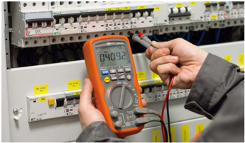

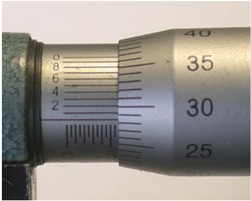

De los ocho pasos anteriormente expuestos, la parte más compleja y que se estudiará son:

Los errores: Forma de calcularlos, expresarlos y minimizarlos, entender la forma en que se propagan.

Los instrumentos: Tipos, métodos, conexiones, características generales, conocer principio físico de funcionamiento , etc.

Las mediciones Aplicar teoría en laboratorio con implementación real, analógica y/o digital, ventajas/desventajas.

SECCIÓN 2.2

## Definiciones en metrología

Instrumento: Dispositivo utilizado para determinar el valor o la magnitud de una cantidad o variable. Los instrumentos deben ser capaces de medir sin interferir de manera sustancial en la distribución original de las variables.

Instrumento patrón y trazabilidad: El proceso de medición está enfocado hacia obtener el valor verdadero de la cantidad medida. Desafortunadamente este valor nunca puede determinarse exactamente ya que los instrumentos y los operadores cometen errores.

Actualmente las normativas de calidad internacionales (Ej. ISO 'International Organization for Standardization' ) exigen que los instrumentos utilizados tanto en laboratorios de certificación como de control de calidad, se comparen con instrumentos de mejor calidad y exactitud. En ese proceso puede ser informado el error del instrumento o reajustado para que la lectura tenga un error dentro de límites razonables. Del proceso anteriormente descrito podemos rescatar los siguientes conceptos:

- Contrastar: Acto de comparar un instrumento con uno de mejor calidad y exactitud, indicando el error obtenido.
- Calibrar: Acto de reajustar un instrumento para que al ser contrastado tenga un Tipos, métodos, conexiones, características generales, etc.
- Instrumento patrón: Instrumento de mejor calidad y exactitud con el cual se comparan otros instrumentos de uso cotidiano.

Los instrumentos patrones deben a su vez contrastarse y calibrarse con otros instrumentos patrones ya sea nacionales como internacionales, que en principio debieran tener una calidad y exactitud aún mayor. Sin embargo, llega un punto de excelencia al final de esta línea de calibración y contrastación, en que solamente se pueden comparar instrumentos patrones de la misma exactitud dado que no se dispone en el mundo de uno mejor. De ese modo se genera un proceso circular interminable de contrastación.

En cada proceso de calibración y/o contrastación se va creando un registro que indica el instrumento patrón usado, que a su vez permitiría conocer con que instrumento fue calibrado y/o contrastado el patrón, generado una cadena de información que se denomina la trazabilidad del instrumento .

El término trazabilidad es definido por la Organización Internacional para la Estandarización (ISO-9001:2008 y ASME-18001), en su International Vocabulary of Basic and General Terms in Metrology como:

'La propiedad del resultado de una medida o del valor de un estándar donde éste pueda estar relacionado con referencias especificadas, usualmente estándares nacionales o internacionales, a través de una cadena continua de comparaciones todas con incertidumbres especificadas' .

Figura 2.1: Proceso de contrastación y/o calibración trazable

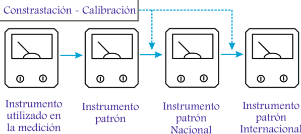

A falta de instrumentos patrones, muchas veces de forma relativamente más sencilla se disponen de los patrones físicos , que son por definición el valor que debe tener un conjunto especial de variables o parámetros bajo ciertas condiciones y que permiten al ser medidas saber como mide y con qué error un instrumento dado.

Sistema Internacional de Unidades (S.I.): sistema basado en el MKS (metro, kilogramo y segundo). El S.I. tiene como magnitudes y unidades fundamentales tales como: longitud al metro ( m ), para masa al kilogramo ( kg ), para tiempo el segundo ( s ), para fuerza el Newton ( N ), para temperatura al Kelvin ( K ), para intensidad de corriente eléctrico al Ampére o amperio ( A ), para la intensidad luminosa la candela ( cd ) y para cantidad de sustancia el mol ( mol ).

Para el caso de la longitud se tiene un patrón físico que lo define y a partir de él se establecen diferentes elementos o instrumentos de medida. Inicialmente el patrón físico fue la distancia desde el Polo Norte hasta el Ecuador, ya que se creía que esta distancia era de 10 . 000km . Tiempo después se estableció el metro patrón de Francia, que es una barra de platino e iridio depositados en cofres situados en los subterráneos del pabellón de Breteuil en Sèvres , Oficina de Pesos y Medidas , en las afueras de París.

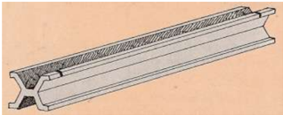

Luego, se definió al metro patrón como 1 . 650 . 763 , 73 veces la longitud de onda de la luz anaranjada emitida por los átomos de Kriptón 86 gaseoso. En la actualidad tenemos que el metro patrón es la longitud de la trayectoria recorrida por la luz en el vacío durante un intervalo de tiempo de 1 / 299 . 792 . 458 segundos, dado que se supone que existe la tecnología para poder cuantificarlo y utilizarlo.

En el ámbito de la electricidad es común el emplear resistores , inductores y capacitores patrones, con lo cual desde un punto de vista bastante general, permitirían establecer niveles de corriente o tensión muy bien conocidas y con ellas evaluar el comportamiento de los instrumentos pertinentes que se requieran.

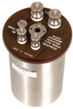

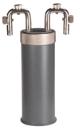

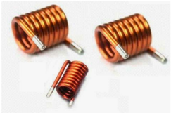

Errores: El error de una medida se define como la diferencia entre el valor medido y el valor verdadero, en el supuesto que se conoce de forma perfecta e ideal el valor verdadero. Geométrica y estadísticamente es una medida de distancia entre dos puntos.

Se pueden expresar los errores de forma absoluta, es decir, con dimensión o de forma porcentual o adimensional. Ejemplo:

$$V _ { v e r d } = 5 A , \, V _ { m e d } = 4 , 8 A , \, \text {entences: } \varepsilon _ { \text {abs} } = 4 , 8 - 5 = - 0 , 2 A \ \delta \varepsilon _ { \text {%} } = \frac { \varepsilon _ { \text {abs} } } { V _ { v e r d } } 1 0 0 \, \% = - 4 \, \%$$

Exactitud: Es diferencia entre el valor medido y el valor real de una variable medida con un instrumento. Como no se puede determinar el valor real de la variable, diremos que un instrumento es más exacto, mientras menor sea la diferencia entre el valor que él mide y el que mide el instrumento patrón. Lo lógico es interpretar a la exactitud como antónimo del error , diciendo que una mayor exactitud implica un menor error . Por otro, lado al expresar o cuantificar la exactitud se termina por expresar el error.

Analogía: distancia entre dos puntos, el medido y el real (mejor medido o el dado por un patrón físico).

Ejemplo: En un instrumento analógico de escala uniforme, la exactitud se expresa como un % de su deflexión máxima. En este caso se puede informar la exactitud como el error admisible de un instrumento.

Si se tuviera un amperímetro 0 -10A con ± 2 % de error a plena escala, cuando se quieran medir 5A el error sería ± 4 % = 2 % · 10 / 5 y cuando se quiera medir 1A el error sería ± 20 % = 2 % · 10 / 1 . Por tanto, es conveniente al medir siempre a plena escala o a lo menos a 1 / 3 de ésta ( ε x = 3 · ε plena -escala % ).

Precisión: Es el grado repetitividad de un conjunto de lecturas más o menos cercanas a un cierto valor medio 2 , cuando la medición y las lecturas son efectuadas cada una en forma independiente y con el mismo instrumento.

Analogía: desviación respecto a un valor medio.

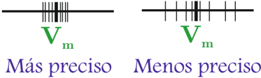

Un instrumento es más preciso que otro cuando siempre mide lo mismo con muy poca variación, pero será exacto si lo que mide es muy cercano a la realidad definida 3 .

## Ejemplo: Diferencia entre exactitud y precisión

Un resistor de 50 , 5Ω se midió con dos óhmetros A y B . Tomando 30 lecturas con cada uno, se tiene el siguiente resultado:

| A                  | A            | B                  | B            |
|--------------------|--------------|--------------------|--------------|
| Nº de repeticiones | Medición [Ω] | Nº de repeticiones | Medición [Ω] |
| 3                  | 48           | 1                  | 51,0         |
| 6                  | 49           | 3                  | 51,5         |
| 15                 | 50           | 20                 | 52,0         |
| 5                  | 51           | 4                  | 52,5         |
| 1                  | 52           | 2                  | 53,0         |
| x A                | 49,8         | x B                | 52,05        |

Se aprecia en primer lugar que no todas las veces cada instrumento midió exactamente lo mismo, por lo cual, dado una definición de la cantidad de mediciones a realizar por instrumento ( 30 para ambos casos ) y que además los instrumentos entre sí miden valores diferentes, la diferencia relativa se puede caracterizar mediante el promedio o valor medio x .

Si se grafican los valores medidos de cada instrumento se puede apreciar en primera instancia que se distribuyen en torno a una Normal , cuyo centro está en el promedio x que a su vez coincide aproximadamente con el dato medido con una repetición mayor.

2 El valor medio de la presente definición no tiene por qué ser exacto.

El instrumento A tiene una dispersión de valores mucho mayor que el instrumento B , que en estadística se traduce en decir que la kurtosis A es menor que la de B . Esto implica que el instrumento B es el más preciso de los dos.

Sin embargo, dado que sabemos el valor numérico real del resistor, se puede decir que a partir de los valores medidos de A y de B , el que está más cercano al valor real es el instrumento A , por lo cual es el instrumento más exacto de los dos.

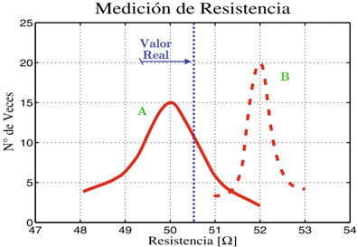

Nota: Observe que el promedio de A se expresó con solamente un (1) decimal dado que los datos que lo originaron son enteros. En el caso del instrumento B su promedio tiene dos (2) decimales dado que los datos se consideraron con una (1) cifra decimal.

Rango: Son los límites dentro de los cuales una variable puede ser medida. Ejemplo: Voltímetro 0 -300V .

Sensibilidad: Razón entre la respuesta del instrumento y la causa o parámetro que la produce (variable medida). Se puede expresar como:

$$s = \frac { \Delta r e p u s e t a \, o \, l e c t u r a \, d e l \, i n s t r u m \, e n t o } { \Delta e x c i t a c i o n \, o \, v a i b l e \, q u e \, o r i g a n e \, e l \, p r i c i p i o }$$

## Ejemplo:

En amperímetros , la sensibilidad se expresa como el menor rango del instrumento: Amperímetro de 0 -6 -12A tiene una sensibilidad de 6A . Amperímetro de 0 -300 -600mA tiene una sensibilidad de 300mA .

Si la sensibilidad se expresara por la deflexión de la aguja en un instrumento analógico y si se tuviera:

s = 12mm / A = 5div / A entonces tendríamos para el caso de 6A un recorrido de 72mm (escala lineal) y/o 30div .

En voltímetros , la sensibilidad es del elemento detector y típicamente se expresa en Ω / V , cumpliéndose que la sensibilidad es definida de forma inversa a la forma que se define normalmente, como el caso del amperímetro.

Un voltímetro de 0 -300V tiene 3kΩ de resistencia interna, es decir, s = 10Ω / V . Los multitester tienen sensibilidades del orden de s = 20kΩ / V

Con la tecnología han cambiado las formas que miden instrumentos electrónicos, por lo cual no siempre es aplicable de este modo el concepto de sensibilidad .

Resolución: Es el cambio más pequeño en el valor medido, que se puede llegar visualizar en el instrumento. Aquellos que tengan selección de rango o escala, la resolución será para cada rango o escala. Numéricamente la resolución es inversa a la sensibilidad.

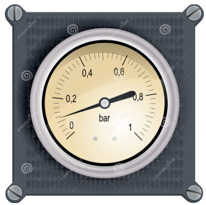

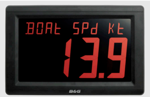

En instrumentos analógicos es la posición de la aguja que se puede distinguir entre dos rayas indicadoras respecto al valor indicado, sujeto al rango o escala empleada. Típicamente entre dos rayas se puede distinguir 1 / 4 ó 1 / 2 de la lectura.

Ejemplo: Amperímetro analógico de escala lineal de 0 -5A graduado en paso de 0 , 25A . Resolución del instrumento 0 , 125A .

En instrumentos digitales es la cifra significativa menor que se puede tener, que al ser presentada en un display el menor valor será '1'.

Ejemplo: Un voltímetro digital de 3 1 2 dígitos, en la escala de 200V , tendrá una resolución de 0 , 1V .

- h Máxima Indicación: 199 , 9V .
- h Resolución: 0 , 1V .

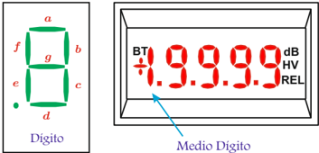

Los instrumentos digitales están caracterizados por la cantidad de dígitos que tiene el display , cuando se habla que 'un instrumento digital posee 4 dígitos' significa que puede mostrar desde 0000 hasta 9999 .

Cuando se dice que tiene '3 dígitos y medio' significa que la cantidad de dígitos que tiene el display son cuatro (4), tres (3) que van de 0-9 y uno (1) que solamente va de 0-1 y que siempre es el primer display de izquierda a derecha o también representa el dígito más significativo.

Cuando se dice que tiene '3 dígitos y tres cuartos' significa que la cantidad de dígitos que tiene el display son cuatro (4), tres (3) que van de 0-9 y uno (1) que solamente va de 0-3 y que siempre es el primer display de izquierda a derecha o también representa el dígito más significativo.

Ejemplo: Instrumento de 6 1 2 dígitos.

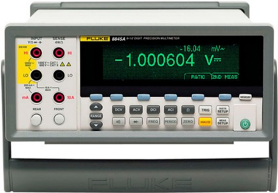

SECCIÓN 2.3

## Análisis de errores y su propagación

No es posible realizar una medición en que exista certeza absoluta que el valor medido sea igual al valor real de la variable medida. Por consiguiente, siempre las mediciones están sujetas a error . Si bien la variable a medir en muchos casos es un parámetro 4 con tan solo tratar de hacer la medición se tiende a alterar el sistema original, por lo cual nunca se sabrá el verdadero valor de la variable en cuestión.

'La relación de indeterminación de Heisenberg o principio de incertidumbre establece la imposibilidad de que determinados pares de magnitudes físicas sean conocidas con precisión arbitraria. Es decir, para un caso específico no se puede conocer la velocidad y la posición simultánea de una partícula.'

Error: Diferencia entre el valor real o verdadero y el valor medido.

En toda medición estarán presentes los errores, los cuales no podrán evaluarse con exactitud ya que no se conoce el valor verdadero de la variable. Si se llegase a medir perfectamente, sin cometer errores o compensándolos unos con otros, tampoco sabríamos que realmente lo hemos logrado, siempre existirá la duda, siempre existirá la incertidumbre frente al resultado obtenido .

4 Variable: ente que está sujeto a cambios o es una incógnita representada por un símbolo que puede ser reemplazado por un valor numérico. Parámetro: es una variable que se mantiene para efectos de un estudio

Los errores de medición aumentan el grado de incertidumbre acerca de la diferencia entre el valor medido y el verdadero.

Sin embargo, si la medición se realizó con cuidado, con instrumentos de buena calidad y calibrados, por un operador competente, en un ambiente adecuado, entre otros factores; necesariamente el error cometido debe haberse minimizado y por lo tanto el resultado en dicha medición debe reflejarlo.

Por lo tanto en una medición debemos:

- a.Detectar las fuentes de error e intentar reducirlos.
- b.Expresar de alguna manera, en el resultado de la medición, el grado de exactitud con que se efectuó.

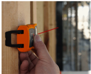

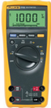

## 2.1.3. Proceso de medición de variables (eléctricas)

Al momento de hacer una medición, orientando nuestra visión al mundo eléctrico, los pasos que identifican el proceso de medición son:

- a.Decidir la variable que se va a medir. Ejemplo: potencia activa .
- b.Seleccionar la unidad o sistema de unidades acorde a la variable a medir (unidad básica o derivada S.I.). Ejemplo: mili Watts (mW) .
- c.Seleccionar el instrumento de medición (calibrado). Ejemplo: un vatímetro de coseno adecuado.

- d.Efectuar las conexiones necesarias, ajustar los rangos y verificar las condiciones de seguridad. Ejemplo: bobina de tensión en paralelo a la fuente, bobina de corriente en serie, conexión voltimétrica.
- e.Aplicar el procedimiento acordado. Ejemplo: Una vez conectada la carga, subir la tensión en pasos del 20 % de la tensión nominal hasta llegar al 120 % .
- f.Registrar los datos medidos en forma ordenada y clara. Ejemplo: Anotar para cada valor de tensión, el valor de la potencia, registrar temperatura, datos de la carga, graficar si es posible.
- g.Cuantificar los errores cometidos en la medición (se deben tomar todas las medidas para reducirlos).
- h.La interpretación y análisis de los datos con el fin de extraer informaciones valiosas del proceso. Expresar el resultado incorporando análisis de error.

¡Tener un buen proceso de medición no implica tener un buen resultado!

En ingeniería, es de suma importancia tener la habilidad de documentar e informar los resultados. Por ello, resulta fundamental el saber generar un informe que además del proceso de medición, indique: la forma en que se realizó la medición, los circuitos empleados y modelos equivalentes considerados, los instrumentos empleados con sus rangos y errores, gráficos y tablas obtenidas, variables externas como temperatura, humedad, presión atmosférica, fecha de las mediciones, fecha del informe, fórmulas principales, conclusiones y datos adicionales.

El uso de un cuaderno de laboratorio, permite el debido registro de los datos, considerando que muchas veces en el traspaso de la información pueden haber pérdidas, truncamiento o permutación de datos. Ejemplo: medido 683V , traspasado al informe 638V .

De los ocho pasos anteriormente expuestos, la parte más compleja y que se estudiará son:

Los errores: Forma de calcularlos, expresarlos y minimizarlos, entender la forma en que se propagan.

Los instrumentos: Tipos, métodos, conexiones, características generales, conocer principio físico de funcionamiento , etc.

Las mediciones Aplicar teoría en laboratorio con implementación real, analógica y/o digital, ventajas/desventajas.

