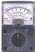
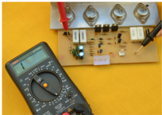
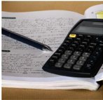

# 2.3.1 Tipos de errores

Tags: #eli214
## 2.3.1. Tipos de errores

Los errores que aparecen en el proceso de una medición son:

Graves o gruesos: Son en gran parte de origen humano , como la mala lectura de los instrumentos, ajuste incorrecto y aplicación inapropiada, así como equivocaciones en los cálculos. Un error grave determina la repetición de la medición ; un error grueso, posibilidad de descartar datos .

Sistemáticos: Se deben a fallas de los instrumentos , como partes defectuosas o desgastadas, y efectos ambientales sobre el equipo. Por ejemplo : el desgaste debido a la fricción de los cojinetes de las partes móviles, deterioro del resorte, mala calibración, mal ajuste del cero, etc.

Estos errores pueden evitarse mediante una buena elección del instrumento; pueden detectarse y corregirse al contrastar con un instrumento de mejor calidad ( instrumento patrón ) o midiendo una probeta conocida ( objeto patrón ).

Aleatorios o fortuitos: Se deben a causas desconocidas propias de la naturaleza y del caos presente en cualquier sistema y ocurren incluso cuando todos los errores sistemáticos han sido considerados. Para compensar estos errores debe incrementarse el número de lecturas y usar medios estadísticos para lograr una mejor aproximación del valor real de la cantidad medida.

casi constante o que varía muy poco.

- Límites: Se deben a las tolerancias aseguradas por el fabricante de los instrumentos y sus componentes ( errores admisibles ). Se les considera en algunos casos como errores aleatorios .

Errores admisibles: En instrumentos de indicación analógica es el error absoluto angular a plena escala , según el tipo de escala: lineal y no lineal . En instrumentos de lectura digital y errores en instrumentos con pantalla reticulada es el error de pasar de un estado a otro (dígito menos significativo) o el de leer entre dos rayas de una cuadrícula.

En instrumentos con múltiples rangos, el error será menor si la lectura es lo más próxima al rango seleccionado.

Si se logra eliminar por completo el error sistemático de una medición, el error final será solamente el admisible , el cual será la medida de la precisión del ensayo.

