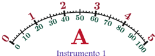
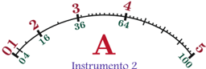

# 2.3.2 Error Admisible en Instrumentos de Indicación Analógica

Tags: #eli214
## 2.3.2. Error Admisible en Instrumentos de Indicación Analógica

La norma DIN57410 5 define al error admisible como:

- a.Un porcentaje del valor a plena escala, en instrumentos de escala uniforme.
- b.Un porcentaje de la longitud de escala, en instrumentos de escala no-uniforme.

Clase de exactitud es el porcentaje de exactitud que tiene un instrumento. Por ello se tienen clases de instrumentos según su uso:

Instrumentos de precisión:

Clase:

0,1 - 0,2 - 0,5 .

Instrumentos Industriales:

Clase: 1,0 - 1,5 - 2,5 - 5,0 .

Casos: Considere dos instrumentos 1 y 2 , respectivamente. Ambos instrumentos son para este caso amperímetros de clase 0 , 5 ; de 0 -5A con indicación analógica, que para una deflexión de la aguja en θ = 100 o de la escala, se tienen los 5A . Sin embargo, el primero es de escala uniforme ( I = 0 , 05 θ ) y el segundo de escala cuadrática ( I = 0 , 5 √ θ ).

5 Acrónimo de Deutsches Institut für Normung (Instituto Alemán de Normalización).

Instrumento 1

|   I [A] | [ o ] ó [%]   | ε adm [%]   |
|---------|---------------|-------------|
|       0 | 0 ±∞          |             |
|       1 | 20            | ± 2 , 50    |
|       2 | 40            | ± 1 , 25    |
|       3 | 60            | ± 0 , 83    |
|       4 | 80            | ± 0 , 62    |
|       5 | 100           | ± 0 , 50    |

Instrumento 2

|   I [A] |   θ [ o ] ó [%] | ε adm   | [%]      |
|---------|-----------------|---------|----------|
|       0 |               0 | ±∞      | ±∞       |
|       1 |               4 | +6 , 07 | - 6 , 46 |
|       2 |              16 | +1 , 55 | - 1 , 57 |
|       3 |              36 | +0 , 69 | - 0 , 70 |
|       4 |              64 | +0 , 39 | - 0 , 39 |
|       5 |             100 | +0 , 25 | - 0 , 25 |

$$\triangle \theta = \frac { \text {Clase} } { 1 0 0 } ( \text {Rango angular} )$$

$$\triangle \theta = \frac { \text {Clase} } { 1 0 0 } ( \text {Rango} \text {angular} ) \\ \varepsilon _ { \text {adm} } = \frac { \text {Clase} } { 1 0 0 } ( \text {Rango} ) & & \triangle \theta = \frac { 0 , 5 } { 1 0 0 } ( 1 0 [ \text {p}] ) = 0 , 5 [ \text {p}] \\ 0 , 5 & & \triangle \theta = \frac { 1 } { 1 ( \theta \pm \triangle \theta ) - 1 ( \theta ) } \\ \varepsilon _ { \text {adm} } = \frac { 0 , 0 2 5 } { 1 0 0 } ( \text {Rango} ) & & \varepsilon _ { \text {adm} \pm } = \frac { 1 ( \theta ) } { 1 ( \theta ) } \\ \varepsilon _ { \text {adm} } = \frac { 0 , 0 2 5 } { \text {Lectura} [ A ] } 1 0 0 \, [ \% ] & & \varepsilon _ { \text {adm} \pm } = \left ( \sqrt { 1 \pm \frac { \triangle \theta } { \theta } } - 1 \right ) 1 0 0 \, [ \% ]$$

