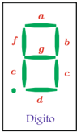

# 2.3.3 Error Admisible en Instrumentos de Indicación Digital

Tags: #eli214
## 2.3.3. Error Admisible en Instrumentos de Indicación Digital

Los instrumentos de indicación digital tienen un conjunto limitado de dígitos para representar el número que valora o cuantifica el resultado de una medición.

Cuando se habla que un instrumento tiene ' X ' dígitos, se indica justamente la cantidad de dígitos disponibles que cada uno va de 0 a 9 .

Si un instrumento tiene X = 3 dígitos podrá informar magnitudes con una secuencia lógica:

$$0 0 0 , 0 0 1 , 0 0 2 , \dots , 1 0 0 , 1 0 1 , 1 0 2 , \dots , 9 9 9$$

Lo cual permite decir que el instrumento hace ' 1000 cuentas '.

Cuando se habla que un instrumento tiene ' Y 1 2 ' dígitos, se indica que se tienen Y dígitos disponibles de 0 a 9 y un dígito ( el más significativo ) de 0 a 1 .

Si un instrumento tiene 3 1 2 dígitos podrá informar magnitudes con una secuencia lógica:

$$0 0 0 0 , 0 0 0 1 , 0 0 0 2 , \dots , 0 9 9 9 , 1 0 0 0 , 1 0 0 1 , \dots , 1 9 9 9$$

Lo cual permite decir que el instrumento hace ' 2000 cuentas '.

La resolución de un instrumento es la cuenta mínima que éste puede hacer, la cual está sujeto al rango del instrumento, y el rango es la selección o ajuste de la magnitud medida por el dígito indicador. Se traduce en el posicionamiento del punto decimal.

Ejemplo: Considere un voltímetro multirango de 3 1 2 dígitos y determine su resolución:

| Rango   | Display digital   | Resolución   |
|---------|-------------------|--------------|
| 200mV   | 000.1 mV          | 0 , 1mV      |
| 2V      | 0.001 V           | 0 , 001V     |
| 20V     | 00.01 V           | 0 , 01V      |
| 200V    | 000.1 V           | 0 , 1V       |

En equipos de indicación digital el error admisible se define como:

$$\varepsilon _ { a d m } = \pm \, \% \, \text {Lectura} + \text {Número de Cuentas} = \pm \, \% \, \text {Lectura} + \, \% \, \text {Rango}$$

Ejemplo: Considere un instrumento de 3 1 2 dígitos con ε adm = 0 , 2 % Lectura +3 Cuentas de rangos 0 -20 -200V . Si se miden 13V , determine el error admisible para cada escala con tal lectura:

$$R a g \, 2 0 V \colon \varepsilon _ { a d m } = \frac { 0 , 2 } { 1 0 0 } \cdot ( 1 3 , 0 0 ) + 3 \cdot 0 , 0 1 = 0 , 0 6 V = 0 , 4 6 \%$$

$$Rango 2 0 V \colon & \varepsilon _ { a d m } = \frac { 0 , 2 } { 1 0 0 } \cdot ( 1 3 , 0 0 ) + 3 \cdot 0 , 0 1 = 0 , 0 6 V = 0 , 4 6 \% \\ & \quad \cdot . \quad 1 3 , 0 0 \pm 0 , 0 6 \ [ V ] = 1 3 , 0 0 \ [ V ] \ \pm 0 , 4 6 \ [ \% ] \\ Rango 2 0 V \colon & \varepsilon _ { a d m } = \frac { 0 , 2 } { 1 0 0 } \cdot ( 1 3 , 0 ) + 3 \cdot 0 , 1 = 0 , 3 V = 2 , 3 \% \\ & \quad \cdot . \quad 1 3 , 0 \pm 0 , 3 \ [ V ] = 1 3 , 0 0 \ [ V ] \ \pm 2 , 3 \ [ \% ]$$

