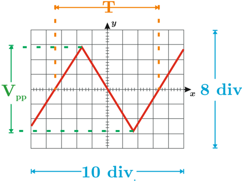

# 2.3.4 Error Admisible en Instrumentos de Pantalla Reticulada

Tags: #eli214
## 2.3.4. Error Admisible en Instrumentos de Pantalla Reticulada

Los Instrumentos de pantalla reticulada son aquellos capaces de graficar casi en tiempo real una variable a medir en función del tiempo (Modo Y-t ) o en función de otra variable que típicamente también es función del tiempo (Modo paramétrico X-Y ).

En la actualidad lo más común es emplear como instrumento 'graficador' al osciloscopio . De este modo tendremos un error para cada uno de los ejes:

El osciloscopio básicamente mide variables que puedan ser expresadas o transformadas en tensión eléctrica, como por ejemplo:

Corriente que para por una resistencia .

Estas variables normalmente se expresan en el eje vertical como función del tiempo; tiempo que a su vez se expresa eje horizontal (Modo Y-t ).

El error admisible se expresa como un porcentaje del reticulado total que dispone el equipo. A saber tenemos que lo usual es tener 10 divisiones para el eje horizontal y 8 para el eje vertical.

a.Vertical: ε V

b.Horizontal: ε H

Ejemplo: Considere un osciloscopio midiendo una señal de tensión triangular en el tiempo (Modo Y-t ). Del osciloscopio se sabe que está a 0 , 5V / div con ε v = 2% y a 2 ms/div con ε h = 3% .

De la gráfica se tiene:

Escala vertical: V pp = 6 , 00div · 0 , 5V / div = 3 , 00V , para el error se tiene ε v = ± 2 · (8div) · (0 , 5V / div) = ± 0 , 08V .

$$\colon 3 , 0 0 \pm 0 , 0 8 \, \left [ V \right ] = 3 , 0 0 \, \left [ V \right ] \, \pm 2 , 7 \, \left [ \, \% \right ]$$

Escala horizontal: T = 6 , 80div · 2ms / div = 13 , 6ms ε h = ± 3 · (10div) · (2ms / div) = ± 0 , 6ms .

, para el error se tiene

$$\colon \ 1 3 , 6 \pm 0 , 6 \ [ m s ] = 1 3 , 6 \ [ m s ] \ \pm 3 , 7 \ [ \% ]$$

