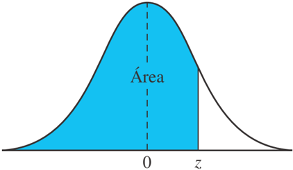
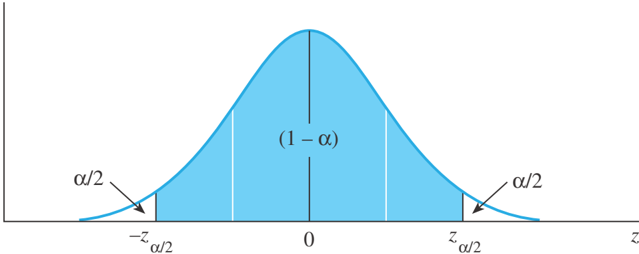
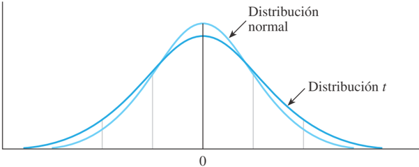
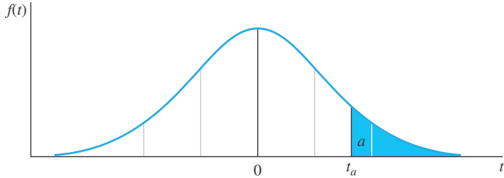

# 2.3.6 Intervalo de confianza

Tags: #eli214
## 2.3.6. Intervalo de confianza

Si se tuviese un conjunto de datos infinitos ( n ⇝ ∞ ) y suponemos que la distribución de datos fuese según la 'Distribución Normal' la cual convenientemente se trabaja mediante datos de tabulados, previamente estandarizados a valor central ' 0 ' y desviación estándar ' 1 '. Permite a partir de ella establecer una cierta probabilidad bajo una cierta condición. TRIAL MODE - a valid license will remove this message. See the keywords property of this PDF for more information.

Figura 2.3: Probabilidad como función de área de una distribución/función Normal estandarizada

Ejemplo: Determine la probabilidad que en una distribución Normal estandarizada , la variable Z sea: a ) z ⩽ 1 y b ) -1 ⩽ z ⩽ 1 .

Respuesta: Las tablas estandarizadas nos proveen directamente la probabilidad asociada al área acumulada bajo la curva, notando además que z = 1 corresponde por definición al valor de hasta la desviación estándar.

Por tanto y por inspección simple, se tiene que para el caso z ⩽ 1 la probabilidad será de P ( z ⩽ 1) = 84 , 13 % .

Para determinar el caso -1 ⩽ z ⩽ 1 , se debe simplemente recordar la equivalencia: P ( -1 ⩽ z ⩽ 1) = P ( z ⩽ 1) -P ( z ⩽ -1) = 84 , 13 -15 , 87 = 68 , 26 % .

TRIAL MODE - a valid license will remove this message. See the keywords property of this PDF for more information.

Note que por la simetría de la distribución P ( z ⩽ -1) = 1 -P ( z ⩽ 1) .

688

❍

APÉNDICE I

TABLAS

Del mismo modo se puede evaluar y concluir cual es la probabilidad obtenida al desplazarse del promedio estandarizado ( x = 0 ) en ± 2 σ y en ± 3 σ , obteniéndose:

* ± 1 σ = P ( -1 ⩽ z ⩽ 1) = 84 , 13 -15 , 87 = 68 , 26 % . Área
* ± 2 σ = P ( -2 ⩽ z ⩽ 2) = 97 , 72 -2 , 28 = 95 , 44 % . z 0
* ± 3 σ = P ( -3 ⩽ z ⩽ 3) = 99 , 87 -0 , 13 = 99 , 74 %

TABLA 3

Áreas bajo la curva normal

Tabla 2.1: Distribución Normal tabulada (1)

| z     |   .00 |   .01 |   .02 |   .03 |   .04 |   .05 |   .06 |   .07 |   .08 |   .09 |
|-------|-------|-------|-------|-------|-------|-------|-------|-------|-------|-------|
| - 3.4 | .0003 | .0003 | .0003 | .0003 | .0003 | .0003 | .0003 | .0003 | .0003 | .0002 |
| - 3.3 | .0005 | .0005 | .0005 | .0004 | .0004 | .0004 | .0004 | .0004 | .0004 | .0003 |
| - 3.2 | .0007 | .0007 | .0006 | .0006 | .0006 | .0006 | .0006 | .0005 | .0005 | .0005 |
| - 3.1 | .0010 | .0009 | .0009 | .0009 | .0008 | .0008 | .0008 | .0008 | .0007 | .0007 |
| - 3.0 | .0013 | .0013 | .0013 | .0012 | .0012 | .0011 | .0011 | .0011 | .0010 | .0010 |
| - 2.9 | .0019 | .0018 | .0017 | .0017 | .0016 | .0016 | .0015 | .0015 | .0014 | .0014 |
| - 2.8 | .0026 | .0025 | .0024 | .0023 | .0023 | .0022 | .0021 | .0021 | .0020 | .0019 |
| - 2.7 | .0035 | .0034 | .0033 | .0032 | .0031 | .0030 | .0029 | .0028 | .0027 | .0026 |
| - 2.6 | .0047 | .0045 | .0044 | .0043 | .0041 | .0040 | .0039 | .0038 | .0037 | .0036 |
| - 2.5 | .0062 | .0060 | .0059 | .0057 | .0055 | .0054 | .0052 | .0051 | .0049 | .0048 |
| - 2.4 | .0082 | .0080 | .0078 | .0075 | .0073 | .0071 | .0069 | .0068 | .0066 | .0064 |
| - 2.3 | .0107 | .0104 | .0102 | .0099 | .0096 | .0094 | .0091 | .0089 | .0087 | .0084 |
| - 2.2 | .0139 | .0136 | .0132 | .0129 | .0125 | .0122 | .0119 | .0116 | .0113 | .0110 |
| - 2.1 | .0179 | .0174 | .0170 | .0166 | .0162 | .0158 | .0154 | .0150 | .0146 | .0143 |
| - 2.0 | .0228 | .0222 | .0217 | .0212 | .0207 | .0202 | .0197 | .0192 | .0188 | .0183 |
| - 1.9 | .0287 | .0281 | .0274 | .0268 | .0262 | .0256 | .0250 | .0244 | .0239 | .0233 |
| - 1.8 | .0359 | .0351 | .0344 | .0336 | .0329 | .0322 | .0314 | .0307 | .0301 | .0294 |
| - 1.7 | .0446 | .0436 | .0427 | .0418 | .0409 | .0401 | .0392 | .0384 | .0375 | .0367 |
| - 1.6 | .0548 | .0537 | .0526 | .0516 | .0505 | .0495 | .0485 | .0475 | .0465 | .0455 |
| - 1.5 | .0668 | .0655 | .0643 | .0630 | .0618 | .0606 | .0594 | .0582 | .0571 | .0559 |
| - 1.4 | .0808 | .0793 | .0778 | .0764 | .0749 | .0735 | .0722 | .0708 | .0694 | .0681 |
| - 1.3 | .0968 | .0951 | .0934 | .0918 | .0901 | .0885 | .0869 | .0853 | .0838 | .0823 |
| - 1.2 | .1151 | .1131 | .1112 | .1093 | .1075 | .1056 | .1038 | .1020 | .1003 | .0985 |
| - 1.1 | .1357 | .1335 | .1314 | .1292 | .1271 | .1251 | .1230 | .1210 | .1190 | .1170 |
| - 1.0 | .1587 | .1562 | .1539 | .1515 | .1492 | .1469 | .1446 | .1423 | .1401 | .1379 |
| - 0.9 | .1841 | .1814 | .1788 | .1762 | .1736 | .1711 | .1685 | .1660 | .1635 | .1611 |
| - 0.8 | .2119 | .2090 | .2061 | .2033 | .2005 | .1977 | .1949 | .1922 | .1894 | .1867 |
| - 0.7 | .2420 | .2389 | .2358 | .2327 | .2296 | .2266 | .2236 | .2206 | .2177 | .2148 |
| - 0.6 | .2743 | .2709 | .2676 | .2643 | .2611 | .2578 | .2546 | .2514 | .2483 | .2451 |
| - 0.5 | .3085 | .3050 | .3015 | .2981 | .2946 | .2912 | .2877 | .2843 | .2810 | .2776 |
| - 0.4 | .3446 | .3409 | .3372 | .3336 | .3300 | .3264 | .3228 | .3192 | .3156 | .3121 |
| - 0.3 | .3821 | .3783 | .3745 | .3707 | .3669 | .3632 | .3594 | .3557 | .3520 | .3483 |
| - 0.2 | .4207 | .4168 | .4129 | .4090 | .4052 | .4013 | .3974 | .3936 | .3897 | .3859 |
| - 0.1 | .4602 | .4562 | .4522 | .4483 | .4443 | .4404 | .4364 | .4325 | .4286 | .4247 |
| - 0.0 | .5000 | .4960 | .4920 | .4880 | .4840 | .4801 | .4761 | .4721 | .4681 | .4641 |

/g1/g1/g12/g12/g12/g2/g3/g10/g6/g6/g4/g7/g5/g10/g9/g11/g2/g8/g6

TABLAS

APÉNDICE I

❍

689

Tabla 2.2: Distribución Normal tabulada (2)

|   z |   .00 |   .01 |   .02 |   .03 |   .04 |   .05 |   .06 |   .07 |   .08 |   .09 |
|-----|-------|-------|-------|-------|-------|-------|-------|-------|-------|-------|
| 0.0 | .5000 | .5040 | .5080 | .5120 | .5160 | .5199 | .5239 | .5279 | .5319 | .5359 |
| 0.1 | .5398 | .5438 | .5478 | .5517 | .5557 | .5596 | .5636 | .5675 | .5714 | .5753 |
| 0.2 | .5793 | .5832 | .5871 | .5910 | .5948 | .5987 | .6026 | .6064 | .6103 | .6141 |
| 0.3 | .6179 | .6217 | .6255 | .6293 | .6331 | .6368 | .6406 | .6443 | .6480 | .6517 |
| 0.4 | .6554 | .6591 | .6628 | .6664 | .6700 | .6736 | .6772 | .6808 | .6844 | .6879 |
| 0.5 | .6915 | .6950 | .6985 | .7019 | .7054 | .7088 | .7123 | .7157 | .7190 | .7224 |
| 0.6 | .7257 | .7291 | .7324 | .7357 | .7389 | .7422 | .7454 | .7486 | .7517 | .7549 |
| 0.7 | .7580 | .7611 | .7642 | .7673 | .7704 | .7734 | .7764 | .7794 | .7823 | .7852 |
| 0.8 | .7881 | .7910 | .7939 | .7967 | .7995 | .8023 | .8051 | .8078 | .8106 | .8133 |
| 0.9 | .8159 | .8186 | .8212 | .8238 | .8264 | .8289 | .8315 | .8340 | .8365 | .8389 |
| 1.0 | .8413 | .8438 | .8461 | .8485 | .8508 | .8531 | .8554 | .8577 | .8599 | .8621 |
| 1.1 | .8643 | .8665 | .8686 | .8708 | .8729 | .8749 | .8770 | .8790 | .8810 | .8830 |
| 1.2 | .8849 | .8869 | .8888 | .8907 | .8925 | .8944 | .8962 | .8980 | .8997 | .9015 |
| 1.3 | .9032 | .9049 | .9066 | .9082 | .9099 | .9115 | .9131 | .9147 | .9162 | .9177 |
| 1.4 | .9192 | .9207 | .9222 | .9236 | .9251 | .9265 | .9279 | .9292 | .9306 | .9319 |
| 1.5 | .9332 | .9345 | .9357 | .9370 | .9382 | .9394 | .9406 | .9418 | .9429 | .9441 |
| 1.6 | .9452 | .9463 | .9474 | .9484 | .9495 | .9505 | .9515 | .9525 | .9535 | .9545 |
| 1.7 | .9554 | .9564 | .9573 | .9582 | .9591 | .9599 | .9608 | .9616 | .9625 | .9633 |
| 1.8 | .9641 | .9649 | .9656 | .9664 | .9671 | .9678 | .9686 | .9693 | .9699 | .9706 |
| 1.9 | .9713 | .9719 | .9726 | .9732 | .9738 | .9744 | .9750 | .9756 | .9761 | .9767 |
| 2.0 | .9772 | .9778 | .9783 | .9788 | .9793 | .9798 | .9803 | .9808 | .9812 | .9817 |
| 2.1 | .9821 | .9826 | .9830 | .9834 | .9838 | .9842 | .9846 | .9850 | .9854 | .9857 |
| 2.2 | .9861 | .9864 | .9868 | .9871 | .9875 | .9878 | .9881 | .9884 | .9887 | .9890 |
| 2.3 | .9893 | .9896 | .9898 | .9901 | .9904 | .9906 | .9909 | .9911 | .9913 | .9916 |
| 2.4 | .9918 | .9920 | .9922 | .9925 | .9927 | .9929 | .9931 | .9932 | .9934 | .9936 |
| 2.5 | .9938 | .9940 | .9941 | .9943 | .9945 | .9946 | .9948 | .9949 | .9951 | .9952 |
| 2.6 | .9953 | .9955 | .9956 | .9957 | .9959 | .9960 | .9961 | .9962 | .9963 | .9964 |
| 2.7 | .9965 | .9966 | .9967 | .9968 | .9969 | .9970 | .9971 | .9972 | .9973 | .9974 |
| 2.8 | .9974 | .9975 | .9976 | .9977 | .9977 | .9978 | .9979 | .9979 | .9980 | .9981 |
| 2.9 | .9981 | .9982 | .9982 | .9983 | .9984 | .9984 | .9985 | .9985 | .9986 | .9986 |
| 3.0 | .9987 | .9987 | .9987 | .9988 | .9988 | .9989 | .9989 | .9989 | .9990 | .9990 |
| 3.1 | .9990 | .9991 | .9991 | .9991 | .9992 | .9992 | .9992 | .9992 | .9993 | .9993 |
| 3.2 | .9993 | .9993 | .9994 | .9994 | .9994 | .9994 | .9994 | .9995 | .9995 | .9995 |
| 3.3 | .9995 | .9995 | .9995 | .9996 | .9996 | .9996 | .9996 | .9996 | .9996 | .9997 |
| 3.4 | .9997 | .9997 | .9997 | .9997 | .9997 | .9997 | .9997 | .9997 | .9997 | .9998 |

Se puede concluir que para obtener un intervalo de confianza del 95,44 %, habrá que abarcar una holgura de ± 2 σ desde la medida central, es decir:

x ± 2 σ

/g1/g1/g12/g12/g12/g2/g3/g10/g6/g6/g4/g7/g5/g10/g9/g11/g2/g8/g6 Intervalo de confianza: Si se tiene una variable aleatoria X cuya distribución depende de un parámetro ˜ x , que muchas veces puede ser el valor verdadero que se desconoce, pero interesa determinar en qué rango con certeza o confianza se encuentra , y sean x 1 · · · x n una muestra aleatoria simple de un conjunto X , se tiene que a partir de dos estimadores T 1 ( x 1 · · · x n ) y T 2 ( x 1 · · · x n ) , establecen un rango de localización de ˜ x , según:

$$\mathbb { P } ( T _ { 1 } \leqslant \tilde { x } \leqslant T _ { 2 } ) = 1 - \alpha$$

Luego, el intervalo I = [ T 1 ; T 2 ] se llama intervalo de confianza , de probabilidad o coeficiente de confianza ' 1 -α '. En los casos donde se usan distribuciones Normales se obtiene que URA 8.8

cación de

z

a

/2

●

se dan en la tabla 8.2.

T 1 = ¯ x -c y T 2 = ¯ x + c , donde c dependerá del valor ' 1 -α ' elegido, donde ' ¯ x ' es el promedio de los datos x 1 · · · x n definido básicamente como un estimador puntual . f ( z )

Figura 2.4: Intervalo de confianza 1 -α

## Ejemplo conceptual :

INTERVALO DE CONFIANZA DE MUESTRA GRANDE (1 /H11546 a )100% Considere el juego de 'dardos' donde el seleccionado nacional sabe que es capaz de dar en torno al blanco limitado por una circunferencia perfecta de 5 cm de diámetro, el 95 % de los intentos.

±

(Estimador puntual)

z

a

/2

×

(error estándar del estimador)

donde z es el valor z con un área a /2 en la cola derecha de una distribución Suponga ahora que el seleccionado nacional hace 10 lanzamientos, que ante la confianza anterior implica que si hiciera 100 lanzamientos en vez de 10, erraría 5 de ellos.

Suponga que el juez del evento no es capaz de ver el blanco ni saber donde está, pero si tiene acceso a observar la posición final de cada uno de los 10 dardos. Ante este caso el juez decide por cada disparo trazar una circunferencia de 5 cm de radio, con centro en cada uno de los dardos.

Por lo tanto, el juez sin saber donde está el verdadero centro del blanco, puede decir que se encuentra dentro del 95 % de los círculos trazados .

Se puede apreciar que para obtener un cierto intervalo de confianza en una curva Normal, se requiere evaluar la expresión: P ( -z α/ 2 ⩽ z ⩽ z α/ 2 ) .

Ejemplo: Para un z estandarizado Normal ¿Qué intervalo de confianza permite tener el 95 % de certeza?

Respuesta: 95 % equivale a α = 1 -0 , 95 = 0 , 05 . Como la distribución Normal es simétrica, las colas de la curva se posicionan en [ -z α/ 2 ; z α/ 2 ] , donde α/ 2 = 0 , 025 y por lo cual ± z α/ 2 = ± 1 , 96 (Ver tabla 2.1 para área acumulada 0 , 250 y 0 , 975 ).

FIGURA 10.1

Estándar normal

z

y la

distribución

t

con 5 grados

de libertad

MI

Para una

df

=

n

-

Si el intervalo [ -z α/ 2 ; z α/ 2 ] se requiere para una distribución no estandarizada, ésta se debe desestandarizar según:

$$\pm c = \pm ( \sigma ) \cdot z _ { \alpha / 2 } \Rightarrow I = [ T _ { 1 } ; T _ { 2 } ] = [ \bar { x } - c ; \bar { x } + c ]$$

Cuando en un ensayo no se tienen suficientes datos, no es posible tener la desviación estándar poblacional ( σ ) que define la distribución Normal. Por ello, con los pocos datos sólo es posible tener una desviación estándar muestral ( s ) y con ello la necesidad de utilizar una distribución ' t ' que justamente incorpora la cantidad de datos disponibles y si éstos tienden a infinito, la distribución ' t ' tiende a la Normal. más y más información. En última instancia, cuando n sea infi  nitamente gra las distribuciones t y z son idénticas.

●

Figura 2.5: Comparación distribución Normal y t

-

El divisor ( n 1) en la fórmula para la varianza muestral s se denomina núm grados de libertad ( df ) asociados con s 2 . Determina la forma de la distribució origen del término grados de libertad es teórico y se refiere al número de desvia independientes elevadas al cuadrado en s 2 existentes para estimar s 2 . Estos gra libertad pueden cambiar para diferentes aplicaciones y, como especifican la distri t correcta a usar, es necesario recordar que hay que calcular los grados de libertad c t de una muestra, 1 . CONSEJO En forma, la distribución ' t ' es muy similar a la distribución normal, ambas centradas en 'cero' cuando están estandarizadas , 'cero' que representa la media. En la distribución t el centro es más bajo y las dos colas son más gruesas, que se asocian a que la poca información genera una dispersión mayor en los extremos y se puede tener una mayor variación en los datos más alejados del centro.

tos para cada aplicación.

La tabla de probabilidades para la distribución z normal estándar ya no es úti calcular valores críticos o valores p para el estadístico p . En lugar de ello, se u tabla  4  del  apéndice  I  que  se  reproduce  parcialmente  en  la  tabla  10.1.  Al  indi número particular de grados de libertad, la tabla registra t , un valor de t que tien La lectura de esta distribución, para entender como se entregan los datos de tabla, es: Dada una probabilidad ' a ', definida como el área de la distribución a la derecha del valor t a hasta ∞ , sujeto a cierto número de grados de libertad según la cantidad de datos disponibles 6 , ¿Cuál es el valor t = t a que satisface la condición anterior?

6 Llamados por nomenclatura ν ó df .

2

words property of this PDF for more information.

FIGURA 10.2

Valores tabulados de la

de Student

TABLA 4

Valores críticos

de

t

| df   |   t .100 |   t .050 | t .025                                                                 |   t .010 |   t .005 | df   |
|------|----------|----------|------------------------------------------------------------------------|----------|----------|------|
| 1    |    3.078 |    6.314 | /g1/g1/g12/g12/g12/g2/g3/g10/g6/g6/g4/g7/g5/g10/g9/g11/g2/g8/g6 12.706 |   31.821 |   63.657 | 1    |
| 2    |    1.886 |    2.920 | 4.303                                                                  |    6.965 |    9.925 | 2    |
| 3    |    1.638 |    2.353 | 3.182                                                                  |    4.541 |    5.841 | 3    |
| 4    |    1.533 |    2.132 | 2.776                                                                  |    3.747 |    4.604 | 4    |
| 5    |    1.476 |    2.015 | 2.571                                                                  |    3.365 |    4.032 | 5    |
| 6    |    1.440 |    1.943 | 2.447                                                                  |    3.143 |    3.707 | 6    |
| 7    |    1.415 |    1.895 | 2.365                                                                  |    2.998 |    3.499 | 7    |
| 8    |    1.397 |    1.860 | 2.306                                                                  |    2.896 |    3.355 | 8    |
| 9    |    1.383 |    1.833 | 2.262                                                                  |    2.821 |    3.250 | 9    |
| 10   |    1.372 |    1.812 | 2.228                                                                  |    2.764 |    3.169 | 10   |
| 11   |    1.363 |    1.796 | 2.201                                                                  |    2.718 |    3.106 | 11   |
| 12   |    1.356 |    1.782 | 2.179                                                                  |    2.681 |    3.055 | 12   |
| 13   |    1.350 |    1.771 | 2.160                                                                  |    2.650 |    3.012 | 13   |
| 14   |    1.345 |    1.761 | 2.145                                                                  |    2.624 |    2.977 | 14   |
| 15   |    1.341 |    1.753 | 2.131                                                                  |    2.602 |    2.947 | 15   |
| 16   |    1.337 |    1.746 | 2.120                                                                  |    2.583 |    2.921 | 16   |
| 17   |    1.333 |    1.740 | 2.110                                                                  |    2.567 |    2.898 | 17   |
| 18   |    1.330 |    1.734 | 2.101                                                                  |    2.552 |    2.878 | 18   |
| 19   |    1.328 |    1.729 | 2.093                                                                  |    2.539 |    2.861 | 19   |
| 20   |    1.325 |    1.725 | 2.086                                                                  |    2.528 |    2.845 | 20   |
| 21   |    1.323 |    1.721 | 2.080                                                                  |    2.518 |    2.831 | 21   |
| 22   |    1.321 |    1.717 | 2.074                                                                  |    2.508 |    2.819 | 22   |
| 23   |    1.319 |    1.714 | 2.069                                                                  |    2.500 |    2.807 | 23   |
| 24   |    1.318 |    1.711 | 2.064                                                                  |    2.492 |    2.797 | 24   |
| 25   |    1.316 |    1.708 | 2.060                                                                  |    2.485 |    2.787 | 25   |
| 26   |    1.315 |    1.706 | 2.056                                                                  |    2.479 |    2.779 | 26   |
| 27   |    1.314 |    1.703 | 2.052                                                                  |    2.473 |    2.771 | 27   |
| 28   |    1.313 |    1.701 | 2.048                                                                  |    2.467 |    2.763 | 28   |
| 29   |    1.311 |    1.699 | 2.045                                                                  |    2.462 |    2.756 | 29   |
| ∞    |    1.282 |    1.645 | 1.960                                                                  |    2.326 |    2.576 | ∞    |

FUENTE:

De 'Table of Percentage Points of the

permiso de los fi  deicomisarios de

t

-Distribution' ,

Biometrika

32 (1941):300. Reproducida con

Biometrika . Tabla 2.3: Distribución t tabulada

Ejemplo matemático: En una distribución Normal para obtener la cobertura 1 -α = 0 , 95 = 95% necesitamos observar que la cola superior e inferior son α/ 2 = 0 , 025 = 2 , 5 % y el valor de la distribución que satisface lo anterior, pensando solamente en el área de la cola derecha α/ 2 , es Z α/ 2 = 1 , 96 .

Si se desea analizar el valor de una distribución t para a = 0 , 025 = 2 , 5 % que por simetría implicaría también una cobertura del 95 % , se aprecia que los valores de t que satisfacen lo anterior son: t a = t 0 , 025 = 12 , 706 | ν =1 , t a = t 0 , 025 = 2 , 131 | ν =15 y t a = t 0 , 025 = 2 , 060 | ν =25 .

Por lo tanto a medida que aumentan los grados de libertad, la dispersión de los datos disminuye y se tiene un valor de t menor. Si se consideran infinitos grados de libertad,

t

●

tabla  4  del  apéndice  I  que  se  reproduce  parcialmente  en  la  tabla  10.1.  Al  indizar  un

número particular de grados de libertad, la tabla registra

a

t

a

, un valor de

de cola a su derecha, como se ve en la figura 10.2.

t

que tiene área

$$\text { se obtiene } t _ { a } = t _ { 0 , 0 2 5 } = 1 , 9 6 0 | _ { \nu = \infty } .$$

Ejemplo eléctrico: Se mide en el transcurso de un día la corriente de un circuito dando los siguientes valores: 3 , 27A ; 3 , 32A ; 3 , 19A ; 3 , 25A y 3 , 29A .

El valor medio de la muestra es ¯ x = 3 , 264A y la desviación estándar muestral es s = 0 , 0488A . Note las cifras significativas empleadas.

Si por un instante suponemos distribución Normal podemos decir que el 68 , 26 % de los valores está entre el intervalo T 1 = ¯ x -s = 3 , 215A y T 2 = ¯ x + s = 3 , 313A . Según los datos que se tienen y el intervalo anterior, podemos apreciar que solamente 3 de los 5 datos pertenecen, lo cual corresponde tan solo al 60 % ( 100 % · 3 / 5 ).

Si se utiliza para describir los datos anteriores una distribución t con ν = 4 deseando tener un 95 % de cobertura, se obtiene el valor de t a = t 2 , 5 % = 2 , 776 . Claramente hay que recordar que este valor está estandarizado, por ende el intervalo de cobertura será:

$$\bar { x } \pm t _ { a } \cdot s = 3 , 2 6 4 \pm 2 , 7 7 6 \cdot 0 , 0 4 8 8 = 3 , 2 6 4 \pm 0 , 1 3 5 5 A$$

Si suponemos que los datos disponibles hubiesen sido 25 , el resultado con una cobertura del 95 % , habría sido:

$$\bar { x } \pm t _ { a } \cdot s = 3 , 2 6 4 \pm 2 , 0 6 0 \cdot 0 , 0 4 8 8 = 3 , 2 6 4 \pm 0 , 1 0 0 5 A$$

Y finalmente con infinitos datos, siendo una distribución Normal:

$$\bar { x } \pm t _ { a } \cdot s = 3 , 2 6 4 \pm 1 , 9 6 0 \cdot 0 , 0 4 8 8 = 3 , 2 6 4 \pm 0 , 0 9 5 6 A$$

## En resumen tenemos:

Si se busca hacer un símil con la distribución Normal, y expresar el valor medio más menos ( ± ) una desviación, se aprecia que se tiene la siguiente forma:

$$\bar { x } \pm s \cdot t _ { a } = \bar { x } \pm s \cdot k _ { 9 5 \% }$$

Donde en este caso k 95 % = t a = t 0 , 025 es el factor de cobertura para el 95 %.

En este caso s es la desviación estándar de la muestra que considera como si fuese una incertidumbre ( 'Evaluation of the Uncertainty of Measurement in Calibration' ):

$$s = \frac { \sigma } { \sqrt { n } }$$

