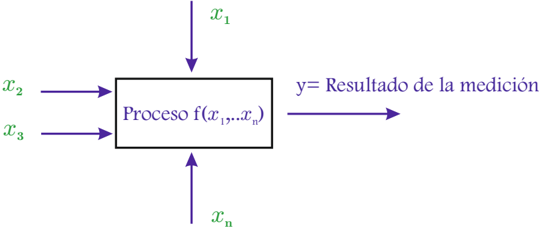

# 2.3.7 Propagación de errores e incertidumbres

Tags: #eli214
## 2.3.7. Propagación de errores e incertidumbres

Si el resultado de una medición y es una función o un proceso en base a los valores medidos de distintas cantidades, simplemente llamados valores de entrada ( x i ; ∀ i : 1 -→ n ), que fueron a su vez obtenidos bajo una cierta condición más o menos controlada ( x i = x i ± ε x i ó x i = x i ± µ x i ), al pasar por este proceso ( f { - → x } ) nos dará un valor resultante y , más un error ( ε y ) y/o una incertidumbre ( µ y ) que será dependiente de los errores o incertidumbres de cada valor de entrada ( ε x i y µ x i ).

Que el error/incertidumbre de ' y ' sea función de los errores/incertidumbres de los valores de entrada, es lo que se llama 'propagación' .

El proceso de propagación se puede abordar desde los errores conocidos ( si se logran conocer ) o desde las incertidumbres ( si se estiman ).

Figura 2.6: Proceso de medición

Por consiguiente:

$$y = f \{ \overrightarrow { x } \} = f \{ x _ { 1 } , x _ { 2 } , x _ { 3 } \dots x _ { n } \}$$

Si solamente se tuvieran los valores centrales sin incertidumbres, se tendría por evaluación simple el valor resultante como:

$$\bar { y } = y _ { Q } = f \{ \bar { x } _ { 1 } , \bar { x } _ { 2 } , \bar { x } _ { 3 } \dots \bar { x } _ { n } \}$$

Para estimar el error que se propaga, una forma es considerar que los errores ( ε x i = ∆ x i ó µ x i = ∆ x i ) son pequeñas perturbaciones alrededor a un punto de operación y = f { ¯ ⃗ x } , y por ello utilizar la serie de Taylor hasta la primera derivada:

$$y = y _ { Q } + \sum _ { i = 1 } ^ { n } \left \{ \frac { \partial f } { \partial x _ { i } } \right | _ { Q } \cdot \Delta x _ { i } \right \}$$

Claramente que esta definición presenta el problema que por la forma de la función ( y ) y signos de los errores, en algunos casos éstos se sumarán y en otros se anularán, no entregando una adecuada medida de confianza.

Ejemplo: Para determinar el cos ( φ ) se mide convenientemente la potencia activa P con un error de +3% , la tensión U con un error +2% y la corriente I con +2 , 5 % . Si se conocen los valores de las mediciones, rápidamente se obtiene que cos ( φ ) = P/ ( U · I ) , por lo cual al centrarnos en la propagación del error tendremos que:

$$y \equiv \cos ( \phi ) = f \left \{ P , U , I \right \} \approx y _ { Q } + \left ( \frac { 1 } { U \cdot I } \right ) _ { Q } \cdot \Delta P - \left ( \frac { P } { U ^ { 2 } \cdot I } \right ) _ { Q } \cdot \Delta U - \left ( \frac { P } { U \cdot I ^ { 2 } } \right ) _ { Q } \cdot \Delta I \ \Big |$$

Lo cual se puede reescribir como:

$$y - y _ { Q } = \left ( \frac { P } { U \cdot I } \right ) _ { Q } \cdot \frac { \Delta P } { P } - \left ( \frac { P } { U \cdot I } \right ) _ { Q } \cdot \frac { \Delta U } { U } - \left ( \frac { P } { U \cdot I } \right ) _ { Q } \cdot \frac { \Delta I } { I }$$

Luego:

$$\frac { y - y _ { Q } } { ( \frac { P } { U \cdot I } ) _ { Q } } = \frac { \Delta P } { P } - \frac { \Delta U } { U } - \frac { \Delta I } { I } \Longleftrightarrow \varepsilon _ { y } = ( 1 ) \cdot \varepsilon _ { P } + ( - 1 ) \cdot \varepsilon _ { U } + ( - 1 ) \cdot \varepsilon _ { I } = - 1 , 5 \%$$

En términos generales si f ( ⃗ x ) = ∏ x α i i , el error porcentual de la función de salida ε y será:

$$\varepsilon _ { y } = \sum _ { i } \left ( \alpha _ { i } \cdot \varepsilon _ { x _ { i } } \right )$$

Este tipo de propagación de errores se usa poco por la métrica empleada que tiende en algunos casos a minimizar el error. Por ello, se busca mejorar las expresiones anteriores usando directamente las incertidumbres.

