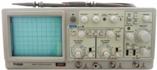
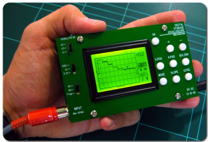
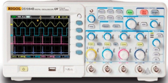
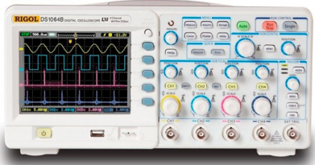
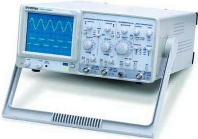

# 2.4.2 Operaciones considerando cifras significativas

Tags: #eli214
## 2.4.2. Operaciones considerando cifras significativas

Al efectuar operaciones matemáticas con números originados en mediciones, se debe tener especial cuidado de no modificar la información contenida en ellos tomando en cuenta las cifras significativas y la cantidad de decimales.

Suma o Resta: El resultado debe contener tantas cifras significativas a la derecha de la coma decimal como los que hay en el sumando que tenga la menor cantidad de tales cifras , con lo cual deberá hacerse redondeo o truncamiento de la información adicional que arroje la operación. Por ejemplo :

$$5 8 5 , 3 1 + 2 4 , 2 = 6 0 9 , 5 \\ 1 5 0 0 + 0 , 0 2 = 1 5 0 0 \\ 0 , 7 8 + 1 , 2 = 2 , 0 \\ 1 , 5 2 - 0 , 3 = 1 , 2$$

Multiplicación o División: El resultado debe contener tantas cifras significativas como las del factor con menor número de ellas , con lo cual deberá hacerse redondeo o truncamiento que arroje la operación. Por ejemplo :

$$3$$

$$5 6 , 2 5 \cdot 2 , 1 3 = 1 2 0 \\ 1 2 \cdot 9 9 , 9 = 1 , 2 \cdot 1 0 ^ { 3 }$$

## Convenio interno:

Para los objetivos del curso, en base a que se poseen calculadoras con memorias capaces de trabajar internamente con gran cantidad de cifras, se recomienda trabajar con todas las cifras posibles de forma interna de modo que no sea introduzcan redondeos o truncamientos. Al el momento de presentar los datos o resultados parciales o finales de un proceso de propagación de errores , ya sea en nomenclatura tradicional o en notación científica, éstos deben contar una cantidad de cifras significativas adecuadas y coherentes con el proceso de medición.

SECCIÓN 2.5

## Sistema de Unidades

Para medir se debe fijar una unidad de comparación que sea estándar, es decir, entendible y reproducible por todos mundialmente. Dado que existen muchas cantidades que se pueden medir, significa que existirían centenares de estándares. Afortunadamente no, por ello fue que se definen a unas pocas unidades como básicas , mientras que el resto son unidades derivadas .

Existen dos reglas que gobiernan la elección de las unidades básicas de una cantidad física :

1. La unidad básica debe ser definida en términos de aquella cantidad física que se pueda medir, con la mayor exactitud, por los instrumentos disponibles.
2. La unidad básica debe ser reproducible en cualquier laboratorio bien equipado, al usar materiales e instrumentos usuales.

Las unidades básicas en el Sistema Internacional de Unidades (S.I.) son: el metro ( longitud ), kilogramo ( masa ), segundo ( tiempo ), Ampére ( intensidad de corriente ), grado Kelvin ( temperatura termodinámica ) y la candela ( intensidad de luz ), de las cuales para nuestro interés podemos especificar:

- Metro ( m ): Distancia entre dos marcas en una barra de platino e iridio ubicada en la Oficina Internacional de Pesos y Medidas de Estándares en Sèvres, Francia . Otra copia se guarda en la Oficina Nacional de Estándares de Washington . Luego, se definió al metro patrón como 1 . 650 . 763 , 73 veces la longitud de onda de la luz anaranjada emitida por los átomos de Kriptón 86 gaseoso. En la actualidad tenemos que el metro patrón es la longitud de la trayectoria recorrida por la luz en el vacío durante un intervalo de tiempo de 1 / 299 . 792 . 458 segundos.

$$1 , 2 / 9 9 , 9 & = 1 , 2 \cdot 1 0 ^ { - 2 } \\ 0 , 0 0 5 \cdot 2 5 , 2 & = 0 , 1$$

- Kilogramo ( kg ): Definido en un cilindro de platino e iridio , también guardado en Sèvres y Washington.
- Segundo ( s ): Originalmente definido como 1/86.400 veces un día solar medio. También definido como 9.192.631.770 períodos de una radiación del isótopo 133 del átomo de cesio ( 133Cs ), a una temperatura de 0K .
- Ampére ( A ): Magnitud de la intensidad de la corriente que fluye por cada uno de dos conductores paralelos separados 1m , resultando entre ellos una fuerza de 2 × 10 -7 N

Las unidades derivadas se obtienen de las unidades básicas por medio de relaciones físicas conocidas, como por ejemplo: volumen en m 3 . A continuación se presenta una tabla con unidades básicas y algunas derivadas.

Tabla 2.6: Unidades básicas y unidades derivadas

| Cantidad          | Nombre          | Símbolo   | Definición                  | Análisis Dimensional       |
|-------------------|-----------------|-----------|-----------------------------|----------------------------|
| Longitud          | metro           | [m]       | Unidad básica Unidad básica | m kg                       |
| Masa              | kilogramo       | [kg]      |                             |                            |
| Tiempo            | segundo         | [s]       | Unidad básica               | s                          |
| Corriente         | Ampére          | [A]       | Unidad básica               | A                          |
| Área              | metro 2         |           | largo x ancho               | m 2                        |
| Aceleración       | metro/segundo 2 |           | velocidad/tiempo            | m / s 2                    |
| Fuerza            | Newton          | [N]       | masa x aceleración          | kg · m / s 2               |
| Trabajo           | Joule           | [J]       | fuerza x longitud           | N · m = kg · m 2 s 2       |
| Potencia          | Watt            | [W]       | Fuerza x velocidad          | J / s = VA = kg · m 2 s 3  |
| Carga             | Coulomb         | [C]       | Corriente x tiempo          | A · s                      |
| Tensión           | Volt            | [V]       | Trabajo/Carga               | J / C = kg · m 2 s 3 · A   |
| Resistencia       | Ohm             | [Ω]       | Tensión/Corriente           | V / A = kg · m 2 s 2 · A 3 |
| Capacitancia      | Faradio         | [F]       | Carga/Tensión               | C / V = A 2 s 4 kg · m 2   |
| Inductancia       | Henry           | [H]       | Tensión x tiempo/corriente  | kg · m 2 s 2 · A 2         |
| Temperatura       | Kelvin          | [K]       | Unidad básica               | K                          |
| Frecuencia        | Hertz           | [Hz]      | ciclos/tiempo               | s - 1                      |
| Intensidad de Luz | candela         | [cd]      | Unidad básica               | cd                         |

Tal como se aprecia en la tabla 2.6, hay muchas unidades derivadas que tienen un símbolo propio, dado su uso frecuente e importancia, por ejemplo, los casos de la tensión y de la potencia.

En el trabajo con dimensiones y magnitudes es de suma importancia el uso y conocimiento de los múltiplos y submúltiplos de las unidades, con el fin de trabajar e informar los resultados de ensayos cuando se trabaja con magnitudes muy pequeñas o muy grandes. Lo anterior se resume en la tabla 2.7

Tabla 2.7: Múltiplos y submúltiplos de unidades

| Símbolo   | prefijo   | multiplicador   |
|-----------|-----------|-----------------|
| Y         | Yotta     | 10 24           |
| Z         | Zetta     | 10 21           |
| E         | Exa       | 10 18           |
| P         | Peta      | 10 15           |
| T         | Tera      | 10 12           |
| G         | Giga      | 10 9            |
| M         | Mega      | 10 6            |
| k         | Kilo      | 10 3            |
| h         | Hecto     | 10 2            |
| da        | Deca      | 10 1            |
| --        |           | 10 0            |
| d         | Deci      | 10 - 1          |
| c         | Centi     | 10 - 2          |
| m         | Mili      | 10 - 3          |
| µ         | Micro     | 10 - 6          |
| n         | Nano      | 10 - 9          |
| ◦ A       | Amstrong  | 10 - 10         |
| p         | Pico      | 10 - 12         |
| f         | Femto     | 10 - 15         |
| a         | Atto      | 10 - 18         |
| z         | Zepto     | 10 - 21         |
| y         | Yocto     | 10 - 24         |

SECCIÓN 2.6

## Tabla para expandir incertidumbres

Tabla 2.8: Distribución 't' para la expansión de incertidumbres

|     | k en función de la probabilidad   | k en función de la probabilidad   | k en función de la probabilidad   | k en función de la probabilidad   | k en función de la probabilidad   | k en función de la probabilidad   |
|-----|-----------------------------------|-----------------------------------|-----------------------------------|-----------------------------------|-----------------------------------|-----------------------------------|
| ν   | 68,27 %                           | 90,00 %                           | 95,00 %                           | 95,45 %                           | 99,00 %                           | 99,73 %                           |
| 1   | 1,84                              | 6,31                              | 12,71                             | 13,97                             | 63,66                             | 235,80                            |
| 2   | 1,32                              | 2,92                              | 4,30                              | 4,53                              | 9,92                              | 19,21                             |
| 3   | 1,20                              | 2,35                              | 3,18                              | 3,31                              | 5,84                              | 9,22                              |
| 4   | 1,14                              | 2,13                              | 2,78                              | 2,87                              | 4,60                              | 6,62                              |
| 5   | 1,11                              | 2,02                              | 2,57                              | 2,65                              | 4,03                              | 5,51                              |
| 6   | 1,09                              | 1,94                              | 2,45                              | 2,52                              | 3,71                              | 4,90                              |
| 7   | 1,08                              | 1,89                              | 2,36                              | 2,43                              | 3,50                              | 4,53                              |
| 8   | 1,07                              | 1,86                              | 2,31                              | 2,37                              | 3,36                              | 4,28                              |
| 9   | 1,06                              | 1,83                              | 2,26                              | 2,32                              | 3,25                              | 4,09                              |
| 10  | 1,05                              | 1,81                              | 2,23                              | 2,28                              | 3,17                              | 3,96                              |
| 11  | 1,05                              | 1,80                              | 2,20                              | 2,25                              | 3,11                              | 3,85                              |
| 12  | 1,04                              | 1,78                              | 2,18                              | 2,23                              | 3,05                              | 3,76                              |
| 13  | 1,04                              | 1,77                              | 2,16                              | 2,21                              | 3,01                              | 3,69                              |
| 14  | 1,04                              | 1,76                              | 2,14                              | 2,20                              | 2,98                              | 3,64                              |
| 15  | 1,03                              | 1,75                              | 2,13                              | 2,18                              | 2,95                              | 3,59                              |
| 16  | 1,03                              | 1,75                              | 2,12                              | 2,17                              | 2,92                              | 3,54                              |
| 17  | 1,03                              | 1,74                              | 2,11                              | 2,16                              | 2,90                              | 3,51                              |
| 18  | 1,03                              | 1,73                              | 2,10                              | 2,15                              | 2,88                              | 3,48                              |
| 19  | 1,03                              | 1,73                              | 2,09                              | 2,14                              | 2,86                              | 3,45                              |
| 20  | 1,03                              | 1,72                              | 2,09                              | 2,13                              | 2,85                              | 3,42                              |
| 25  | 1,02                              | 1,71                              | 2,06                              | 2,11                              | 2,79                              | 3,33                              |
| 30  | 1,02                              | 1,70                              | 2,04                              | 2,09                              | 2,75                              | 3,27                              |
| 35  | 1,01                              | 1,70                              | 2,03                              | 2,07                              | 2,72                              | 3,23                              |
| 40  | 1,01                              | 1,68                              | 2,02                              | 2,06                              | 2,70                              | 3,20                              |
| 45  | 1,01                              | 1,68                              | 2,01                              | 2,06                              | 2,69                              | 3,18                              |
| 50  | 1,01                              | 1,68                              | 2,01                              | 2,05                              | 2,68                              | 3,16                              |
| 100 | 1,005                             | 1,660                             | 1,984                             | 2,025                             | 2,626                             | 3,077                             |
| ∞   | 1,000                             | 1,645                             | 1,960                             | 2,000                             | 2,576                             | 3,000                             |

## CAPÍTULO 3

## OSCILOSCOPIO

SECCIÓN 3.1

## Prolegómenos

El osciloscopio es un instrumento de visualización electrónico para representar de forma gráfica a señales eléctricas que pueden variar en el tiempo . En general, sujeto al conocimiento y habilidad del operador, es posible visualizar desde fenómenos transitorios hasta estacionarios .

En ingeniería eléctrica se trabaja mucho con valores de tensión , corriente y potencia , que son variables invisibles para el ser humano, pero tienen efectos físicos apreciables y son de gran importancia el poder conocerlas a plenitud para darle un tratamiento y modelamiento matemático o tomar decisiones a partir de las mediciones que se hagan.

Desde el estudio clásico de las 'Redes Eléctricas' se suele establecer que lo realmente importante de una señal sinusoidal periódica es conocer su valor efectivo y desfase relativo , pero existen aplicaciones en ingeniería donde la visualización en el tiempo de tensiones y corrientes permite por ejemplo:

- Determinación del desfase entre dos o más señales en un mismo circuito.
- Localización de fallas en un circuito eléctrico.
- Evaluar el efecto de saturación/histéresis en transformadores.
- Evaluar por medio de las formas de onda en circuitos con rectificadores/controladores la presencia de elementos en buen o mal estado.

Power d by TCPDF (w

.tcpdf.org)

- Ver la forma del campo magnético en máquinas rotatorias a partir de tensiones o corrientes proporcionales.
- Visualizar señales con armónicos y en algunos casos analizar su espectro de frecuencias por medio de una FFT ( Fast Fourier Transform ).
- Determinar niveles ruido en señales y medir pulsos del alta frecuencias, entre otros.

Por lo general, es preferible que los instrumentos de medición sean lo más simples y baratos posibles. Sin embargo, los ejemplos citados nos demuestran que en ocasiones es necesario un dispositivo complejo y posiblemente costoso, que sea capaz de entregar de forma detallada la forma de las señales, sus valores máximos, frecuencias, etc. Lo anterior puede incluir en algunos casos al análisis de estados transitorios mediante la forma de las señales medidas, lo cual justifica el uso del osciloscopio. Gracias al avance de la tecnología estos elementos son cada vez más pequeños, han disminuido sus costos e incluso se han desarrollado aplicaciones móviles para transformar un smartphone en un osciloscopio con el adecuado adaptador; también destacando por ejemplo el uso de Arduinos ( http://arduino.cl/ ) que de forma simple pueden medir señales, procesarlas e interactuar con el usuario a nivel gráfico o simplemente por medio de una aplicación específica medir y tomar de decisiones.

Power d by TCPDF (w

.tcpdf.org)

(a) Osciloscopio digital marca RIGOL.

- (b) Osciloscopio analógico de banco GOS-635G.

Figura 3.1: Ejemplo de osciloscopios

En la pantalla del osciloscopio se presentan los valores de las señales eléctricas en forma de coordenadas , por ello la pantalla es graduada o reticulada para poder obtener la lectura de la variable. Cuando en un osciloscopio se desea visualizar una señal eléctrica en función del tiempo (Modo Y-t ), el eje horizontal representará al tiempo, mientras que el eje vertical a la variable en cuestión. Del mismo modo, cuando se desea visualizar el comportamiento paramétrico de dos variables en función del tiempo (Modo paramétrico X-Y ) cada eje tendrá como entrada a una de las variables, quedando el tiempo como una variable implícita.

El osciloscopio al igual que cualquier otro instrumento de medición tiene sus limitaciones dado el principio físico con el cual trabaja, una de ellas es que sus entradas o canales , pueden medir única y exclusivamente señales de tensión mediante puntas de medición o sondas. Por ello para poder medir un gran número de fenómenos físicos, se requiere de un transductor o elemento que convierte una magnitud física en señal eléctrica de tensión, pudiendo así mostrar comportamientos de una presión, de un ritmo cardíaco, de una temperatura, señales varias que típicamente son funciones del tiempo.

De un punto de vista general hay dos tipos de osciloscopio, los cuales son: analógicos y digitales . Ellos difieren principalmente en su principio de funcionamiento y tecnología de procesamiento de información. Sin embargo, la forma en que se manipulan variables, los distintos modos de funcionamiento, los ajustes de escalas y la forma en que sincronizan las señales son muy parecidas. De hecho, hay muchas funcionalidades en un osciloscopio digital que son idénticas a las del osciloscopio analógico y se siguen manteniendo como herencia, pero hoy por hoy las miles de prestaciones adicionales que tiene un instrumento digital partiendo por menor tamaño y la capacidad de almacenar muchos datos en memorias tipo flash , han hecho que sea indiscutible el desplazamiento y olvido del osciloscopio analógico .

Como motivación se comenzará analizando al osciloscopio analógico , dado que el principio físico permite entender 'por qué' las señales se presentan de tal o cual modo, para luego pasar al osciloscopio digital y considerar la validez de los conceptos anteriormente presentados, pero ahora bajo el prisma que las señales están muestreadas y procesadas antes de ser presentadas en pantalla.

SECCIÓN 3.2

## Principio de Funcionamiento

Los tipos de osciloscopios existentes son en principio:

1. Osciloscopios Analógicos.
2. Osciloscopios Digitales.

Ambos tipos de osciloscopios cumplen el mismo objetivo que es mostrar en la pantalla forma de la(s) señal(es) de tensión de forma estática para hacer mediciones y/o comparar señales entre sí, según los canales o entradas disponibles y utilizadas . La diferencia entre ambos osciloscopios es el proceso para poder mostrar la señal en la pantalla, aunque lógicamente entendiendo el funcionamiento analógico es posible rápidamente pasar a comprender el digital.

## 2.4.2. Operaciones considerando cifras significativas

Al efectuar operaciones matemáticas con números originados en mediciones, se debe tener especial cuidado de no modificar la información contenida en ellos tomando en cuenta las cifras significativas y la cantidad de decimales.

Suma o Resta: El resultado debe contener tantas cifras significativas a la derecha de la coma decimal como los que hay en el sumando que tenga la menor cantidad de tales cifras , con lo cual deberá hacerse redondeo o truncamiento de la información adicional que arroje la operación. Por ejemplo :

$$5 8 5 , 3 1 + 2 4 , 2 = 6 0 9 , 5 \\ 1 5 0 0 + 0 , 0 2 = 1 5 0 0 \\ 0 , 7 8 + 1 , 2 = 2 , 0 \\ 1 , 5 2 - 0 , 3 = 1 , 2$$

Multiplicación o División: El resultado debe contener tantas cifras significativas como las del factor con menor número de ellas , con lo cual deberá hacerse redondeo o truncamiento que arroje la operación. Por ejemplo :

$$3$$

$$5 6 , 2 5 \cdot 2 , 1 3 = 1 2 0 \\ 1 2 \cdot 9 9 , 9 = 1 , 2 \cdot 1 0 ^ { 3 }$$

## Convenio interno:

Para los objetivos del curso, en base a que se poseen calculadoras con memorias capaces de trabajar internamente con gran cantidad de cifras, se recomienda trabajar con todas las cifras posibles de forma interna de modo que no sea introduzcan redondeos o truncamientos. Al el momento de presentar los datos o resultados parciales o finales de un proceso de propagación de errores , ya sea en nomenclatura tradicional o en notación científica, éstos deben contar una cantidad de cifras significativas adecuadas y coherentes con el proceso de medición.

