# 3.2.1 Osciloscopio analógico

Tags: #eli214
## 3.2.1. Osciloscopio analógico

El principio de funcionamiento del osciloscopio se basa desde sus orígenes analógicos, a partir de la posibilidad generar un haz de electrones que se proyecta una pantalla fotoactiva, produciendo un punto fijo al centro, que por medio de la creación de campos eléctricos y magnéticos es posible que sea desviado, produciendo desplazamiento o sensación de movimiento.

Figura 3.2: Tubo de rayos catódicos ocupados por los osciloscopios analógicos.

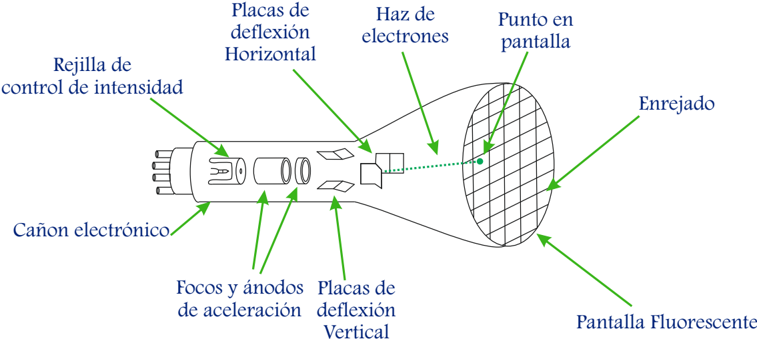

En la mayoría de osciloscopios, la desviación electrónica, llamada deflexión , se consigue mediante campos eléctricos , ello constituye la deflexión electrostática. Una minoría de aparatos de osciloscopía especializados en la visualización de curvas de respuesta, emplean el sistema de deflexión electromagnética, igual al usado en televisión de tubos.

El proceso de deflexión del haz electrónico se lleva a cabo en el vacío creado en el interior del llamado tubo de rayos catódicos ( TRC ). En su pantalla se visualiza la información o forma de la señal. El tubo de rayos catódicos de deflexión electroestática está dotado con dos pares de placas para deflexión horizontal y vertical respectivamente, que debidamente controladas hacen posible la representación sobre la pantalla de los fenómenos que se desean analizar.

Figura 3.3: Pantalla fotoactiva (fósforo) con un haz de electrones.

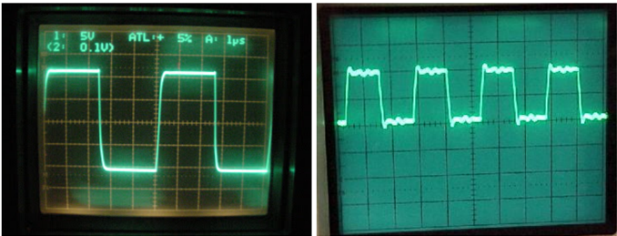

El haz en pantalla ha de representar una imagen o señal, la cual se puede considerar inscrita sobre unas coordenadas cartesianas en las que los ejes horizontal y vertical representan dos señales de tensión, cuya combinación ortogonal (modo X-Y ) genera una forma paramétrica temporal, pero si una de estas entradas de tensión tiene la forma temporal de una recta de pendiente finita, ésta se puede interpretar como el tiempo (modo Y-t ) y permitiría graficar el comportamiento de temporal de la otra entrada.

La escala de cada uno de los ejes cartesianos grabados en la pantalla, puede ser cambiada de forma independiente por medio de ganancias electrónicas a fin de dotar a la señal de la representación más adecuada para su medida y análisis, sin problemas de truncamiento o saturación.

Figura 3.4: Placas paralelas y deflección de un haz de electrones.

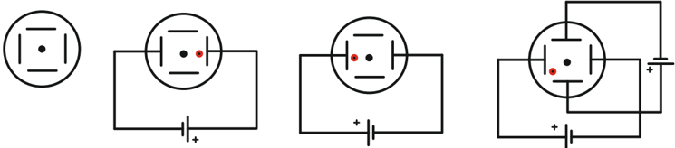

En la Figura 3.4 se muestra un esquema simplificado transversal de un osciloscopio donde se proyecta el haz de electrones al centro de la pantalla y a medida que se aplican tensiones tanto en sus placas paralelas horizontales como verticales se produce la deflexión del haz. Claramente para este ejemplo las fuentes de tensión son continuas por lo cual el haz solamente se deflecta a una posición fija, pero note que la acción en cada eje o coordenada es linealmente independiente.

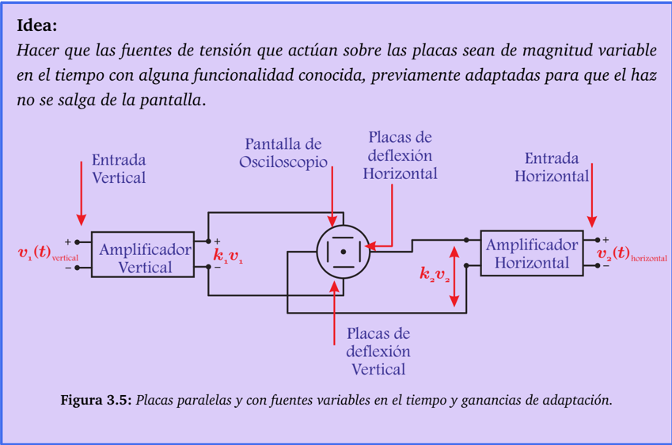

Bajo ese concepto y configuración teórica se pueden ahora excitar a las placas verticales y horizontales con sendas señales que varían en el tiempo. Si por ejemplo consideramos que estas señales son sinusoidales estacionarias, que por simpleza solo se pensará en un período, podríamos notar que si ambas señales están en fase la imagen a representar en pantalla será una recta que tendrá pendiente unitaria si las amplitudes de las señales de entrada son iguales o si al no serlo, se adaptan las ganancias de los amplificadores de entrada para que las tensiones máximas en las placas de deflexión sean idénticas, lo cual se presenta en la Figura 3.6(a).

$$y ( t ) = k _ { 1 } \cdot s i n ( \omega t ) , \ x ( t ) = k _ { 2 } \cdot s i n ( \omega t ) , \Rightarrow y ( t ) = ( k _ { 1 } / k _ { 2 } ) \cdot x ( t )$$

Si por el contrario las señales en este ejemplo presentan un desfase de 90 o y se mantiene la restricción de igualdad de amplitud o adaptación por ganancias, se logrará en pantalla una circunferencia perfecta, lo cual se presenta en la Figura 3.6(b).

$$y ( t ) = k _ { 1 } \cdot s i n ( \omega t ) , \ x ( t ) = k _ { 2 } \cdot \cos ( \omega t ) , \, \Rightarrow y ^ { 2 } ( t ) + x ^ { 2 } ( t ) = k ^ { 2 } \cdot ( s i n ^ { 2 } ( \omega t ) + \cos ^ { 2 } ( \omega t ) ) = k ^ { 2 }$$

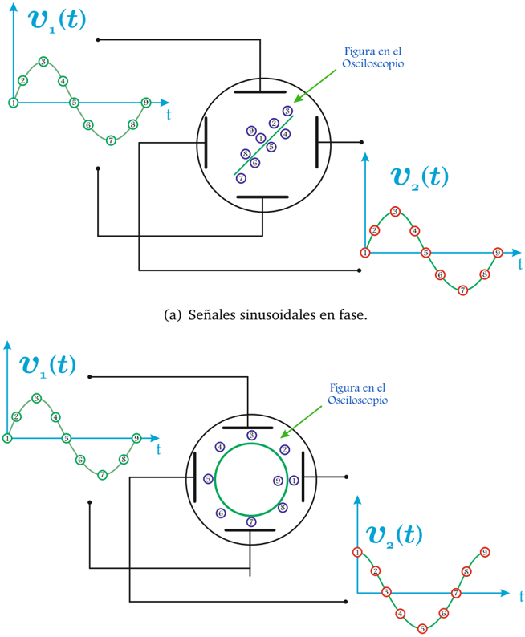

- (b) Señales sinusoidales en cuadratura.

Figura 3.6: Ejemplos de visualización dinámica del haz.

Note que en las expresiones matemáticas anteriores el tiempo t está implícito o desaparece de las expresiones. Si las señales cambian periodo a periodo o pierden sincronía las figuras paramétricas anteriores dejarán de ser estáticas y tendrán movilidad.

Las señales de tensión que se buscan visualizar en el osciloscopio son funciones del tiempo y si por ejemplo fueran señales estacionarias se desearían ver de forma fija o estática en pantalla. La pregunta que nace a continuación ¿Cómo representar al tiempo? o ¿Cómo ver a una función del tiempo en pantalla?. Para ello se emulará al tiempo colocándolo como una señal en las placas horizontales, señal que será del tipo diente de sierra de pendiente positiva que en abstracción es simplemente una recta, teniendo:

$$y ( t ) = f ( t ) , \ x ( t ) = k \cdot t , \Rightarrow y = f ( x )$$

Entonces se puede decir que se sigue teniendo una representación paramétrica, pero ahora el parámetro x es proporcional a t , lo cual hace que se piense simplemente que y es función del tiempo de forma directa en la representación en pantalla, pero necesariamente para volver al tiempo verdadero ser necesitará conocer claramente la ganancia k ( x ( t ) = k · t ).

A modo de ejemplo, se volverá a citar el caso donde se busca ver en la pantalla del osciloscopio a sinusoidal estacionaria, lo cual permite resumir y definir los siguientes conceptos:

Placas de deflexión horizontal: Deben representar el tiempo que transcurre mientras varía el valor de la señal de tensión estacionaria a medir . Esto se logra aplicando en las placas una tensión que aumente linealmente y haga que el haz se mueva a velocidad constante de izquierda a derecha, logrando con esto un desplazamiento uniforme en el eje horizontal, eje X o mejor dicho para este caso eje t .

Figura 3.7: Señal de barrido en placas horizontales y su consecuencia en la pantalla del osciloscopio

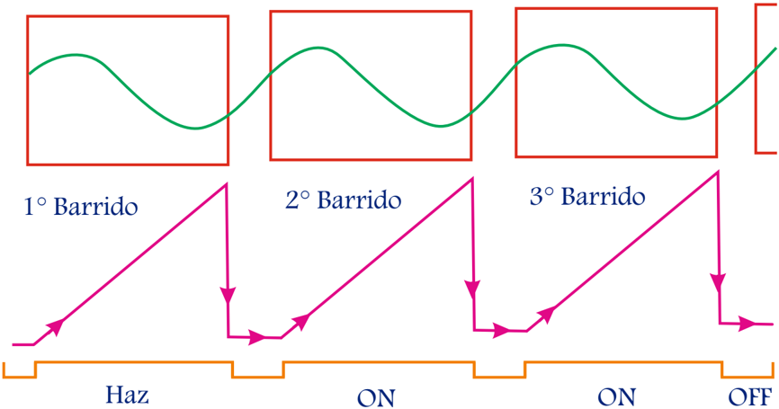

Este aumento lineal de tensión debe partir desde un máximo negativo para llegar a un máximo positivo. Luego, la señal debe rápidamente volver al máximo negativo para volver a aumentar linealmente. Con esto se logra que el haz de electrones pueda volver a pasar por los mismos puntos de la pantalla una y otra vez, cosa de obtener una imagen estática y permanente en la pantalla , sí y solo sí ha habido una sincronización previa , a estudiar más adelante llamado trigger .

A cada una de las subidas lineales del tensión en las placas horizontales se les llama barrido horizontal .

Placas de deflexión vertical: Deben representar la amplitud de la señal que cambia en el tiempo , en este ejemplo de señal sinusoidal, representando el valor de la tensión en cada momento. Esto se logra alimentando las placas con la señal de entrada, previamente ajustada y escalada, con lo cual el haz se moverá vertical y proporcionalmente a la señal de entrada, dando origen al eje Y .

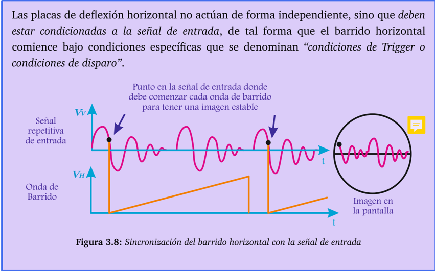

En función de lo anterior se presentan algunas definiciones para considerar en el osciloscopio:

Tiempo: No es una entrada propiamente tal, pero está presente internamente en el osciloscopio como una señal de tensión del tipo 'diente de sierra' de pendiente positiva que actúa en el eje horizontal y es lo que se denominó como barrido horizontal . Cada período de la señal diente de sierra es una recta que representa justamente el paso gradual y lineal del tiempo , de este modo se deflecta el haz de electrones desde una posición inicial, que puede ser el inicio de la escala horizontal cuando la señal está en su valor mínimo, hasta que llega a fin de escala cuando la señal alcanza su valor máximo.

Figura 3.9: Ejemplo de visualización en el tiempo de una señal alterna a 10ms / div en una aplicación digital

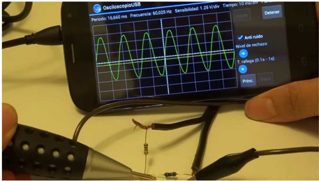

Sin embargo lo anterior, es posible darle un corrimiento a la señal diente de sierra ( con o sin tiempo muerto ), con lo cual el inicio teórico y esperado se desplaza con fines para mejorar una medición. Esto típicamente se llama corrimiento del cero temporal o simplemente posición horizontal .

Si se considera que es fijo el largo horizontal de la pantalla del osciloscopio al ser recorrida por el haz de electrones en un (1) período de la señal diente de sierra , se puede conceptualmente considerar que si se manipula el valor de la pendiente , se tendrá un haz más lento o más rápido, lo cual se traduce en la cantidad de información que se podría desplegar en pantalla. Es decir, si el haz es lento se tendrá un mayor tiempo de visualización de la señal de entrada, que si ésta es periódica, se verán más ciclos.

Base de tiempo: También interpretada como una ganancia , es la manipulación del la señal diente de sierra , que conocido el largo de la pantalla típicamente descrito en cuadros, permitirá establecer una relación que permita llevar desde la medición de la forma de onda en el osciloscopio a un valor en tiempo real o verdadero , lo cual se trabaja en 'segundos por divisiones o cuadros (s/div)' . Con la apropiada manipulación de este control, es posible mejorar la visualización horizontal de una señal.

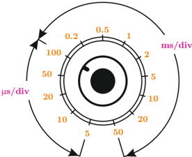

Canales: También llamados channels (Ejm. CH1 ) son las entradas del osciloscopio de las señales a medir o funciones tiempo, que deben ser representadas o adaptadas a señales de tensión. Los canales actúan directamente sobre el eje vertical del osciloscopio deflectando el haz de electrones en ese eje de forma linealmente independiente, que sumado al eje horizonal del tiempo permite describir el comportamiento completo de la señal a medir.

Figura 3.10: Ejemplo de canales en un osciloscopio digital heredando forma del osciloscopio analógico

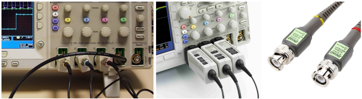

Un osciloscopio analógico puede tener muchos canales, típicamente dos, pero solo tiene un (1) par de placas de deflexión vertical un (1) haz de electrones. Por lo cual las señales de entrada de cada canal no pueden estar activas de forma simultánea pese a que en pantalla así vean y requieran, como por ejemplo para calcular un desfase relativo. Solamente para el osciloscopio analógico las formas que permiten ver dos señales de forma cuasi-simultánea son los modos: 'Alternado' y 'Chopeado (chopper)' .

Como su nombre lo sugiere 'modo alternado' grafica de forma alternada la señal de cada canal de forma secuencial para cada barrido horizontal completo , que por la fosforescencia de la pantalla y tiempos involcrados, hace parecer que ambas señales están al unísono. Claramente una vez que se ha barrido la señal del primer canal, se barre la señal del segundo canal y si no hay más canales que barrer , se vuelve a barrer el primer canal y así sucesivamente de manera que se mantenga la información en pantalla y parezca fija.

El 'modo chopeado' traza a las señales de cada canal en pantalla de forma casi simultánea , esto se logra conmutando la representación en instantes muy pequeños durante un (1) barrido horizonal , dando por resultado en pantalla señales 'trozadas' , 'segmentadas' o 'chopeadas' , que por continuidad visual parecen que estuviesen completas. Al siguiente barrido horizontal se repite el proceso, pero en teoría se busca graficar los segmentos faltantes de cada señal.

Ganancias verticales: Las señales de tensión que ingresan a los canales por sendos adaptadores, transductores o puntas, proveen una etapa de adaptación previa a niveles que el osciloscopio puede trabajar sin saturaciones ni pérdidas de información.

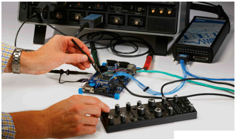

Luego, el osciloscopio tiene internamente la opción de amplificar o atenuar las señales con ganancias de modo de mejorar lo que se quiere visualizar en pantalla. Estas ganancias permitirán establecer una relación en pantalla que permita llevar desde la medición de la forma de onda en el osciloscopio a un valor en tensión real o verdadero, lo cual se trabaja en 'Volts por divisiones o cuadros (V/div)' .

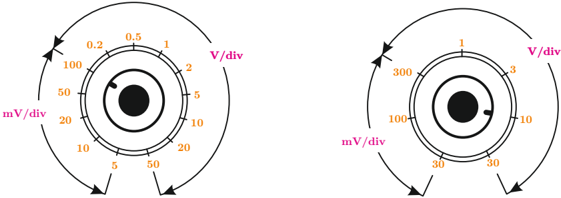

Posición o Niveles: Son señales de valor fijo que se superponen a las señales de las placas vertical y horizontal, lo cual permite efectuar corrimientos o desplazamientos de la señal presentada para dar una mejor lectura. De este modo aparecen los conceptos de posición vertical para desplazamientos arriba-abajo y posición horizontal para desplazamientos derecha-izquierda , que se aplican de forma independiente a cada canal.

Modo Y-t : Es graficar en el tiempo en un osciloscopio una o más señales del tipo y ( t ) , que ya están adaptadas a niveles de tensión proporcionales y que se muestran en función del tiempo porque la señal del eje horizontal es la señal tipo diente de sierra que el mismo osciloscopio genera .

Figura 3.11: Ejemplo modo Y-t en osciloscopio digital

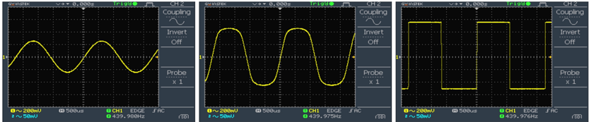

Modo X-Y : Es graficar en un osciloscopio una señal del tipo y ( t ) respecto a otra x ( t ) de forma paramétrica, donde ambas señales ya están adaptadas a niveles de tensión proporcionales y seguros, pero la señal del eje horizontal es la señal que ingresa como entrada por un canal que el mismo osciloscopio tiene asignado a ser reconocido como x ( t ) .

Figura 3.12: Ejemplo modo X-Y en osciloscopio digital.

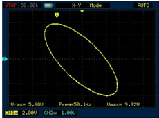

Trigger: Sincronización del barrido de horizontal con alguna de las señales de entrada, pudiéndose solamente escoger entre alguna de las siguientes opciones:

1. Alguno de los canales, pero solo uno (1) de ellos,
2. Desde señal externa que se ingresa igual que en los canales convencionales pero no está conectada al sistema de deflexión vertical ,
3. Desde la alimentación desde la red alterna, de donde se saca una muestra de dicha señal.

A continuación se presenta en la Figura 3.13, el esquema completo del funcionamiento de un osciloscopio analógico de forma simplificada, mientras que en la Figura 3.14 se muestra un esquema su de un panel del control, donde se aprecia visualmente la existencia de las funciones anteriormente descritas, dispuestas para su manipulación.

Sabiendo que la magnitud de la señal de entrada en los canales hará que el haz de electrones se deflecte y proyecte una imagen dentro de la distancia total disponible de ese eje, es que se tiene también la posibilidad que si la señal de entrada tiene niveles muy altos podría hacer que el haz se salga del rango y de este modo la señal se vea truncada o cortada, donde el caso más extremo sería el que si alguna de las señales de entrada es tan grande pudiera dañar al osciloscopio y generar un desperfecto.

## AT : atenuación

Figura 3.13: Diagrama del funcionamiento de un osciloscopio analógico.

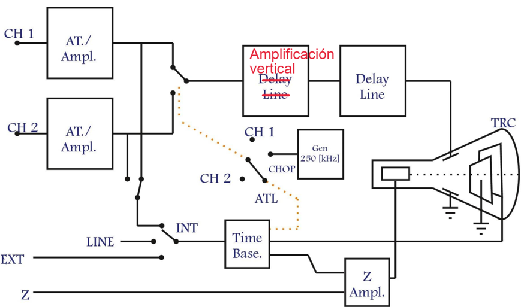

Figura 3.14: Esquema simplificado de controles del osciloscopio.

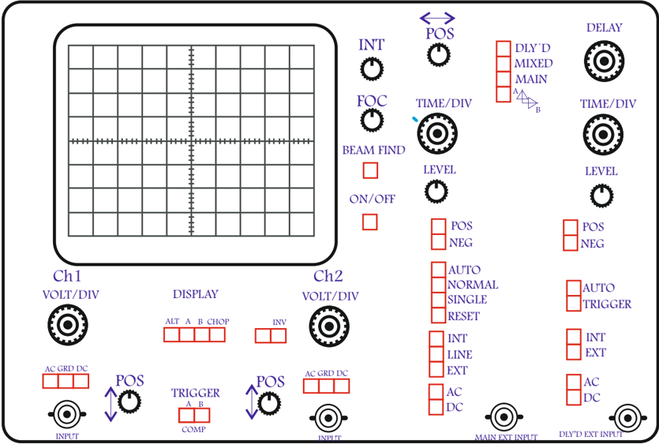

Ante este problema es que se disponen de una serie de adaptadores y atenuadores de señal, que van desde antes que la señal ingrese al osciloscopio, hasta los ajustes internos que permitan llevar las entradas a niveles confiables. Por tanto se tiene como parte del proceso de adaptación los siguientes pasos a seguir:

- a.Saber lo que se va a medir!, tensión, corriente, rangos, frecuencias, etc.
- b.Transductores: Equipos que transforman una medida física en una señal eléctrica de tensión o corriente. Se requiere escoger el más adecuado.
- c.Adaptadores externos : manejo externo de las variables para llevarlas a límites seguros tanto para el operador como para el equipo. Se transforma todo a señal de tensión, para llevar a cabo el fenómeno de deflexión por campo eléctrico. Podría estar incluido en el mismo transductor el adaptador externo y estar siempre trabajando con variables de tensión proporcionales.
- d.Puntas o sondas del osciloscopio : terminales aptos para la conexión y entrada de señales al osciloscopio, que en principio ya vienen con factores de atenuación típicamente denominados: 1X (1:1), 10X (1:10), 100X (1:100), entre otros. Es recomendable siempre usar puntas.
- e.Ganancia del osciloscopio : manejo interno de las señales tanto de atenuación o amplificación. Esta ganancia representa lo que se conoce como la escala vertical o 'ajuste de los Volts x división' . Seleccionar la ganancia adecuada permitirá ver de mejor forma la señal en pantalla según lo que se necesite.

Figura 3.15: Osciloscopio analógico

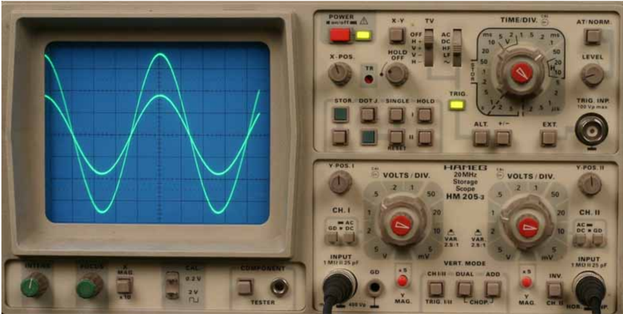

