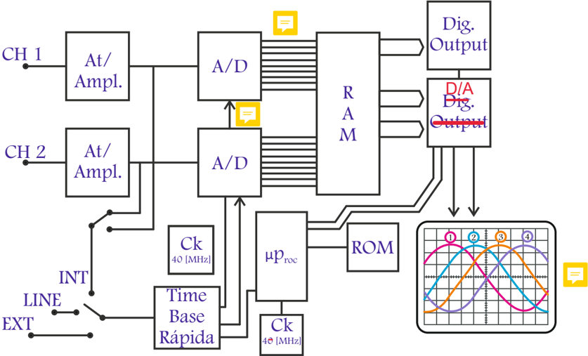

# 3.2.2 Funcionamiento osciloscopio digital

Tags: #eli214
## 3.2.2. Funcionamiento osciloscopio digital

Los osciloscopios digitales son casi como un computador con: memoria , procesador , pantalla , entre otros elementos comunes, más un programa que es capaz de graficar una serie de datos . La diferencia con un computador sería que la serie de datos se obtiene del mundo real de señales de tensión que internamente el osciloscopio en su proceso analógico/digital transforma a valores numéricos. La principal limitante como el cualquier proceso de digitalización, es la cantidad de muestras a tomar y el intervalo o paso del muestreo.

De este modo se puede precisar que el osciloscopio digital no ocupa haz de electrones ni tubo de rayos catódicos . Por ello, en el osciloscopio digital se tiene que la señal continua del mundo real que se convierte en una señal discreta digitalizada , que no se muestra directamente en pantalla, sino que tarda lo que el instrumento logra procesar, almacenar en memoria y presentar.

En la Figura 3.16 se muestra un diagrama básico del funcionamiento del osciloscopio digital, apreciándose multiples diferencias con el funcionamiento analógico (Figura 3.13). Sin embargo, todos los conceptos que se introdujeron para el caso analógico son heredados en el caso digital, es decir, se replica la misma funcionalidad aunque internamente solo es procesamiento numérico .

Figura 3.16: Diagrama básico del funcionamiento de un osciloscopio digital.

Las principales ventajas que presenta este tipo de instrumento son:

- Se pueden guardar las señales registradas como sendos vectores de datos, lo cual permite como postproceso hacer efectuar múltiples operaciones matemáticas.
- Es posible disponer de tantos canales de entrada se requieran en función del costo del equipo, siendo lo tradicional disponer de cuatro canales.
- Los canales tienen la posibilidad de ser independientes entre sí, cuya comunicación con la unidad de procesos es por acoplamiento óptico, lo cual sin duda elimina riesgos cuando se trabaja con señales de intensidades de peligro. Lo anterior también es en función del costo del equipo.
- Señales de canales pueden ser trabajadas a tiempo real del osciloscopio efectuando operaciones matemáticas de forma individual y colectiva, por ejemplo determinar valores efectivos frecuencias, hacer el producto de dos señales, etc.
- Con mucha mayor simplicidad se puede implementar el modo SINLGE , el cual es de utilidad para ver y analizar estados transitorios, lo cual es más difícil de implementar en el mundo analógico.
- Se pude implementar el modo XY con más de dos canales.

SECCIÓN 3.3

## Barrido horizontal

Considerando la diferencias constructivas de los tipos de osciloscopio, pero que en principio básico tanto el analógico como el digital son similares, es que se hace fundamental el precisar los ajustes a realizar en ambos tipos, para siempre poder sincronizar adecuadamente el barrido horizontal con alguna de las señales de entrada dada por los canales y de este modo poder contar con señales e información que se mantengan quietas en pantalla y con ello poder realizar mediciones y en algunos casos tomar decisiones o realizar diagnósticos.

## 3.2.2. Funcionamiento osciloscopio digital

Los osciloscopios digitales son casi como un computador con: memoria , procesador , pantalla , entre otros elementos comunes, más un programa que es capaz de graficar una serie de datos . La diferencia con un computador sería que la serie de datos se obtiene del mundo real de señales de tensión que internamente el osciloscopio en su proceso analógico/digital transforma a valores numéricos. La principal limitante como el cualquier proceso de digitalización, es la cantidad de muestras a tomar y el intervalo o paso del muestreo.

De este modo se puede precisar que el osciloscopio digital no ocupa haz de electrones ni tubo de rayos catódicos . Por ello, en el osciloscopio digital se tiene que la señal continua del mundo real que se convierte en una señal discreta digitalizada , que no se muestra directamente en pantalla, sino que tarda lo que el instrumento logra procesar, almacenar en memoria y presentar.

En la Figura 3.16 se muestra un diagrama básico del funcionamiento del osciloscopio digital, apreciándose multiples diferencias con el funcionamiento analógico (Figura 3.13). Sin embargo, todos los conceptos que se introdujeron para el caso analógico son heredados en el caso digital, es decir, se replica la misma funcionalidad aunque internamente solo es procesamiento numérico .

Figura 3.16: Diagrama básico del funcionamiento de un osciloscopio digital.

Las principales ventajas que presenta este tipo de instrumento son:

- Se pueden guardar las señales registradas como sendos vectores de datos, lo cual permite como postproceso hacer efectuar múltiples operaciones matemáticas.
- Es posible disponer de tantos canales de entrada se requieran en función del costo del equipo, siendo lo tradicional disponer de cuatro canales.
- Los canales tienen la posibilidad de ser independientes entre sí, cuya comunicación con la unidad de procesos es por acoplamiento óptico, lo cual sin duda elimina riesgos cuando se trabaja con señales de intensidades de peligro. Lo anterior también es en función del costo del equipo.
- Señales de canales pueden ser trabajadas a tiempo real del osciloscopio efectuando operaciones matemáticas de forma individual y colectiva, por ejemplo determinar valores efectivos frecuencias, hacer el producto de dos señales, etc.
- Con mucha mayor simplicidad se puede implementar el modo SINLGE , el cual es de utilidad para ver y analizar estados transitorios, lo cual es más difícil de implementar en el mundo analógico.
- Se pude implementar el modo XY con más de dos canales.

