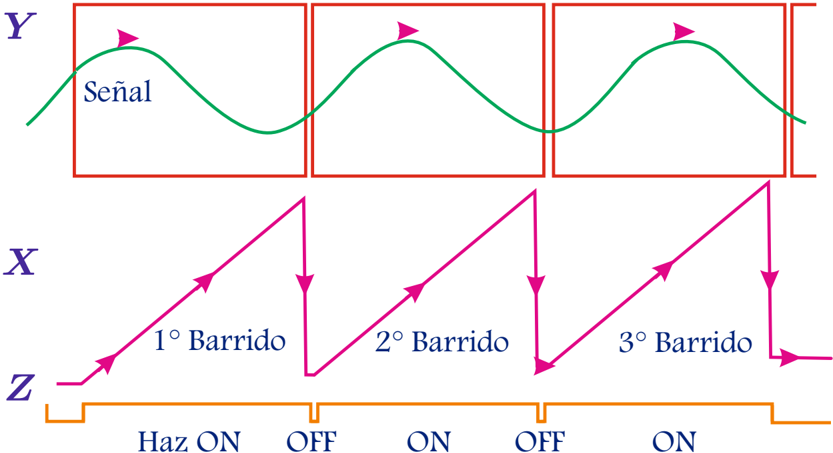
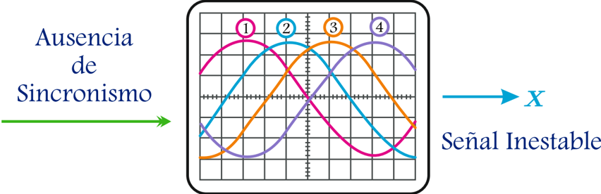

# 3.3.1 Señal de barrido sin sincronía

Tags: #eli214
## 3.3.1. Señal de barrido sin sincronía

Supongamos que se tiene una onda sinusoidal estacionaria como entrada y que el barrido horizontal se activa por sí mismo, es decir, en ausencia de sincronismo con la señal de entrada u otra. Al iniciar el primer barrido, la señal de entrada comenzará de izquierda a derecha a aparecer en pantalla, suponiendo además que para este ejemplo al comenzar desde el lado izquierdo la señal de entrada tiene un valor V 1 . La base de tiempo ( pendiente de la señal diente de sierra ) determina cuantos periodos de la onda aparecerán en la pantalla, pero no tiene por qué coincidir la duración del barrido con un múltiplo entero del período de la señal de entrada .

Figura 3.17: Señal mostrada en pantalla debido a señales de barrido sin sincronización.

Si el segundo barrido comienza de forma instantánea, la onda comenzará a mostrarse en pantalla desde la parte izquierda justo en el punto temporal en que quedó al finalizar el barrido anterior. Por tanto, el valor en el extremo izquierdo será de un valor V 2 y a partir de él se comenzará a presentar en pantalla la señal sinusoidal estacionara. Note que V 2 no tiene por qué ser igual a V 1 , salvo coincidencia.

Este proceso si se repite múltiples veces dará lugar a una señal en pantalla que cambiará su posición con cada barrido y parecerá estar en movimiento. En la siguiente imagen se puede apreciar la consecuencia luego de cuatro barridos .

Figura 3.18: Señal mostrada en pantalla sin sincronización.

En la pantalla del osciloscopio (Figuras 3.17 y 3.18) se ve que hay señales sinusoidales desfasadas como consecuencia de los barridos arbitrarios. Estas señales no se ven al mismo tiempo, sino que aparecen en secuencia dando la ilusión de movimiento. Lo anterior indica que primero se observa la señal 1, desaparecida la señal 1 se ve la señal 2, al irse la señal 2 aparece la 3 y finalmente la señal 4. Claro está que si la frecuencia del barrido es alta, en pantalla no se distinguirá información.

## Conclusión:

Cuando no hay un barrido horizontal correctamente ajustado , lo que se verá en pantalla es una señal moviéndose sin control, teniendo en cuenta que las señales de barrido actúan de forma muy rápida es muy probable que ni siquiera sea posible identificar la forma de la señal.

Esto nos obliga a conocer y aplicar las condiciones para que inicie la señal de barrido, lo cual da origen al concepto de disparo o simplemente Trigger .

Lo explicado anteriormente es bastante sencillo de imaginar considerando un osciloscopio analógico y su proceso de trazado al desplazar el haz de electrones. Para el caso digital se puede interpretar la similaridad del proceso como el instante donde se genera el vector de tiempo que se une a la señal de entrada para ser graficada, cambiando gráfica a gráfica la relación tiempo y función.

