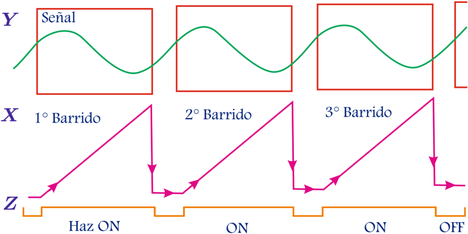
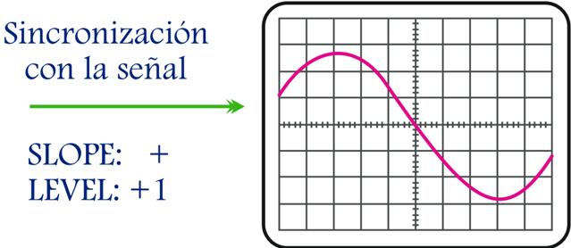

# 3.3.2 Señal de barrido sincronizada

Tags: #eli214
## 3.3.2. Señal de barrido sincronizada

Supongamos que se tiene una onda sinusoidal estacionaria como entrada y que el barrido horizontal ahora se activará en un par de condiciones muy específicas:

1. Disparar el barrido horizontal si la señal de entrada del canal escogido llega a ser igual una referencia relativa llamada LEVEL .

2. Disparar el barrido horizontal si la señal de entrada que ya ha cumplido la condición anterior de LEVEL , lo hace con una cierta pendiente ( positiva o negativa ) o dirección (en subida o en bajada ).

Con ello se garantizaría que en cada barrido horizontal , la señal de entrada comience a ser presentada de izquierda a derecha siempre con un valor conocido e idéntico al definido en la condición de LEVEL , que para el caso sin sincronización se le llamó V 1 .

Figura 3.19: Señal mostrada en pantalla debido a señales de barrido sincronizada.

Lógicamente al tener infinitos barridos que siempre comiencen con la señal en el mismo punto, se tendrá en pantalla a una señal fija. Las condiciones anteriores se conocen como condiciones de Trigger y tiene por consecuencia que no es necesario que el período de la señal de entrada tenga que coincidir con el periodo o sus múltiplos enteros de la señal diente de sierra de la base de tiempo.

SLOPE:   +

LEVEL: +1

Figura 3.20: Señal mostrada en pantalla con sincronización.

