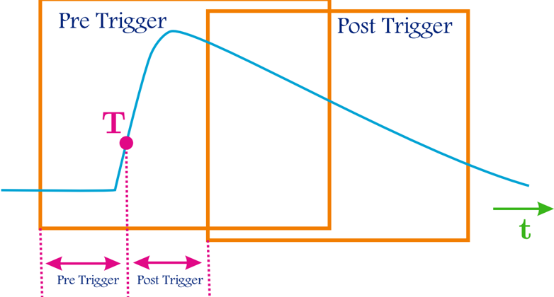
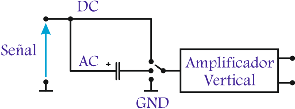
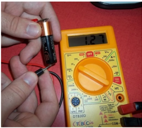
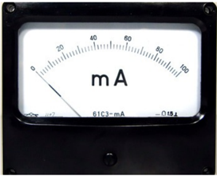

# 3.3.3 Definición de Trigger y sus condiciones

Tags: #eli214
## 3.3.3. Definición de Trigger y sus condiciones.

Como se vio anteriormente, es esencial la sincronización del barrido horizontal con alguna de las señales de entrada o alguna otra externa. Para ello se requiere de un dispositivo o mecanismo físico o sistema condicional digital, que se encargue de disparar el barrido horizontal . Este dispositivo, llamado Trigger , una vez que da la instrucción de comenzar el barrido cesa su trabajo hasta que el barrido fi naliza y se vuelve a activar para el barrido siguiente y los sucesivos. Para que el Trigger de inicio al barrido , se deben cumplir las siguientes restricciones y condiciones:

1. Asociar el trabajo del Trigger a la información de solo uno (1) de los canales que el osciloscopio tenga disponible, asegurándose que el canal asignado tenga algún tipo de información o señal, no siendo prudente que el canal seleccionado esté en vacío o a masa/tierra.

Si no se desea sincronizar el barrido con algún canal, el osciloscopio ofrece la opción de disponer un canal externo solo para señales de Trigger y también la opción de sincronizarse con la red eléctrica si el osciloscopio toma energía de la misma sacando la información desde el enchufe, no así osciloscopio trabaja con baterías.

2. Establecer un nivel ( LEVEL ) ya sea en tensión ( V ) o divisiones ( div ), de valor positivo ⊕ o negativo ⊖ para que cuando la señal de entrada llegue a ser igual que ese nivel, ya sea por incremento o decremento , se de la instrucción de disparo.
3. Establecer una pendiente ( SLOPE ) para definir de forma unívoca si cumplida la condición de LEVEL , esta fue por incremento (pendiente positiva/subida) o decremento (pendiente negativa/bajada).

## Preguntas conceptuales:

1. ¿Qué ocurre cuando no se cumplen las condiciones del Trigger ?
2. En caso de medir dos o más señales, ¿Cuál de estas señales es la que debe cumplir las condiciones del Trigger ?
3. ¿Es posible sincronizar el Trigger con una señal interna o externa que no sea una señal a medir?
4. ¿Es posible ocupar el Trigger para analizar señales transitorias?

Como se mencionó anteriormente, la señal con la cual el Trigger se puede sincronizar puede venir de tres fuentes, que se precisan a continuación para efectos de incorporar su nomenclatura clásica que se ha de encontrar en la práctica:

INT: Interna , que indica que la señal con la cual se sincroniza el Trigger de alguno de los canales, pero sólo uno de ellos , ya que se mantiene el concepto que el vector o dimensión de tiempo es único e independiente. En algunos casos la opción INT no se visualiza como tal, sino que se especifica directamente el canal ( CH ) empleado.

- LINE: Línea , que hace que el Trigger se sincronice con la alimentación del osciloscopio (red de 220V y 50Hz para el caso de Chile), claramente que el mismo osciloscopio adapta la señal de la red para su utilización. Si tiene batería esta opción no aplica.

- EXT: Externo , el Trigger toma una señal para sincronizar el barrido que no ingresa los canales de entrada, sino por una entrada especial para ello, entrada que no tiene opción de ser mostrada en pantalla como los canales ( CH's ) tradicionales.

Conocidas la reglas de activación del disparo ( Trigger ) para el barrido horizontal y las fuentes o entradas con las cuales se hará el proceso de sincronización, se tiene a continuación la descripción de los 'modos' del Trigger , los cuales permiten adaptarse a las necesidades del usuario principalmente por las características de las señales a graficar, ya sean estacionarias o transitorias, periódicas o no; teniendo:

- Modo NORMAL: Cuando cumplidas las condiciones del Trigger se inicia el barrido horizontal . En caso contrario, no iniciará el barrido y la pantalla permanecerá sin señales. En un osciloscopio digital , dada la memoria interna es posible que se muestre en pantalla la última señal que quedó guardada del barrido horizontal anterior como una imagen estática o congelada ( WAIT ) hasta que cumplan las condiciones del Trigger y se muestre dinámicamente la señal actual en la pantalla.

Modo AUTO: Funciona del mismo modo que le modo Normal , pero cuando no se cumplen las condiciones del Trigger se iniciará el barrido horizontal de forma automática con una velocidad ya establecida de fábrica por el osciloscopio, por lo cual será posible ver en pantalla la señal presente en los canales ( CH's ) que se encuentren activos y lógicamente éstas no tendrán por qué estar sincronía, es decir, difícilmente se verán fijas en pantalla. Esto provee al usuario la posibilidad de ir modificando las condiciones del Trigger hasta lograr sincronismo.

- Modo SINGLE: Este modo es (casi) único de los osciloscopios digitales , gracias a su capacidad de almacenar las señales medidas en su memoria. En el modo Single , al cumplirse las condiciones del Trigger solamente se producirá un (1) barrido horizontal almacenando y mostrando solamente la información de las señales durante el ∆ t [ s ] que dura el barrido, es decir, se presenta en pantalla una señal por cada canal que se haya encontrado activo de forma estática o congelada.

Si por alguna razón se volvieran a cumplir las condiciones de Trigger , no habrá otro barrido horizontal hasta que el mismo usuario desde el panel de control active la opción 'esperar trigger' .

Este es el modo que se ocupa principalmente para la captura de señales transitorias, por lo cual se deberá tener un conocimiento previo de la forma esperada de la señal de modo de ajustar correctamente la base de tiempo , ganancias de los canales, etc; de modo de no perder información e incluso en este modo se hace relevante tener claridad sobre la pendiente ( SLOPE ) con la que se quiere hacer el Trigger .

En osciloscopios analógicos se podía hacer modo Single aumentando la persistencia de la señal, por ejemplo con una pantalla fósforo con constante de disipación luminosa mayor, más la disposición una cámara fotográfica guardar la forma de onda de la pantalla, que por la antigüedad de la tecnología hay que considerar que la foto para ser analizada debía previamente ser revelada.

RUN/STOP: No es un modo de Trigger , pero si se usa en el modo automático donde siempre hay barrido horizontal y por ejemplo no se hayam cumplido las condiciones de Trigger , con STOP se puede congelar las señales en pantalla dado que la información está en la memoria del osciloscopio y luego con RUN se vuelve a la normalidad. Esta opción también se puede usar en modo Normal , pero no tiene mucho sentido práctico. Claramente esta es solo una opción de los osciloscopios digitales.

En la figura 3.21, se muestra una señal obtenida de un barrido simple en el modo Single , de ella se puede apreciar dos zonas llamadas Pre-Trigger y Post-Trigger . Los osciloscopios digitales internamente van guardando información tiempo antes que se cumpla las condiciones del Trigger , por lo cual es posible mediante el posicionamiento horizontal ver las señales instantes anteriores a la condición de disparo.

La explicación más simple a este proceso es considerar que el osciloscopio digital está siempre guardando información en su memoria, memoria dinámica que tiene espacios fijos para la información del Pre-Trigger y Post-Trigger . Cuando se cumple la condición de Trigger , se muestra en pantalla toda la información.

Figura 3.21: Señal resultante por un modo SINGLE.

SECCIÓN 3.4

## Modo de acoplamiento de los canales de entrada

Cuando se tiene una señal que ha de ser ingresada al osciloscopio como una magnitud proporcional de tensión, dada la etapa de adaptación previa que se debe efectuar, antes de llegar al amplificador interno del osciloscopio se disponen de filtros o simplemente conexiones específicas que permiten eliminar ciertas componentes de frecuencia que pudiera tener la señal. Esto pasa a llamarse modo de acoplamiento y se tiene en específico, junto a la Figura 3.22, lo siguiente:

Modo DC: En este modo se deja pasar completamente la señal de entrada , sin filtrar ninguna de las componentes de frecuencia de la señal original.

Modo AC: En este modo se filtra o elimina el valor continuo de la señal de entrada , de tal forma que sólo deja pasar la componente alterna de la entrada. Esto se logra colocando básicamente con un condensador en serie, justo antes del sistema de amplificación. Aproximadamente señales con frecuencias por debajo de los 5Hz en este modo ya comienzan a presentar atenuaciones.

Modo GND: Este modo aterriza la señal de entrada causando que lo que se muestra en la pantalla es una recta horizontal de valor cero. Este modo suele ocuparse para ubicar correctamente en qué parte del eje vertical está centrado el canal específico, también para eliminar ruido que pudiera acoplarse. Sin embargo lo anterior, los canales ( CH's ) de los osciloscopios digitales tienen a su vez el modo u opción ON/OFF , lo cual independientemente del modo empleado pueden mostrar ( ON ) o no mostrar ( OFF ) la señal del canal respectivo en pantalla, por lo que pudiera en muchos casos no ser requerido el modo GND .

Figura 3.22: Modos de acoplamiento.

Hay que tener en cuenta que el Trigger se sincroniza con la señal de entrada, después del amplificador vertical, por lo que estos filtros pueden causar que la señal no cumpla con las condiciones de disparo que el mismo usuario definió. Ejemplo: 'Si se sincroniza con el CH1 y éste se envía a modo GND se pierde la opción de disparo, no así si solamente se decide no verlo en pantalla usando la opción OFF pero dejándolo en acoplamiento AC ó DC ' .

SECCIÓN 3.5

## Puntas del Osciloscopio

Los canales de entrada de un osciloscopio suelen estar muy protegidos, cosa de evitar el desgaste o que cualquier tipo de señal indeseada sea medida por un contacto fortuito, que pudieran dañar el equipo. De este modo la forma clásica de entrada es del tipo coaxial, llevando en el interior la señal activa y en el exterior típicamente tierra, la cual como su nombre sugiere es la misma que está en el enchufe y posiblemente el en circuito que se requiere medir alguna señal.

Como los canales y el osciloscopio trabajan con señales de tensión, se tiene que el usuario debe adaptar las magnitudes a medir a niveles de seguridad personal y seguridad dentro de lo que la tolerancia o rango del equipo puede trabajar, para luego hacer ingreso de las señales hacia el osciloscopio no de forma directa, sino preferentemente por medio del uso de sondas , como una medida de protección adicional y en muchos casos las sondas también juegan un papel de reducción adicional de los niveles a medir.

Los principales tipos de sondas se describen a continuación:

Puntas de tensión: Sonda para medir una señal de tensión, la cual normalmente atenúa o reduce en magnitud la señal y posee un ancho de banda adecuado para que al momento de representar en pantalla, la señal no haya sufrido alteraciones. Se tienen:

1. Pasivas.
2. Activas.
3. Diferenciales.

Puntas de corriente: Sonda para medir una señal de corriente, que por un principio físico lleva la corriente a un valor proporcional de tensión, las cuales tienen un ancho de banda adecuado para no alterar su representación en pantalla. Este tipo de sonda se puede considerar como dentro de la etapa de adaptación o como un transductor específico.

Dentro de las puntas de corriente tenemos también los siguientes casos:

1. Bobinas con ley Faraday con núcleo ferromagnético.
2. Bobinas con ley de Faraday con núcleo de aire (Bobina Rogowsky ), que al no tener núcleo ferroso no hay problemas de saturación y tendería a tener un ancho de banda mayor, perdiendo ganancia por el lado del acoplamiento mutuo.
3. Puntas con efecto Hall para corrientes donde es importante considerar la componente continua o corrientes que no presentan variación en el tiempo. Note que las dos puntas anteriormente presentadas no funcionan bien para señales en continua.
4. Resistencias Shunt para medir tensiones proporcionales a la corriente, donde el resistor debe ser de un valor muy bajo para no alterar al circuito original y tener una componente inductiva baja si las señales a medir son de frecuencias elevadas o transitorias.

Transductores: elemento que es capaz por medio de un principio físico llevar una cierta magnitud a un valor proporcional de tensión , cuya variación en el tiempo se desea graficar. En este caso por la misma definición las puntas de corriente son un tipo específico de transductor. Entre los transductores más comúnmente usados tenemos: Termocuplas, tacómetros, presostatos, acelerómetros, etc.

Ahora bien, tal como se ha mencionado anteriormente es posible acoplar en cascada la salida de un transductor con una punta de tensión y luego conectar el osciloscopio.

## CAPÍTULO 4

## MEDICIÓN DE TENSIÓN Y CORRIENTE CONTINUA

SECCIÓN 4.1

## Introducción y definiciones

Cada día es posible apreciar los innumerables avances tecnológicos, que para el caso de la metrología eléctrica ha permitido el mejoramiento continuo de los instrumentos, principalmente en la transición desde lo analógico a lo digital , que en una gran cantidad de casos ha generado obsolescencia. Sin embargo, aún muchos instrumentos analógicos siguen manteniendo su vigencia principalmente por su robustez, bajo costo, clase de error que si bien no es nula está acorde a la necesidad práctica a nivel industrial. Un ejemplo de este caso se encuentra en los instrumentos electromagnéticos de bobina móvil y de fierro móvil, por ello se mantiene su estudio.

La tendencia actual en instrumentación es lograr instrumentos cada vez más exactos, sensibles y robustos, que sean además estables frente a las variaciones de las condiciones ambientales y que permitan que se alarguen los períodos de mantenimiento y calibración. Los instrumentos digitales en su gran mayoría tienen estas características y superan a los instrumentos más tradicionales. Sin embargo, los conceptos que se pueden extraer desde el mundo analógico permiten el mejor entendimiento del 'principio de medida' que rige para cada caso y de esta forma extrapolar al mundo digital.

Los instrumentos para medir tensiones y corrientes son esencialmente iguales entre sí. Se diferencian únicamente en la etapa de adaptación de la señal. Por esta razón, es que se estudian en conjunto, destacando uno del otro cuando corresponda la salvedad.

Para poder entender el principio de funcionamiento de un instrumento, hay que previamente estudiar la forma de las señales que se quieren medir, que en muchos casos son las señales de la red eléctrica. Existen diferentes valores característicos de una señal, recordando por ejemplo: Valor medio , valor efectivo , valores máximos y mínimos , frecuencia , etc. Estos valores característicos al ser reconocidos permiten la adecuada selección del instrumento más acorde a utilizar.

## 3.3.3. Definición de Trigger y sus condiciones.

Como se vio anteriormente, es esencial la sincronización del barrido horizontal con alguna de las señales de entrada o alguna otra externa. Para ello se requiere de un dispositivo o mecanismo físico o sistema condicional digital, que se encargue de disparar el barrido horizontal . Este dispositivo, llamado Trigger , una vez que da la instrucción de comenzar el barrido cesa su trabajo hasta que el barrido fi naliza y se vuelve a activar para el barrido siguiente y los sucesivos. Para que el Trigger de inicio al barrido , se deben cumplir las siguientes restricciones y condiciones:

1. Asociar el trabajo del Trigger a la información de solo uno (1) de los canales que el osciloscopio tenga disponible, asegurándose que el canal asignado tenga algún tipo de información o señal, no siendo prudente que el canal seleccionado esté en vacío o a masa/tierra.

Si no se desea sincronizar el barrido con algún canal, el osciloscopio ofrece la opción de disponer un canal externo solo para señales de Trigger y también la opción de sincronizarse con la red eléctrica si el osciloscopio toma energía de la misma sacando la información desde el enchufe, no así osciloscopio trabaja con baterías.

2. Establecer un nivel ( LEVEL ) ya sea en tensión ( V ) o divisiones ( div ), de valor positivo ⊕ o negativo ⊖ para que cuando la señal de entrada llegue a ser igual que ese nivel, ya sea por incremento o decremento , se de la instrucción de disparo.
3. Establecer una pendiente ( SLOPE ) para definir de forma unívoca si cumplida la condición de LEVEL , esta fue por incremento (pendiente positiva/subida) o decremento (pendiente negativa/bajada).

## Preguntas conceptuales:

1. ¿Qué ocurre cuando no se cumplen las condiciones del Trigger ?
2. En caso de medir dos o más señales, ¿Cuál de estas señales es la que debe cumplir las condiciones del Trigger ?
3. ¿Es posible sincronizar el Trigger con una señal interna o externa que no sea una señal a medir?
4. ¿Es posible ocupar el Trigger para analizar señales transitorias?

Como se mencionó anteriormente, la señal con la cual el Trigger se puede sincronizar puede venir de tres fuentes, que se precisan a continuación para efectos de incorporar su nomenclatura clásica que se ha de encontrar en la práctica:

INT: Interna , que indica que la señal con la cual se sincroniza el Trigger de alguno de los canales, pero sólo uno de ellos , ya que se mantiene el concepto que el vector o dimensión de tiempo es único e independiente. En algunos casos la opción INT no se visualiza como tal, sino que se especifica directamente el canal ( CH ) empleado.

- LINE: Línea , que hace que el Trigger se sincronice con la alimentación del osciloscopio (red de 220V y 50Hz para el caso de Chile), claramente que el mismo osciloscopio adapta la señal de la red para su utilización. Si tiene batería esta opción no aplica.

- EXT: Externo , el Trigger toma una señal para sincronizar el barrido que no ingresa los canales de entrada, sino por una entrada especial para ello, entrada que no tiene opción de ser mostrada en pantalla como los canales ( CH's ) tradicionales.

Conocidas la reglas de activación del disparo ( Trigger ) para el barrido horizontal y las fuentes o entradas con las cuales se hará el proceso de sincronización, se tiene a continuación la descripción de los 'modos' del Trigger , los cuales permiten adaptarse a las necesidades del usuario principalmente por las características de las señales a graficar, ya sean estacionarias o transitorias, periódicas o no; teniendo:

- Modo NORMAL: Cuando cumplidas las condiciones del Trigger se inicia el barrido horizontal . En caso contrario, no iniciará el barrido y la pantalla permanecerá sin señales. En un osciloscopio digital , dada la memoria interna es posible que se muestre en pantalla la última señal que quedó guardada del barrido horizontal anterior como una imagen estática o congelada ( WAIT ) hasta que cumplan las condiciones del Trigger y se muestre dinámicamente la señal actual en la pantalla.

Modo AUTO: Funciona del mismo modo que le modo Normal , pero cuando no se cumplen las condiciones del Trigger se iniciará el barrido horizontal de forma automática con una velocidad ya establecida de fábrica por el osciloscopio, por lo cual será posible ver en pantalla la señal presente en los canales ( CH's ) que se encuentren activos y lógicamente éstas no tendrán por qué estar sincronía, es decir, difícilmente se verán fijas en pantalla. Esto provee al usuario la posibilidad de ir modificando las condiciones del Trigger hasta lograr sincronismo.

- Modo SINGLE: Este modo es (casi) único de los osciloscopios digitales , gracias a su capacidad de almacenar las señales medidas en su memoria. En el modo Single , al cumplirse las condiciones del Trigger solamente se producirá un (1) barrido horizontal almacenando y mostrando solamente la información de las señales durante el ∆ t [ s ] que dura el barrido, es decir, se presenta en pantalla una señal por cada canal que se haya encontrado activo de forma estática o congelada.

Si por alguna razón se volvieran a cumplir las condiciones de Trigger , no habrá otro barrido horizontal hasta que el mismo usuario desde el panel de control active la opción 'esperar trigger' .

Este es el modo que se ocupa principalmente para la captura de señales transitorias, por lo cual se deberá tener un conocimiento previo de la forma esperada de la señal de modo de ajustar correctamente la base de tiempo , ganancias de los canales, etc; de modo de no perder información e incluso en este modo se hace relevante tener claridad sobre la pendiente ( SLOPE ) con la que se quiere hacer el Trigger .

En osciloscopios analógicos se podía hacer modo Single aumentando la persistencia de la señal, por ejemplo con una pantalla fósforo con constante de disipación luminosa mayor, más la disposición una cámara fotográfica guardar la forma de onda de la pantalla, que por la antigüedad de la tecnología hay que considerar que la foto para ser analizada debía previamente ser revelada.

RUN/STOP: No es un modo de Trigger , pero si se usa en el modo automático donde siempre hay barrido horizontal y por ejemplo no se hayam cumplido las condiciones de Trigger , con STOP se puede congelar las señales en pantalla dado que la información está en la memoria del osciloscopio y luego con RUN se vuelve a la normalidad. Esta opción también se puede usar en modo Normal , pero no tiene mucho sentido práctico. Claramente esta es solo una opción de los osciloscopios digitales.

En la figura 3.21, se muestra una señal obtenida de un barrido simple en el modo Single , de ella se puede apreciar dos zonas llamadas Pre-Trigger y Post-Trigger . Los osciloscopios digitales internamente van guardando información tiempo antes que se cumpla las condiciones del Trigger , por lo cual es posible mediante el posicionamiento horizontal ver las señales instantes anteriores a la condición de disparo.

La explicación más simple a este proceso es considerar que el osciloscopio digital está siempre guardando información en su memoria, memoria dinámica que tiene espacios fijos para la información del Pre-Trigger y Post-Trigger . Cuando se cumple la condición de Trigger , se muestra en pantalla toda la información.

Figura 3.21: Señal resultante por un modo SINGLE.

