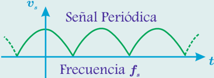

# 4.1.1 Definiciones

Tags: #eli214
## 4.1.1. Definiciones

Señal: es cualquier cantidad física cuya magnitud pueda especificarse en el tiempo en forma unívoca como una función ξ ( t ) , donde nos centramos en las señales de tensión y corriente, ya sea tanto de las fuentes como de los diversos componentes circuitales.

Ejemplo: Señal de tensión s

ξ ( t ) = v ( t )

Componente continua: en una señal es el valor medio que se obtiene como una media ponderada de valores en un cierto intervalo o como la integral de la función en un período dividida por el mismo período de estudio.

Si lo que interesa es obtener el valor medio de una señal cualquiera ξ ( t ) , llamado ξ , en un cierto intervalo [t 1 , t 2 ] o en un cierto período T ( señal periódica ), se tendrían las siguientes formas de cálculo:

$$\bar { \xi } = \frac { 1 } { t _ { 2 } - t _ { 1 } } \int _ { t _ { 1 } } ^ { t _ { 2 } } \xi ( t ) d t = \frac { 1 } { T } \int _ { t _ { 0 } } ^ { t _ { 0 } + T } \xi ( t ) d t = \frac { \sum _ { k = 1 } ^ { n } \xi ( k ) \Delta t _ { k } } { \sum _ { k = 1 } ^ { n } \Delta t _ { k } }$$

Por lo tanto se puede asegurar que:

$$\xi _ { c c } ( t ) = \overline { \xi }$$

Componente alterna: es la señal sin su valor medio .

$$\xi _ { c a } ( t ) = \xi ( t ) - \xi _ { c c }$$

Por consiguiente se tiene que por definición ξ ca = 0 . Cabe destacar que la componente alterna si bien tiene un período ( T ) y una frecuencia fundamental ω s , también puede tener sobrepuestas componentes de varias otras frecuencias en ella.

Ondulación: también conocido como 'ripple' , es una medida de la variabilidad periódica que tiene una señal, típicamente cuando la componente continua es dominante o tiene el mayor peso relativo.

$$\delta = \frac { 1 } { 2 } ( \hat { \xi } - \check { \xi } )$$

donde ˆ ξ y ˇ ξ son los valores máximo y mínimo de la señal ξ ( t ) respectivamente, en un cierto período.

Una interpretación para la ondulación desde el punto de vista de su formulación, es que coincide con la definición de amplitud de una señal alterna simétrica .

