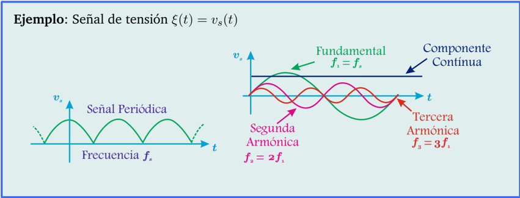
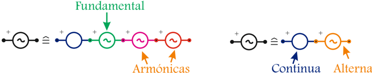

# 4.1.2 Descomposición de señales

Tags: #eli214
## 4.1.2. Descomposición de señales

La descomposición de señales alude a que toda señal periódica ξ , cualquiera sea su forma temporal, de acuerdo a 'Fourier' 1 puede expresarse como una (1) componente continua más una (1) componente alterna , pero a su vez la componente alterna se puede expresar como una suma infinita de funciones esenciales y ortogonales sen ( kω s t ) y cos ( kω s t ) permitiendo bajo la linealidad de los sistemas, estudiarlos bajo el principio de superposición.

De este modo se tiene:

$$\xi ( t ) \approx \tilde { \xi } ( t ) = a _ { 0 } + \sum _ { k = 1 } ^ { \infty } \{ a _ { k } \cdot \cos ( k \omega _ { s } t ) + b _ { k } \cdot s e n ( k \omega _ { s } t ) \}$$

donde:

$$a _ { 0 } = \frac { 1 } { T } \int _ { t _ { 0 } } ^ { t _ { 0 } + T } y ( t ) d t = \xi _ { c c } ( t ) = \bar { \xi }$$

$$a _ { k } = \frac { 2 } { T } \int _ { t _ { 0 } } ^ { t _ { 0 } + T } y ( t ) \cdot \cos ( k \omega _ { s } t ) d t , \ \forall k \in \mathbb { N }$$

$$b _ { k } = \frac { 2 } { T } \int _ { t _ { 0 } } ^ { t _ { 0 } + T } y ( t ) \cdot s e n ( k \omega _ { s } t ) d t , \ \forall k \in \mathbb { N }$$

1 Matemático francés Jean-Baptiste Joseph Fourier, que desarrolló la teoría cuando estudiaba la ecuación del calor, mostrando que una serie infinita converge puntualmente a una función periódica y continua.

$$\omega _ { s } = 2 \cdot \pi \cdot f _ { s } = \frac { 2 \cdot \pi } { T }$$

Para este caso se tiene una definición general para la componente alterna ξ ca ( t ) = ∑ ∞ k =1 ( a k · cos ( kω s t ) + b k · sen ( kω s t )) , con lo cual se puede decir que la componente alterna está formada por múltiples frecuencias, ponderadas por las amplitudes a k y b k . Al centrarse en la frecuencia principal se define a la componente fundamental de frecuencia angular ' ω s ' como:

$$\xi _ { c a 1 } ( t ) = ( a _ { 1 } \cdot \cos ( \omega _ { s } t ) + b _ { 1 } \cdot s e n ( \omega _ { s } t ) ) = \underbrace { \left ( \sqrt { a _ { 1 } ^ { 2 } + b _ { 1 } ^ { 2 } } \right ) \cdot \cos ( \omega _ { s } t - t a n ^ { - 1 } ( b _ { 1 } / a _ { 1 } ) ) } _ { c _ { 1 } } \quad ( 4 . 9 )$$

La sumatoria de componentes de frecuencia que queda luego de restar la fundamental de la señal alterna, se le suelen denominar armónicos:

$$\text {ArmonicosTotales} \colon \xi _ { c a } ( t ) - \xi _ { c a } ( t ) _ { 1 } = \sum _ { k = 2 } ^ { \infty } \{ a _ { k } \cdot \cos ( k \omega _ { s } t ) + b _ { k } \cdot s e n ( k \omega _ { s } t ) \}$$

$$k - \hat { \epsilon } \sin o n { \dot { \epsilon } } { \cos ( t ) } _ { k } = \underbrace { \left ( \sqrt { a _ { k } ^ { 2 } + b _ { k } ^ { 2 } } \right ) \cdot \cos ( k \omega _ { s } t - t a n ^ { - 1 } ( b _ { k } / a _ { k } ) ) } _ { c _ { k } } , \ \forall k \geqslant 2 \in \mathbb { N }$$

De este modo se define el índice de Distorsión Total Armónica 2 como un índice para determinar que tan pura es la señal alterna, por ejemplo de nuestra red eléctrica:

$$T H D _ { \xi _ { c a } } = \sqrt { \frac { \sum _ { k = 2 } ( a _ { k } ^ { 2 } + b _ { k } ^ { 2 } ) } { a _ { 1 } ^ { 2 } + b _ { 1 } ^ { 2 } } } = \frac { \sqrt { \sum _ { k = 2 } ( \xi _ { c a , e f _ { k } } ^ { 2 } ) } } { \xi _ { c a , e f _ { 1 } } }$$

Donde típicamente desde un punto de vista técnico y práctico se evalúa hasta k = 50 .

Cuando una señal se descompone en sus señales elementales de frecuencias, siempre se puede obtener una representación circuital que reproduzca tal sumatoria, como lo que obtendría en un modelo serie si la señal es de tensión o en un modelo paralelo si la señal es de corriente .

De este modo, si se desea resolver un problema se utiliza el principio de superposición . Sin embargo, en el caso de querer medir una componente específica de la señal en cuestión, se debiera intentar según el principio físico dominante, intentar 'filtrar la señal' y dejar solamente la información que se desea medir.

2 Total Harmonic Distortion.

