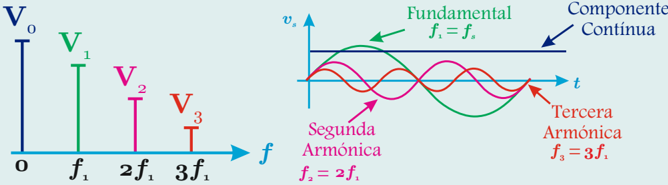
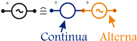
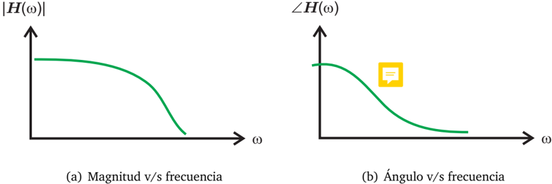
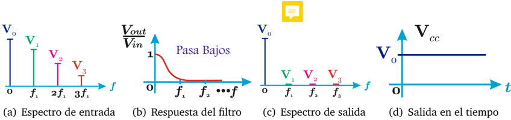
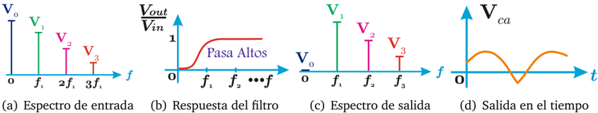
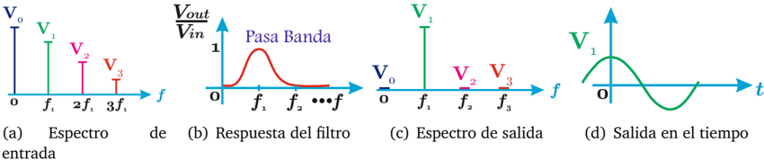

# 4.1.3 Respuesta en frecuencias y filtros

Tags: #eli214
## 4.1.3. Respuesta en frecuencias y filtros

El concepto de 'respuesta en frecuencias' nace de aplicar a un sistema lineal e invariante (S.L.I) una señal con muchas frecuencias como fuente y ver como el sistema 'responde' a cada una de las frecuencias, generando una salida con las mismas componentes de frecuencia, pero cambiando la amplitud y la fase, conceptos se denominan 'ganancias' .

El concepto de 'filtro' alude a un sistema específico que es capaz de dar ganancia de amplitud nula a entradas de un cierto rango de frecuencias, mientras que a señales de otro rango de frecuencias, mantienen o amplifican sus amplitudes de entrada.

Por tanto, se hace necesario determinar de una forma simple las amplitudes o valores efectivos para cada frecuencia presentes en una señal, la que se le denomina 'espectro de magnitud' .

## 4.1.3.1. Espectro de magnitud

A partir de la serie de Fourier , se aprecia que aplicando la Transformada Fasorial , elemento a elemento tendremos n -→ ∞ fasores, cada uno de frecuencia distinta:

$$\ M a g n i t u d \colon c _ { k } = \sqrt { a _ { k } ^ { 2 } + b _ { k } ^ { 2 } }$$

$$\dot { \ A n g u l o } \colon \varphi _ { k } = - t a n ^ { - 1 } \left \{ \frac { b _ { k } } { a _ { k } } \right \}$$

Frecuencia angular: k

ω = k · ω s

Ejemplo : Señal de tensión ξ ( t ) = v s ( t ) mostrando su comportamiento en términos de su espectro de magnitud.

(a) Espectro en frecuencia de ξ ( t ) en f u ω (b) Separación de las componentes de ξ ( t ) en t

Figura 4.1: Ejemplo del espectro en frecuencia de una señal

La transformada Fasorial permite trabajar de forma sencilla con señales expresadas en variables trigonométricas de frecuencia única, llevándolas a variables complejas donde sólo interesa su magnitud y su ángulo relativo.

Claro está que estos fasores no pueden mezclarse en el plano complejo, porque sus frecuencias son distintas, con lo cual no se podría tener una representación estática de vectores (fasores) para la resolución de problemas. También se puede asumir que la componente continua se trabaja como un fasor de frecuencia cero, fasores que no presentarían desfases salvo 0 o ( valores positivos según referencia) y 180 o ( valores negativos ).

Por ello es una herramienta muy útil el poder graficar o medir con instrumentos adecuados el espectro de magnitud de una señal, notando que éste tiene un comportamiento discreto porque no hay frecuencias entre ω k y ω k +1 con k ∈ N , dada la descripción del modelo provisto por Fourier .

El espectro de magnitud es una poderosa herramienta para analizar y entender las distintas componentes de frecuencia que tiene una señal, su peso relativo en la sumatoria de Fourier o en la fuente equivalente del modelo circuital.

## 4.1.3.2. Respuesta en frecuencias

La respuesta en frecuencias se entiende como una modificación que sufre en estado estacionario cada señal de frecuencia al pasar por un sistema lineal e invariante ( S.L.I. )

Desde el punto de vista de las redes eléctricas, se busca analizar en un sistema la relación que hay entre una salida (definida por el usuario) y la entrada (fuente), realizando el lugar geométrico respecto de la frecuencia . Considerando la relación compleja salida/entrada es que se denomina función de transferencia H ( ω ) , ya que se interpreta como 'el transferir una señal de entrada a un circuito para determinar la señal de salida' , pero normalmente en vez de dibujarla en un plano complejo, se separa en 'magnitud v/s frecuencia' y 'ángulo v/s frecuencia' . Note que la respuesta en frecuencias es una función continua.

Figura 4.2: Ejemplo de respuesta en frecuencia de un sistema

Continua La respuesta en frecuencia, es una gráfica continua porque es válida para cualquier frecuencia cuyo origen es justificado por la Transformada de Fourier que a su vez es la versión continua de su serie trigonométrica. Por ello cuando se grafica el módulo de una función de transferencia respecto a la frecuencia se le suele llamar 'densidad espectral' .

Desde un punto de vista teórico, el lugar geométrico de la frecuencia de un sistema nos arroja una función H ( ω ) de forma explícita. Desde el punto de vista de laboratorio si quisiéramos obtener H ( ω ) de forma experimental, habría que hacer pasar por el sistema bajo estudio una señal sinusoidal pura de frecuencia variable y analizar el cambio de amplitud y fase que se obtendría en la salida definida para cada frecuencia.

Cuando se analiza el lugar geométrico de la frecuencia de un circuito, ya sea por medio de la impedancia, admitancia o cualquier otra función de transferencia, típicamente se la dibuja en un plano complejo donde el parámetro implícito es la frecuencia ω . A este tipo de diagrama se le suele llamar Diagrama Nyquist .

Si por el contrario, con el mismo lugar geométrico, se opta por hacer una representación solamente de la magnitud respecto a la frecuencia o solamente del ángulo relativo de desfase respecto de la frecuencia, pero por conveniencia descrito en escala logarítmica, a ese tipo de diagrama se le llama Diagrama de Bode .

## 4.1.3.3. Filtros como una respuesta de un sistema

Un filtro es un circuito eléctrico pasivo o activo cuya función de transferencia H ( ω ) o relación V out ( ω ) / V in ( ω ) tiene desde el punto de vista de su magnitud , una característica especial que potencia o amplifica la señal de entrada en un cierto rango de frecuencias, mientras que las atenúa o las elimina en otro rango . Ello implica que es un requisito esencial el poder manipular y dar forma a la respuesta de magnitud del filtro , para dar la forma deseada a la salida en términos de los grados de libertad disponibles y del orden que éste posee.

Un filtro se usa en cascada a la señal de entrada, para extraer de ella solo las componentes de frecuencias que sean de interés. Los filtros típicos y más generales son: Pasa bajos , pasa altos y pasa bandas , en honor a las frecuencias que 'dejan pasar' cuyo ajuste se determina a partir de la llamada frecuencia de corte ( f c ó ω c ) o frecuencia desde donde el filtro comienza a atenuar o amplificar la magnitud.

Considere como ejemplo ξ ( t ) = v s ( t ) de la figura 4.1(a) donde se presentó su espectro en frecuencias. Con ello se tienen las siguientes definiciones:

Pasa bajos: Filtro que deja pasar frecuencias bajas, consideradas desde 0 hasta f = f 1 &lt; f c , donde f c es la frecuencia de corte del filtro.

Figura 4.3: Respuesta de un filtro pasa bajos. Ej: f c &lt; f 1

Del ejemplo se aprecia que al interceptar el espectro de entrada con la respuesta del filtro con frecuencia de corte f c &lt; f 1 (operación de convolución en el tiempo), solamente pasan las frecuencias muy bajas dejando únicamente la componente continua.

.

Pasa altos: Filtro que deja pasar frecuencias desde f = f 0 &gt; f c hasta f →∞

Figura 4.4: Respuesta de un filtro pasa altos. Ej: f c &gt; f 0

Del ejemplo se aprecia que al interceptar el espectro de entrada con la respuesta del filtro con frecuencia de corte f c &gt; f 0 (operación de convolución en el tiempo), solamente pasan las frecuencias altas, es decir, se elimina únicamente la componente continua.

Pasa banda: Filtro que deja pasar frecuencias bajas entre f c 1 hasta f c 2 .

Figura 4.5: Respuesta de un filtro pasa banda. Ej: f c 1 &lt; f 1 y f c 2 &gt; f 1

Del ejemplo se aprecia que al interceptar el espectro de entrada con la respuesta del filtro, solamente sobrevive la componente de frecuencia fundamental f 1 , dadas las frecuencias de corte superior e inferior.

Un filtro pasa banda se puede entender como la superposición de un filtro pasa bajos con uno pasa altos debidamente ajustadas sus frecuencias de corte.

Por tanto, cuando se busca medir tensión y/o corriente continua en un circuito específico, se debe indicar cuales son las variables a medir, en el entendido del proceso físico involucrado. Las señales a medir pueden traer muchas frecuencias superpuestas que son innecesarias y pudieran empeorar la medición, la cuales deberían ser filtradas previamente, sino disponer un proceso físico de medición que cumpla también la función de filtro.

Por el momento este apartado se centrará en estudios con señales continuas puras.

SECCIÓN 4.2

## Modelos eléctricos de voltímetros y amperímetros

La medición de tensión y corriente se realiza generalmente con los siguientes tipos de instrumentos:

- a.Instrumento de bobina móvil .
- b.Instrumento electrónico.

La principal diferencia entre ellos radica en que los primeros son sensibles a la corriente, donde la deflexión de la aguja es por al fuerza eléctrica proporcional a la corriente que vence a la fuerza mecánica del resorte del instrumento. Los instrumentos electrónicos, en cambio, son sensibles a la tensión dada la etapa de conversión analógica digital. Esto es bajo el supuesto que cualquier instrumento debe contar con una etapa de adaptación de la señal a medir, para reducir las magnitudes a niveles seguros para el instrumento.

## 4.1.3. Respuesta en frecuencias y filtros

El concepto de 'respuesta en frecuencias' nace de aplicar a un sistema lineal e invariante (S.L.I) una señal con muchas frecuencias como fuente y ver como el sistema 'responde' a cada una de las frecuencias, generando una salida con las mismas componentes de frecuencia, pero cambiando la amplitud y la fase, conceptos se denominan 'ganancias' .

El concepto de 'filtro' alude a un sistema específico que es capaz de dar ganancia de amplitud nula a entradas de un cierto rango de frecuencias, mientras que a señales de otro rango de frecuencias, mantienen o amplifican sus amplitudes de entrada.

Por tanto, se hace necesario determinar de una forma simple las amplitudes o valores efectivos para cada frecuencia presentes en una señal, la que se le denomina 'espectro de magnitud' .

## 4.1.3.1. Espectro de magnitud

A partir de la serie de Fourier , se aprecia que aplicando la Transformada Fasorial , elemento a elemento tendremos n -→ ∞ fasores, cada uno de frecuencia distinta:

$$\ M a g n i t u d \colon c _ { k } = \sqrt { a _ { k } ^ { 2 } + b _ { k } ^ { 2 } }$$

$$\dot { \ A n g u l o } \colon \varphi _ { k } = - t a n ^ { - 1 } \left \{ \frac { b _ { k } } { a _ { k } } \right \}$$

Frecuencia angular: k

ω = k · ω s

Ejemplo : Señal de tensión ξ ( t ) = v s ( t ) mostrando su comportamiento en términos de su espectro de magnitud.

(a) Espectro en frecuencia de ξ ( t ) en f u ω (b) Separación de las componentes de ξ ( t ) en t

Figura 4.1: Ejemplo del espectro en frecuencia de una señal

La transformada Fasorial permite trabajar de forma sencilla con señales expresadas en variables trigonométricas de frecuencia única, llevándolas a variables complejas donde sólo interesa su magnitud y su ángulo relativo.

Claro está que estos fasores no pueden mezclarse en el plano complejo, porque sus frecuencias son distintas, con lo cual no se podría tener una representación estática de vectores (fasores) para la resolución de problemas. También se puede asumir que la componente continua se trabaja como un fasor de frecuencia cero, fasores que no presentarían desfases salvo 0 o ( valores positivos según referencia) y 180 o ( valores negativos ).

Por ello es una herramienta muy útil el poder graficar o medir con instrumentos adecuados el espectro de magnitud de una señal, notando que éste tiene un comportamiento discreto porque no hay frecuencias entre ω k y ω k +1 con k ∈ N , dada la descripción del modelo provisto por Fourier .

El espectro de magnitud es una poderosa herramienta para analizar y entender las distintas componentes de frecuencia que tiene una señal, su peso relativo en la sumatoria de Fourier o en la fuente equivalente del modelo circuital.

## 4.1.3.2. Respuesta en frecuencias

La respuesta en frecuencias se entiende como una modificación que sufre en estado estacionario cada señal de frecuencia al pasar por un sistema lineal e invariante ( S.L.I. )

Desde el punto de vista de las redes eléctricas, se busca analizar en un sistema la relación que hay entre una salida (definida por el usuario) y la entrada (fuente), realizando el lugar geométrico respecto de la frecuencia . Considerando la relación compleja salida/entrada es que se denomina función de transferencia H ( ω ) , ya que se interpreta como 'el transferir una señal de entrada a un circuito para determinar la señal de salida' , pero normalmente en vez de dibujarla en un plano complejo, se separa en 'magnitud v/s frecuencia' y 'ángulo v/s frecuencia' . Note que la respuesta en frecuencias es una función continua.

Figura 4.2: Ejemplo de respuesta en frecuencia de un sistema

Continua La respuesta en frecuencia, es una gráfica continua porque es válida para cualquier frecuencia cuyo origen es justificado por la Transformada de Fourier que a su vez es la versión continua de su serie trigonométrica. Por ello cuando se grafica el módulo de una función de transferencia respecto a la frecuencia se le suele llamar 'densidad espectral' .

Desde un punto de vista teórico, el lugar geométrico de la frecuencia de un sistema nos arroja una función H ( ω ) de forma explícita. Desde el punto de vista de laboratorio si quisiéramos obtener H ( ω ) de forma experimental, habría que hacer pasar por el sistema bajo estudio una señal sinusoidal pura de frecuencia variable y analizar el cambio de amplitud y fase que se obtendría en la salida definida para cada frecuencia.

Cuando se analiza el lugar geométrico de la frecuencia de un circuito, ya sea por medio de la impedancia, admitancia o cualquier otra función de transferencia, típicamente se la dibuja en un plano complejo donde el parámetro implícito es la frecuencia ω . A este tipo de diagrama se le suele llamar Diagrama Nyquist .

Si por el contrario, con el mismo lugar geométrico, se opta por hacer una representación solamente de la magnitud respecto a la frecuencia o solamente del ángulo relativo de desfase respecto de la frecuencia, pero por conveniencia descrito en escala logarítmica, a ese tipo de diagrama se le llama Diagrama de Bode .

## 4.1.3.3. Filtros como una respuesta de un sistema

Un filtro es un circuito eléctrico pasivo o activo cuya función de transferencia H ( ω ) o relación V out ( ω ) / V in ( ω ) tiene desde el punto de vista de su magnitud , una característica especial que potencia o amplifica la señal de entrada en un cierto rango de frecuencias, mientras que las atenúa o las elimina en otro rango . Ello implica que es un requisito esencial el poder manipular y dar forma a la respuesta de magnitud del filtro , para dar la forma deseada a la salida en términos de los grados de libertad disponibles y del orden que éste posee.

Un filtro se usa en cascada a la señal de entrada, para extraer de ella solo las componentes de frecuencias que sean de interés. Los filtros típicos y más generales son: Pasa bajos , pasa altos y pasa bandas , en honor a las frecuencias que 'dejan pasar' cuyo ajuste se determina a partir de la llamada frecuencia de corte ( f c ó ω c ) o frecuencia desde donde el filtro comienza a atenuar o amplificar la magnitud.

Considere como ejemplo ξ ( t ) = v s ( t ) de la figura 4.1(a) donde se presentó su espectro en frecuencias. Con ello se tienen las siguientes definiciones:

Pasa bajos: Filtro que deja pasar frecuencias bajas, consideradas desde 0 hasta f = f 1 &lt; f c , donde f c es la frecuencia de corte del filtro.

Figura 4.3: Respuesta de un filtro pasa bajos. Ej: f c &lt; f 1

Del ejemplo se aprecia que al interceptar el espectro de entrada con la respuesta del filtro con frecuencia de corte f c &lt; f 1 (operación de convolución en el tiempo), solamente pasan las frecuencias muy bajas dejando únicamente la componente continua.

.

Pasa altos: Filtro que deja pasar frecuencias desde f = f 0 &gt; f c hasta f →∞

Figura 4.4: Respuesta de un filtro pasa altos. Ej: f c &gt; f 0

Del ejemplo se aprecia que al interceptar el espectro de entrada con la respuesta del filtro con frecuencia de corte f c &gt; f 0 (operación de convolución en el tiempo), solamente pasan las frecuencias altas, es decir, se elimina únicamente la componente continua.

Pasa banda: Filtro que deja pasar frecuencias bajas entre f c 1 hasta f c 2 .

Figura 4.5: Respuesta de un filtro pasa banda. Ej: f c 1 &lt; f 1 y f c 2 &gt; f 1

Del ejemplo se aprecia que al interceptar el espectro de entrada con la respuesta del filtro, solamente sobrevive la componente de frecuencia fundamental f 1 , dadas las frecuencias de corte superior e inferior.

Un filtro pasa banda se puede entender como la superposición de un filtro pasa bajos con uno pasa altos debidamente ajustadas sus frecuencias de corte.

Por tanto, cuando se busca medir tensión y/o corriente continua en un circuito específico, se debe indicar cuales son las variables a medir, en el entendido del proceso físico involucrado. Las señales a medir pueden traer muchas frecuencias superpuestas que son innecesarias y pudieran empeorar la medición, la cuales deberían ser filtradas previamente, sino disponer un proceso físico de medición que cumpla también la función de filtro.

Por el momento este apartado se centrará en estudios con señales continuas puras.

