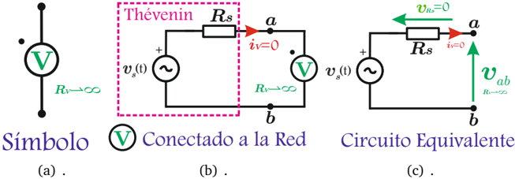
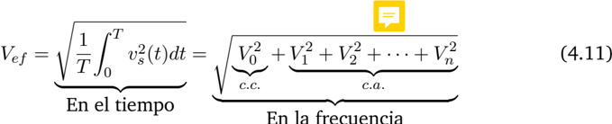
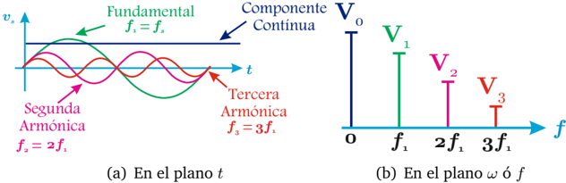
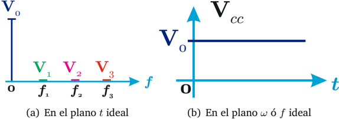

# 4.2.1 Voltímetro ideal

Tags: #eli214
## 4.2.1. Voltímetro ideal

Mide el valor medio o componente continua de la señal de tensión que se encuentre entre sus terminales, con polaridad claramente definida, sin consumir corriente y por lo tanto, sin consumir potencia potencia media.

Figura 4.6: Modelo del voltímetro ideal

Si la señal de tensión que mide el voltímetro (V) ó V es rica en frecuencias, se sabe entonces que el valor efectivo se calculará como:

Figura 4.7: Señal rica en frecuencias

Por tanto el valor medido en continua será :

$$\bar { v } _ { s } ( t ) = \bar { v } _ { a b } ( t ) = V _ { 0 } = V _ { c c }$$

Figura 4.8: Respuesta del voltímetro

Sin embargo, la tensión que ingresa al instrumento sigue siendo v s ( t ) , por lo que la potencia media que consume es:

$$P _ { ( V ) } = \frac { V _ { e f } ^ { 2 } } { \mathcal { R } _ { v } ^ { \sim \infty } } \rightarrow 0$$

En un caso no ideal, todas las componentes de frecuencia disiparían potencia en la resistencia interna del voltímetro.

