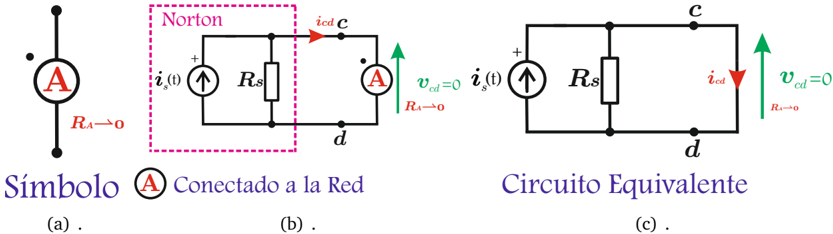

# 4.2.2 Amperímetro ideal

Tags: #eli214
## 4.2.2. Amperímetro ideal

Mide el valor medio o componente continua de la señal de corriente que circule a través de sus terminales, con polaridad claramente definida y positiva cuando la corriente entra por el punto de polaridad (referencia carga), sin que exista una caída de tensión interna, es decir, sin consumir potencia media.

Figura 4.9: Modelo del amperímetro ideal

Si la señal de corriente que mide el amperímetro (A) ó A es rica en componentes de frecuencias, se sabe entonces que el valor efectivo será:

$$I _ { e f } = \sqrt { \frac { 1 } { T } \int _ { 0 } ^ { T } i _ { s } ^ { 2 } ( t ) d t } = \sqrt { \underbrace { I _ { 0 } ^ { 2 } + I _ { 1 } ^ { 2 } + I _ { 2 } ^ { 2 } + \cdots I _ { n } ^ { 2 } } }$$

Por tanto el valor medido en continua:

$$\bar { i } _ { s } ( t ) = \bar { i } _ { c d } ( t ) = I _ { 0 }$$

Sin embargo, la tensión que ingresa al instrumento sigue siendo i s ( t ) , por lo que la potencia media que consume es:

$$P _ { ( A ) } = I _ { e f } ^ { 2 } \mathcal { R } _ { a } ^ { \times } \rightarrow 0$$

SECCIÓN 4.3

## Instrumentos analógicos

## 4.2.2. Amperímetro ideal

Mide el valor medio o componente continua de la señal de corriente que circule a través de sus terminales, con polaridad claramente definida y positiva cuando la corriente entra por el punto de polaridad (referencia carga), sin que exista una caída de tensión interna, es decir, sin consumir potencia media.

Figura 4.9: Modelo del amperímetro ideal

Si la señal de corriente que mide el amperímetro (A) ó A es rica en componentes de frecuencias, se sabe entonces que el valor efectivo será:

$$I _ { e f } = \sqrt { \frac { 1 } { T } \int _ { 0 } ^ { T } i _ { s } ^ { 2 } ( t ) d t } = \sqrt { \underbrace { I _ { 0 } ^ { 2 } + I _ { 1 } ^ { 2 } + I _ { 2 } ^ { 2 } + \cdots I _ { n } ^ { 2 } } }$$

Por tanto el valor medido en continua:

$$\bar { i } _ { s } ( t ) = \bar { i } _ { c d } ( t ) = I _ { 0 }$$

Sin embargo, la tensión que ingresa al instrumento sigue siendo i s ( t ) , por lo que la potencia media que consume es:

$$P _ { ( A ) } = I _ { e f } ^ { 2 } \mathcal { R } _ { a } ^ { \times } \rightarrow 0$$

