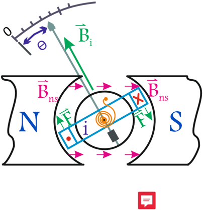
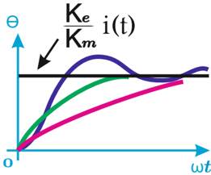
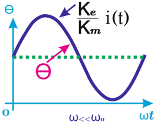
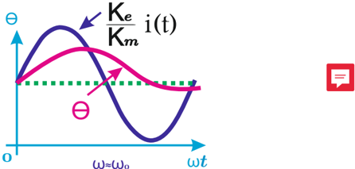
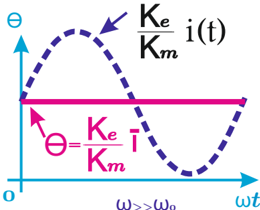

# 4.3.1 Instrumento de bobina móvil

Tags: #eli214
## 4.3.1. Instrumento de bobina móvil

Es un instrumento electromagnético de indicación analógica (escala), que es sensible al valor medio de la corriente que circula por su bobina móvil .

Las partes principales del instrumento son:

1. Escala.
2. Aguja.
3. Imán fijo de campo ⃗ B ns .
4. bobina móvil con terminales de entrada, que producen un campo ⃗ B i ( i ) ∝ i ( t ) , como función de la circulación de corriente i ( t ) .
5. Resorte tipo espiral, con ley de Hooke angular T r = k r · θ .

Es en pocas palabras se está en presencia de un galvanómetro , que actúa como un transductor analógico-electromecánico que produce una rotación en un eje donde yace una aguja o puntero, rotación que es en respuesta a la corriente eléctrica que fluye a través de su bobina. El galvanómetro es capaz de detectar la presencia de pequeñas corrientes en un circuito cerrado y puede ser adaptado, mediante su calibración , para medir su magnitud. Su principio de operación ( bobina móvil e imán fijo ) se conoce como mecanismo de D'Arsonval 3 .

Mecánicamente se tiene que el imán fijo produce un campo magnético aproximadamente constante ⃗ B ns que atraviesa la zona donde se desplaza rotacionalmente la bobina móvil . Si por la bobina móvil circula una corriente continua i ( t ) , se produce un campo magnético ⃗ B i que puede girar al igual que su bobina. Este campo interactúa con ⃗ B ns de modo que se produce un torque electromecánico T e , generando movimiento de modo que los campos en estado estacionario se alineen.

Esto llevaría fácilmente a máxima deflexión de la escala si no fuera por las pérdidas del roce , la inercia angular y principalmente por el torque del resorte T r . Este último es el encargado, mediante calibración , que en estado estacionario sea igual a T e para una cierta deflexión θ , así poder ser interpretado como una lectura proporcional a la corriente ( escala lineal ) o proporcional al ángulo ( escala cuadrática ), obteniendo un instrumento de medida.

Por tanto y en resumen, de la sumatoria de torques se tiene:

$$\underbrace { \frac { T _ { e } } { k _ { e } \cdot i ( t ) } } _ { r o c e } = \underbrace { \frac { T _ { r } } { k _ { m } \cdot \theta } } _ { r o c e } + \underbrace { d \theta } _ { r o c e } + \underbrace { J \frac { d ^ { 2 } \theta } { d t ^ { 2 } } } _ { i n e r c i a } \\$$

Así la respuesta del instrumento dependerá de la forma de la corriente i ( t ) , observando los siguientes casos donde se compara la frecuencia de excitación de la señal, con la frecuencia natural del sistema electromecánico:

Estado estacionario: i ( t ) = I 0 , por lo cual en escala lineal se tiene:

$$\theta = \left ( \frac { k _ { e } } { k _ { m } } \right ) i ( t )$$

Conexión o escalón: i ( t ) = I 0 µ ( t ) , por lo cual se tendrán el conjunto de típico de respuestas para un sistema de segundo orden (De arriba a abajo: sub-amortiguada , críticamente amortiguada y sobre-amortiguada ).

3 Jacques-Arsène D'Arsonval, inventor del galvanómetro de bobina móvil y del amperímetro termopar francés

Figura 4.10: Respuesta del instrumento ( θ ( t ) ) a escalón de corriente ( i ( t ) )

En estado estacionario debe llegar a un valor proporcional a I 0 , según la descripción de la ecuación 4.14.

Continua con componente C.A.: En estado estacionario si i ( t ) = I 0 + I 1 sin ( ωt ) , se tiene en función de la frecuencia ω de excitación, respecto a la frecuencia natural del sistema ω 0 los siguientes casos:

1. Si la frecuencia de entrada es mucho menor que la frecuencia natural del sistema ( ω ≪ ω 0 ) entonces se tiene que el movimiento angular de la aguja seguirá al movimiento temporal de i ( t ) , es decir, la aguja tendrá un valor medio proporcional a I 0 , pero oscilará entorno a ese punto medio con amplitud proporcional a I 1 .
2. Si la frecuencia de entrada es muy similar que la frecuencia natural del sistema ( ω ≈ ω 0 ) entonces se tiene que el movimiento angular de la aguja deja de seguir perfectamente al movimiento temporal de i ( t ) , habiendo un desfase y una amortiguación de esta oscilación cada vez más grande conforme crezca la frecuencia de entrada.

Figura 4.11: Respuesta θ ( t ) a i ( t ) con frecuencia ω ≪ ω 0

ω ω

0

Figura 4.12: Respuesta θ ( t ) a i ( t ) con frecuencia ω ≈ ω 0

3. Si la frecuencia de entrada es mucho mayor que la frecuencia natural del sistema ( ω ≫ ω 0 ) , entonces se tiene que el movimiento angular de la aguja no puede seguir al movimiento temporal de i ( t ) , salvo por su componente continua. Por ello, es que se interpreta a la respuesta en frecuencias del instrumento como una del tipo pasa bajos, con frecuencia corte ω 0 .

ω

&gt;&gt;

ω

0

Figura 4.13: Respuesta θ ( t ) a i ( t ) con frecuencia ω ≫ ω 0

