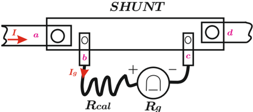
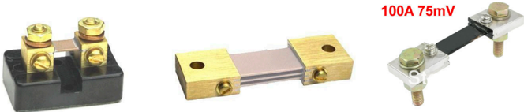
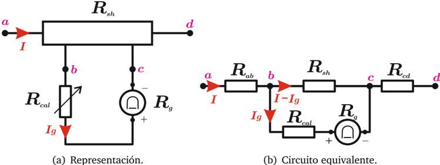
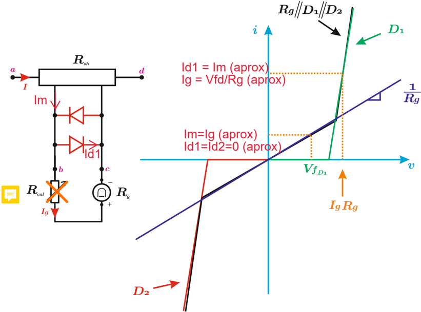
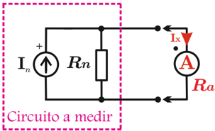
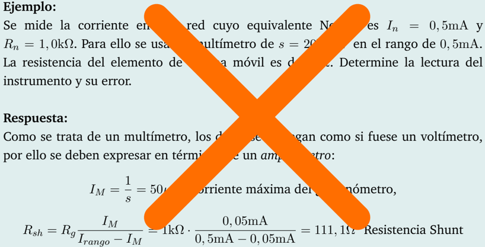

# 4.3.2 Amperímetro de bobina móvil

Tags: #eli214
## 4.3.2. Amperímetro de bobina móvil

Un amperímetro , tal como se indica en este acápite, se construye usando un galvanómetro de bobina móvil . Como el galvanómetro es muy sensible a pequeñas magnitudes de corriente, es necesario adaptar la señal que ha de ingresar a la bobina móvil. Por esta razón es que a partir del principio del divisor de corriente se usa un resistor en paralelo o resistor shunt el cual debe tener una resistencia muy pequeña y una capacidad de transporte de corriente adecuada para no quemarse ni dañarse.

Gracias a que la resistencia shunt es de un valor muy bajo, en paralelo a la resistencia equivalente del circuito de medida, es que la resistencia del amperímetro se puede muchas veces aproximar al valor del shunt , cumpliendo a priori la premisa básica que el amperímetro ideal debe tener resistencia nula .

La representación y circuito equivalente para estudiar el amperímetro de bobina móvil , se presenta a continuación en la figura 4.14.

Figura 4.14: Representación y circuito equivalente de un amperímetro de bobina móvil.

Se aprecia desde las tensiones de las ramas en paralelo que:

$$( I - I _ { g } ) R _ { s h } = I _ { g } ( R _ { c a l } + R _ { g } ) \longrightarrow s i \ I _ { g } \ll I \Rightarrow R _ { s h } \ll ( R _ { c a l } + R _ { g } )$$

## Ejemplo:

Suponga que se posee un galvanómetro de 1mA -60mV , no se dispone de R cal y se necesita calcular una resistencia shunt para medir a fondo de escala 50A .

De la ecuación anterior se tiene que:

$$R _ { s h } = \frac { 6 0 m V } { 1 m A } \left ( \frac { 0 , 0 0 1 A } { 5 0 A - 0 , 0 0 1 A } \right ) = 1 , 2 0 m \Omega$$

Para proteger a un galvanómetro de sobrecorrientes que pudieran dañar el dispositivo, normalmente se usa un arreglo de diodos ( 'modelo real' ) en antiparalelo. En el rango de operación del galvanómetro se tiene que los diodos no consumen corriente y están en estado abierto. Con corrientes en sentido directo y caídas de tensión ánodo-cátodo mayores que V Dx (típicamente 0 , 7V ), el diodo D x se comporta como un cortocircuito de resistencia casi nula, desviando toda la corriente del galvanómetro. Lo anterior se aprecia en la figura 4.15.

Figura 4.15: Protección de un amperímetro de bobina móvil.

## 4.3.2.1. Error sistemático introducido por la resistencia interna

Si se tuvieran instrumentos ideales, que para el caso del amperímetro sería con resistencia interna nula, se podría leer perfectamente la corriente del equivalente Norton en los terminales de interés. Sin embargo, producto de la naturaleza física del instrumento y elementos reales con pérdidas, la conexión del amperímetro afecta al circuito original produciendo que la variable a medir cambie, lo cual produce en definitivas cuentas un error que se le denomina sistemático .

Por tanto, al comparar el caso ideal con el real , el error sistemático se estima como:

- a.Sin instrumento, con un cortocircuito ideal se tiene que:

$$I _ { x _ { a } } \equiv I _ { n } , \ \ V a l o r \ v e r d a d e r o$$

- b.Con instrumento y sus pérdidas equivalentes ( R a ≈ R sh ) se tiene que:

$$I _ { x _ { b } } \equiv I _ { n } \left ( \frac { 1 } { 1 + \frac { R _ { a } } { R _ { n } } } \right ) , \ \ V a l o r \, m e d i d o$$

- c.Por tanto el error sistemático:

$$\varepsilon _ { a } = \left ( \frac { I _ { x _ { b } } - I _ { x _ { a } } } { I _ { x _ { a } } } \right ) 1 0 0 \, \% = - \left ( \frac { 1 0 0 } { 1 + \frac { R _ { n } } { R _ { a } } } \right ) \, \%$$

$$\colon \text {si se desea que} \| \varepsilon _ { a } \| < 1 \, \% \Leftrightarrow R _ { a } < \frac { R _ { n } } { 9 9 }$$

Por tanto la resistencia interna del amperímetro es R a = 100Ω y de esa forma la lectura del instrumento es I med = 0 , 455mA y ε ( A ) = -9 , 1 % .

