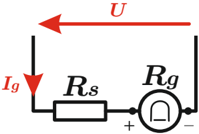
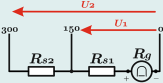
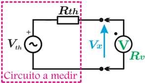
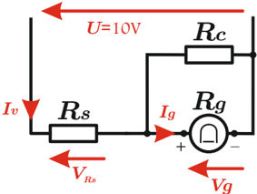
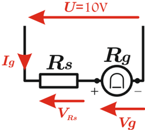

# 4.3.3 Voltímetro de bobina móvil

Tags: #eli214
## 4.3.3. Voltímetro de bobina móvil

Un voltímetro de bobina móvil se puede construir a partir de un galvanómetro, cuando se le añade en serie una resistencia resistencia R s . De este modo se limita la corriente que circula por el galvanómetro, ajustando R s para que la tensión de fondo de escala coincida con la corriente máxima.

Si se caracteriza al galvanómetro por la corriente máxima que puede soportar I M y su resistencia interna R g , se podría calcular la resistencia R s a partir de la tensión máxima que se espera medir a fondo de escala U , según:

$$R _ { s } = \frac { U } { I _ { M } } - R _ { g }$$

Luego, la sensibilidad s del voltímetro sería:

$$s = \frac { 1 } { I _ { M } } = \frac { R _ { g } + R _ { s } } { U } \ [ \Omega / V ]$$

## Ejemplo:

Construya un voltímetro de bobina móvil para los rangos de 0 -150 -300V con un galvanómetro de 1mA -60mV .

## Respuesta:

$$R _ { s 1 } = \frac { 1 5 0 V } { 1 m A } - \frac { 6 0 m V } { 1 m A } = 1 4 9 . 9 4 0 , 0 \ [ \Omega ]$$

$$R _ { s 2 } = \frac { 3 0 0 V } { 1 m A } - \frac { 6 0 m V } { 1 m A } - R _ { s 1 } = 1 5 0 . 0 0 0 , 0 \ [ \Omega ]$$

Con una sensibilidad:

$$& R _ { s 1 } = \frac { 1 5 0 V } { 1 m A } - \frac { 6 0 m V } { 1 m A } = 1 4 9 . 9 4 0 , 0 \, [ \Omega ] \\ & = \frac { 3 0 0 V } { 1 m A } - \frac { 6 0 m V } { 1 m A } - R _ { s 1 } = 1 5 0 . 0 0 0 , 0 \, [ \Omega ]$$

$$s = \frac { 1 } { 1 m A } = 1 \ [ k \Omega / V ]$$

## 4.3.3.1. Error sistemático introducido por la resistencia interna

Si se tuvieran instrumentos ideales que para el caso del voltímetro sería con resistencia interna infinita, se podría leer perfectamente la tensión del equivalente Thévenin en los terminales de interés. Sin embargo, producto de la naturaleza física del instrumento y elementos reales con pérdidas, la conexión del voltímetro afecta al circuito original produciendo que la variable a medir cambie lo cual produce error que se le denomina sistemático .

Por tanto, al comparar el caso ideal con el real , el error sistemático se estima como:

- a.Sin instrumento, con un circuito abierto se tiene que:

$$V _ { x _ { a } } \equiv V _ { t h } , \ \ V a l o r \ v e r d a d e r o$$

b.Con instrumento y sus pérdidas equivalentes ( R v ) se tiene que:

$$V _ { x _ { b } } \equiv V _ { t h } \left ( \frac { 1 } { 1 + \frac { R _ { t h } } { R _ { v } } } \right ) , \ \ V a l o r m e d i d o$$

- c.Por tanto el error sistemático:

$$\varepsilon _ { v } = \left ( \frac { V _ { x _ { b } } - V _ { x _ { a } } } { V _ { x _ { a } } } \right ) 1 0 0 \% = - \left ( \frac { 1 0 0 } { 1 + \frac { R _ { v } } { R _ { t h } } } \right ) \, \%$$

∴ si se desea que ‖ ε a ‖ &lt; 1 % ⇔ R v &gt; 99 R th

## Ejemplo:

Se tiene una red serie con una fuente de tensión de 6V y dos resistencias de valor 1 , 0MΩ y 0 , 5MΩ . Determine el valor real y el valor medido por un multímetro de 20kΩ / V de rango 0 , 1 -0 , 5 -5 -50 -250 -1000V si mide la caída de tensión en la resistencia de 0 , 5MΩ .

## Respuesta:

El valor verdadero se obtiene del principio del divisor de tensión :

$$V _ { x _ { a } } = 6 \frac { 0 , 5 } { 1 , 0 + 0 , 5 } = 2 \left [ V \right ]$$

Luego el valor medido se obtiene de usar el rango 5V , por ello la resistencia interna de ese rango es:

$$R _ { v } = 5 V \cdot 2 0 k \Omega / V = 1 0 0 \ [ k \Omega ]$$

Por lo tanto el valor medido

$$V _ { x _ { b } } = 6 \frac { 0 , 5 / / 0 , 1 } { 1 + 0 , 5 / / 0 , 1 } = 0 , 4 6 \, [ V ]$$

Ante tal paradoja se opta por usar el rango de 0 , 5V para tener una mejor lectura. De este modo se puede llegar a que R v = 10kΩ y V x b = 0 , 058V .

Por tanto se aprecia que los errores son del -77 y -97 % respectivamente, debido a que la carga del circuito afecta al rango empleado, junto a la sensibilidad del mismo.

## 4.3.3.2. Ejemplo de construcción de un voltímetro y su calibración

Considere que se posee un galvanómetro de 1mA -500Ω con el que se desea construir un voltímetro de escala 10V .

Para ello se dispone en serie una resistencia R s en serie a la resistencia del galvanómetro, por lo cual para medir los 10V de ese rango máximo se obtiene a R s como:

$$1 0 V = 1 m A \cdot \left ( R _ { g } ^ { \prime } + R _ { s } \right ) \rightarrow R _ { s } = 9 . 5 0 0 [ \Omega ]$$

Por tanto, si hubiera que calibrar el voltímetro habría que reajustar el valor de R s . Suponga entonces que la resistencia interna del galvanómetro ( R g ) ha disminuido en un 5 % por efecto de envejecimiento y desgaste, por lo cual se tiene:

$$1 0 V = 1 m A \cdot \left ( R _ { g } ^ { 4 7 5 \Omega } \right ) \to R _ { s } = 9 . 5 2 5 [ \Omega ] = 9 . 5 0 0 [ \Omega ] + 0 , 2 6 \%$$

Por tanto se aprecia que una variación de -5 % en R g se ajusta con una variación de +0 , 26 % en el grado de libertad R s , lo cual es factible pero muy difícil en la práctica.

De lo anterior es que aparece un nueva configuración que deja en paralelo al galvanómetro una resistencia de calibración R c , de este modo sería posible ajustar o calibrar de mejor forma un circuito con variaciones porcentuales similares.

Así en su etapa inicial se habría tenido:

Si R g = 500Ω y la tensión a medir son 10V entonces:

$$V _ { g } = 5 0 0 \Omega \cdot 1 m A = 0 , 5 V \Rightarrow 9 , 5 V = V _ { R _ { s } }$$

Si se usa R s = 7 , 5kΩ , pensando que es un grado de libertad que puede ser escogido y que debe ser menor que la resistencia determinada en el caso anterior, sino nunca se tendrá la corriente nominal en el galvanómetro, se tiene que la corriente que consume el voltímetro I v será:

$$I _ { v } = \frac { 9 , 5 V } { 7 , 5 k \Omega } = 1 , 2 6 7 \, [ m A ] \Rightarrow I _ { R _ { c } } = 0 , 2 6 7 \, [ m A ]$$

Y por tanto la resistencia de calibración sería:

$$R _ { c } = \frac { 0 , 5 V } { 0 , 2 6 7 m A } = 1 . 8 7 3 \, [ \Omega ]$$

Ahora si la resistencia interna del galvanómetro ( R g ) disminuye en un 5 % por efecto de envejecimiento y desgaste, se tendría para la corriente máxima del galvanómetro al calibrar:

$$V _ { g } = 4 7 5 \Omega \cdot 1 m A = 4 7 5 m V \Rightarrow 9 , 5 2 5 V = V _ { R _ { s } }$$

La corriente que consume el voltímetro I v será:

$$I _ { v } = \frac { 9 , 5 2 5 V } { 7 , 5 k \Omega } = 1 , 2 7 0 \, [ m A ] \Rightarrow I _ { R _ { c } } = 0 , 2 7 0 \, [ m A ]$$

$$R _ { c } = \frac { 4 7 5 m V } { 0 , 2 7 0 m A } = 1 . 7 5 9 \left [ \Omega \right ] = 1 . 8 7 3 \left [ \Omega \right ] - 6 , 5 \, \%$$

Entonces:

Lo cual para una variación del -5 % en R g , se compensa de buena forma con un ajuste del -6 , 5 % de R c .

SECCIÓN 4.4

## Instrumentos electrónicos

## 4.3.3. Voltímetro de bobina móvil

Un voltímetro de bobina móvil se puede construir a partir de un galvanómetro, cuando se le añade en serie una resistencia resistencia R s . De este modo se limita la corriente que circula por el galvanómetro, ajustando R s para que la tensión de fondo de escala coincida con la corriente máxima.

Si se caracteriza al galvanómetro por la corriente máxima que puede soportar I M y su resistencia interna R g , se podría calcular la resistencia R s a partir de la tensión máxima que se espera medir a fondo de escala U , según:

$$R _ { s } = \frac { U } { I _ { M } } - R _ { g }$$

Luego, la sensibilidad s del voltímetro sería:

$$s = \frac { 1 } { I _ { M } } = \frac { R _ { g } + R _ { s } } { U } \ [ \Omega / V ]$$

## Ejemplo:

Construya un voltímetro de bobina móvil para los rangos de 0 -150 -300V con un galvanómetro de 1mA -60mV .

## Respuesta:

$$R _ { s 1 } = \frac { 1 5 0 V } { 1 m A } - \frac { 6 0 m V } { 1 m A } = 1 4 9 . 9 4 0 , 0 \ [ \Omega ]$$

$$R _ { s 2 } = \frac { 3 0 0 V } { 1 m A } - \frac { 6 0 m V } { 1 m A } - R _ { s 1 } = 1 5 0 . 0 0 0 , 0 \ [ \Omega ]$$

Con una sensibilidad:

$$& R _ { s 1 } = \frac { 1 5 0 V } { 1 m A } - \frac { 6 0 m V } { 1 m A } = 1 4 9 . 9 4 0 , 0 \, [ \Omega ] \\ & = \frac { 3 0 0 V } { 1 m A } - \frac { 6 0 m V } { 1 m A } - R _ { s 1 } = 1 5 0 . 0 0 0 , 0 \, [ \Omega ]$$

$$s = \frac { 1 } { 1 m A } = 1 \ [ k \Omega / V ]$$

## 4.3.3.1. Error sistemático introducido por la resistencia interna

Si se tuvieran instrumentos ideales que para el caso del voltímetro sería con resistencia interna infinita, se podría leer perfectamente la tensión del equivalente Thévenin en los terminales de interés. Sin embargo, producto de la naturaleza física del instrumento y elementos reales con pérdidas, la conexión del voltímetro afecta al circuito original produciendo que la variable a medir cambie lo cual produce error que se le denomina sistemático .

Por tanto, al comparar el caso ideal con el real , el error sistemático se estima como:

- a.Sin instrumento, con un circuito abierto se tiene que:

$$V _ { x _ { a } } \equiv V _ { t h } , \ \ V a l o r \ v e r d a d e r o$$

b.Con instrumento y sus pérdidas equivalentes ( R v ) se tiene que:

$$V _ { x _ { b } } \equiv V _ { t h } \left ( \frac { 1 } { 1 + \frac { R _ { t h } } { R _ { v } } } \right ) , \ \ V a l o r m e d i d o$$

- c.Por tanto el error sistemático:

$$\varepsilon _ { v } = \left ( \frac { V _ { x _ { b } } - V _ { x _ { a } } } { V _ { x _ { a } } } \right ) 1 0 0 \% = - \left ( \frac { 1 0 0 } { 1 + \frac { R _ { v } } { R _ { t h } } } \right ) \, \%$$

∴ si se desea que ‖ ε a ‖ &lt; 1 % ⇔ R v &gt; 99 R th

## Ejemplo:

Se tiene una red serie con una fuente de tensión de 6V y dos resistencias de valor 1 , 0MΩ y 0 , 5MΩ . Determine el valor real y el valor medido por un multímetro de 20kΩ / V de rango 0 , 1 -0 , 5 -5 -50 -250 -1000V si mide la caída de tensión en la resistencia de 0 , 5MΩ .

## Respuesta:

El valor verdadero se obtiene del principio del divisor de tensión :

$$V _ { x _ { a } } = 6 \frac { 0 , 5 } { 1 , 0 + 0 , 5 } = 2 \left [ V \right ]$$

Luego el valor medido se obtiene de usar el rango 5V , por ello la resistencia interna de ese rango es:

$$R _ { v } = 5 V \cdot 2 0 k \Omega / V = 1 0 0 \ [ k \Omega ]$$

Por lo tanto el valor medido

$$V _ { x _ { b } } = 6 \frac { 0 , 5 / / 0 , 1 } { 1 + 0 , 5 / / 0 , 1 } = 0 , 4 6 \, [ V ]$$

Ante tal paradoja se opta por usar el rango de 0 , 5V para tener una mejor lectura. De este modo se puede llegar a que R v = 10kΩ y V x b = 0 , 058V .

Por tanto se aprecia que los errores son del -77 y -97 % respectivamente, debido a que la carga del circuito afecta al rango empleado, junto a la sensibilidad del mismo.

## 4.3.3.2. Ejemplo de construcción de un voltímetro y su calibración

Considere que se posee un galvanómetro de 1mA -500Ω con el que se desea construir un voltímetro de escala 10V .

Para ello se dispone en serie una resistencia R s en serie a la resistencia del galvanómetro, por lo cual para medir los 10V de ese rango máximo se obtiene a R s como:

$$1 0 V = 1 m A \cdot \left ( R _ { g } ^ { \prime } + R _ { s } \right ) \rightarrow R _ { s } = 9 . 5 0 0 [ \Omega ]$$

Por tanto, si hubiera que calibrar el voltímetro habría que reajustar el valor de R s . Suponga entonces que la resistencia interna del galvanómetro ( R g ) ha disminuido en un 5 % por efecto de envejecimiento y desgaste, por lo cual se tiene:

$$1 0 V = 1 m A \cdot \left ( R _ { g } ^ { 4 7 5 \Omega } \right ) \to R _ { s } = 9 . 5 2 5 [ \Omega ] = 9 . 5 0 0 [ \Omega ] + 0 , 2 6 \%$$

Por tanto se aprecia que una variación de -5 % en R g se ajusta con una variación de +0 , 26 % en el grado de libertad R s , lo cual es factible pero muy difícil en la práctica.

De lo anterior es que aparece un nueva configuración que deja en paralelo al galvanómetro una resistencia de calibración R c , de este modo sería posible ajustar o calibrar de mejor forma un circuito con variaciones porcentuales similares.

Así en su etapa inicial se habría tenido:

Si R g = 500Ω y la tensión a medir son 10V entonces:

$$V _ { g } = 5 0 0 \Omega \cdot 1 m A = 0 , 5 V \Rightarrow 9 , 5 V = V _ { R _ { s } }$$

Si se usa R s = 7 , 5kΩ , pensando que es un grado de libertad que puede ser escogido y que debe ser menor que la resistencia determinada en el caso anterior, sino nunca se tendrá la corriente nominal en el galvanómetro, se tiene que la corriente que consume el voltímetro I v será:

$$I _ { v } = \frac { 9 , 5 V } { 7 , 5 k \Omega } = 1 , 2 6 7 \, [ m A ] \Rightarrow I _ { R _ { c } } = 0 , 2 6 7 \, [ m A ]$$

Y por tanto la resistencia de calibración sería:

$$R _ { c } = \frac { 0 , 5 V } { 0 , 2 6 7 m A } = 1 . 8 7 3 \, [ \Omega ]$$

Ahora si la resistencia interna del galvanómetro ( R g ) disminuye en un 5 % por efecto de envejecimiento y desgaste, se tendría para la corriente máxima del galvanómetro al calibrar:

$$V _ { g } = 4 7 5 \Omega \cdot 1 m A = 4 7 5 m V \Rightarrow 9 , 5 2 5 V = V _ { R _ { s } }$$

La corriente que consume el voltímetro I v será:

$$I _ { v } = \frac { 9 , 5 2 5 V } { 7 , 5 k \Omega } = 1 , 2 7 0 \, [ m A ] \Rightarrow I _ { R _ { c } } = 0 , 2 7 0 \, [ m A ]$$

$$R _ { c } = \frac { 4 7 5 m V } { 0 , 2 7 0 m A } = 1 . 7 5 9 \left [ \Omega \right ] = 1 . 8 7 3 \left [ \Omega \right ] - 6 , 5 \, \%$$

Entonces:

Lo cual para una variación del -5 % en R g , se compensa de buena forma con un ajuste del -6 , 5 % de R c .

