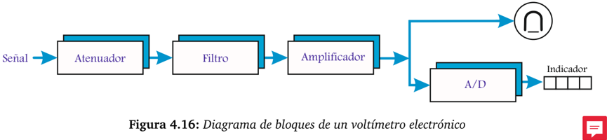
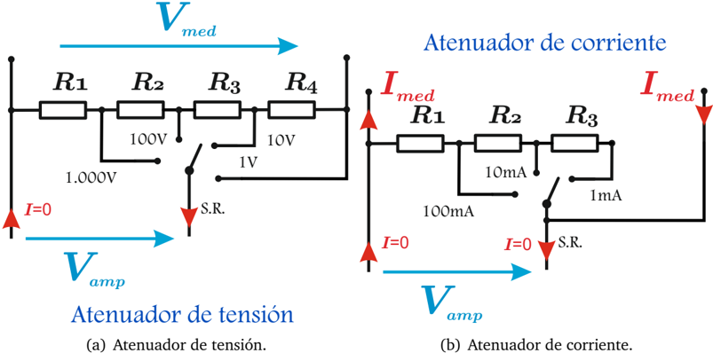
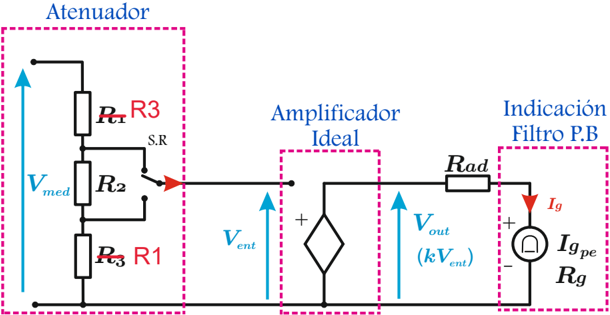
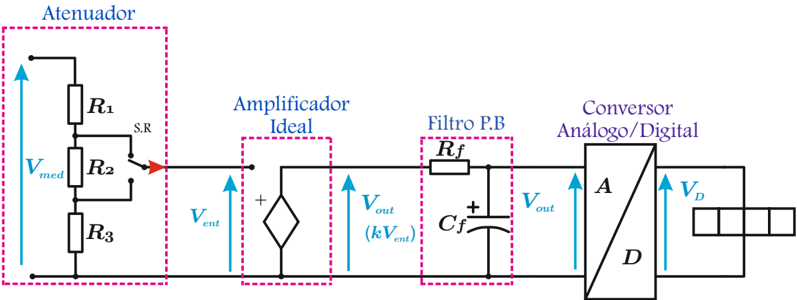
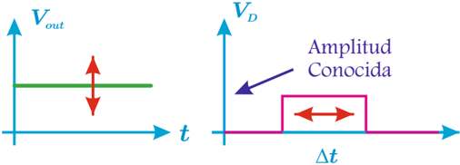

# 4.4.1 Voltímetro y amperímetro electrónico

Tags: #eli214
## 4.4.1. Voltímetro y amperímetro electrónico

Son instrumentos de indicación analógica o digital, sensibles al valor medio de la tensión aplicada a sus terminales . Su principal ventaja es que solamente ocupa del circuito a medir una fracción muy pequeña de la energía de la señal/variable de interés, junto con presentar una resistencia interna constante en todos los rangos.

## 4.4.1.1. Funcionamiento

La señal de entrada ( ξ ( t ) ) es atenuada y luego filtrada para obtener su componente continua, cosa de resguardar el circuito y correcto funcionamiento de la etapa de amplificación.

La entrada del amplificador trabaja principalmente con niveles de tensión tanto para un voltímetro como para un amperímetro , por lo cual el atenuador es el circuito que escala magnitudes y unidades medidas a niveles de tensión proporcionales. El amplificador prácticamente no consume potencia de la señal de entrada ( Z interna → ∞ ), por ello debe obtener energía ya sea desde la red eléctrica o típicamente desde un conjunto de baterías o pilas para procesar la señal. Luego, el valor amplificado puede ser enviado a un galvanómetro de bobina móvil o a un display digital, previa conversión analógica digital ( A/D ).

El voltímetro : Para la medición de tensión se requiere de un atenuador de tensión , cuya función se basa en el principio del divisor de tensión . Se busca reducir los niveles la tensión a medir ( V med ) para que la tensión de entrada del amplificador sea la misma para cada uno de los rangos empleados, cuando justamente V med coincide con el valor del rango de tensión.

El amperímetro : Para la medición de corriente se requiere de un atenuador de corriente , cuya función es que al paso de la corriente medida ( I med ) aparezca en la entrada del amplificador la misma tensión de entrada para cada uno de los rangos, cuando I med coincida con el valor máximo del rango de corriente usado.

## 4.4.1.2. Atenuador

Es la componente que se encarga de adaptar la señal de tensión o corriente a una tensión compatible con los circuitos de entrada de un amplificador. El atenuador de tensión presenta una entrada constante ( R v = R 1 + R 2 + R 3 + R 4 ) sin importar el rango usado, mientras que el atenuador de corriente simplemente busca trasformar la corriente medida en una señal de tensión fija. El principio del atenuador se potencia al considerar que el amplificador presenta una impedancia de entrada infinita, es decir, no hay circulación de corriente por este circuito.

Figura 4.17: Atenuadores

El rango se escoge por medio del 'selector de rangos' ( S.R. ), que en definitiva es un interruptor ideal de posición múltiple.

## Ejemplo:

Calcular las resistencias del atenuador de un multímetro cuya tensión máxima del amplificador es 1V . Para el caso del atenuador de tensión la resistencia interna debe ser de 10MΩ .

## Atenuador de tensión:

a.- Rango 1 . 000V :

b.- Rango 100V :

c.- Rango 10V :

d.- Rango 1V :

$$1 V = 1 . 0 0 0 V \left ( \frac { R _ { 1 } } { 1 0 M \Omega } \right ) \rightarrow R _ { 1 } = 1 0 [ k \Omega ]$$

$$1 V = 1 0 0 V \left ( \frac { R _ { 1 } + R _ { 2 } } { 1 0 M \Omega } \right ) \rightarrow R _ { 2 } = 9 0 [ k \Omega ]$$

$$1 V = 1 0 V \left ( \frac { R _ { 1 } + R _ { 2 } + R _ { 3 } } { 1 0 M \Omega } \right ) \rightarrow R _ { 3 } = 9 0 0 [ k \Omega ]$$

$$1 V = 1 V \left ( \frac { R _ { 1 } + R _ { 2 } + R _ { 3 } + R _ { 4 } } { 1 0 M \Omega } \right ) \rightarrow R _ { 4 } = 9 [ M \Omega ]$$

## Atenuador de corriente:

a.- Rango 100mA :

b.- Rango 10mA :

c.- Rango 1mA :

$$1 V = 1 0 0 m A \cdot R _ { 1 } \rightarrow R _ { 1 } = 1 0 [ \Omega ] \quad \Xi$$

$$1 V = 1 0 m A \cdot ( R _ { 1 } + R _ { 2 } ) \rightarrow R _ { 2 } = 9 0 [ \Omega ]$$

$$1 V = 1 m A \cdot ( R _ { 1 } + R _ { 2 } + R _ { 3 } ) \rightarrow R _ { 3 } = 9 0 0 [ \Omega ]$$

## 4.4.1.3. Instrumento analógico Indicación

Dado que tanto el voltímetro como amperímetro trabajan desde la entrada del amplificador solamente con niveles de tensión y que su única diferencia radica principalmente en la etapa del atenuador , es que no se hará mayor diferencia entre ambos instrumentos, por lo que se trabajará por simplicidad con voltímetros sin perder generalidad y pudiendo extrapolar las conclusiones para los amperímetros .

El instrumento analógico se basa en que la salida del amplificador ( V out ) es una señal proporcional a la magnitud medida ( V med para el caso del voltímetro ), que alimenta a un galvanómetro de bobina móvil en serie a una resistencia adicional ( R ad ) de ajuste. Por tanto, en esta etapa es cuando recién se alude al comportamiento analógico del galvanómetro, transformado la tensión de salida del amplificador en una señal de corriente proporcional, que genere una lectura por medio de una aguja interpretada y graduada como tensión para el voltímetro .

Figura 4.18:

Esquema de instrumento analógico. electrónico con indicación analógica

Para el caso del voltímetro , se aprecia que con el selector de rango S.R. del atenuador se puede seleccionar la magnitud más adecuada para la entrada del amplificador (Relación V med y V ent ). Luego, la corriente del galvanómetro queda descrita por:

$$I _ { g } = \left ( \frac { k } { R _ { a d } + R _ { g } } \cdot \frac { 1 } { \underbrace { 1 + \frac { R _ { 3 } } { R _ { 1 } + R _ { 2 } } } } \right ) V _ { m e d } \\$$

Donde k es la ganancia del amplificador. Por ello, si ya se tiene definida las ganancias del atenuador y la del amplificador, solamente con R ad se podría hacer los ajustes y correcciones por calibración.

Para este caso note que la resistencia del voltímetro será: R v = R 1 + R 2 + R 3 , constante para cualquier rango usado.

## 4.4.1.4. Indicación

## Instrumento digital

El instrumento digital es en rigor idéntico que el analógico solamente hasta la salida del amplificador, luego la señal pasa por un filtro pasa bajos, que también puede ser interpretado como un retentor de orden cero , que estabiliza la señal de tensión V out al cargar el condensador C f con una constante de tiempo rápida.

Figura 4.19: Esquema de instrumento digital.

electrónico con indicación digital Con un valor estable a la entrada del conversor analógico-digital A/D , éste en su proceso genera una señal rectangular, típicamente de amplitud unitaria, cuyo ancho de pulso será proporcional a la magnitud medida, tiempo que a razón constante de reloj u oscilador, producirá una cantidad de cuentas tal que dará origen a una lectura indicada en un display digital.

Figura 4.20: Principio de conversión A/D.

