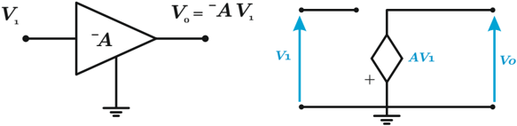
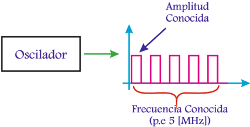
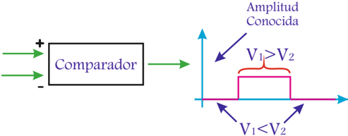
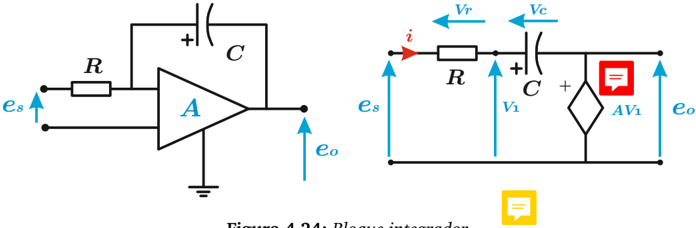
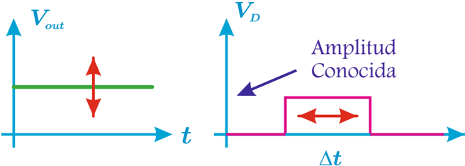
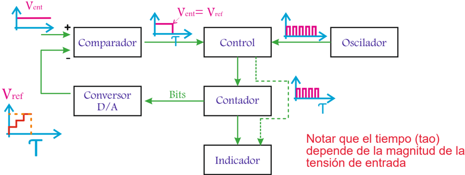
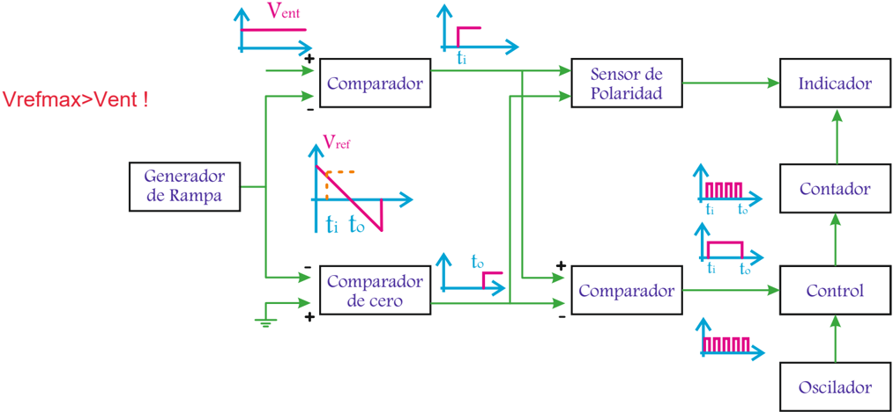
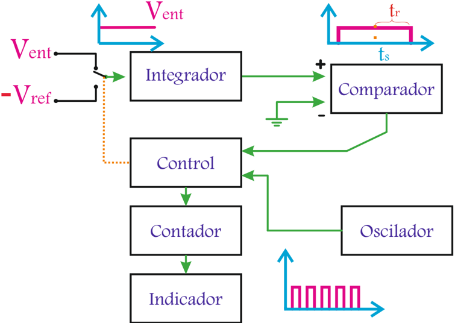
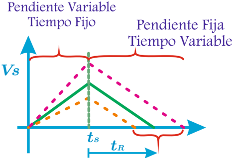

# 4.4.2 Introducción a la conversión analógica-digital

Tags: #eli214
## 4.4.2. Introducción a la conversión analógica-digital

## 4.4.2.1. Bloques típicos de electrónica analógica

A continuación se presenta una breve descripción en diagrama de bloques de algunos elementos esenciales para la comprensión de del proceso de conversión analógica-digital ( A/D ).

Ganancia: Una entrada V 1 se ve amplificada por una constante finita A , dando por salida V 0 = -A · V 1 . En estricto rigor se tiene para esta configuración a un amplificador operacional clásico, con retroalimentación negativa, cuyo arreglo de resistencias de entrada y del mismo lazo define la constante de ganancia A . Los amplificadores deben siempre ser alimentados por una fuente de tensión externa, por tanto, la máxima amplificación de la entrada se satura cuando se llega a nivel de la fuente.

Figura 4.21: Bloque de ganancia.

Oscilador: A partir de un circuito electrónico aestable que toma por valores máximos y mínimos los valores de la fuente de alimentación, se genera un tren de pulsos cuya frecuencia y período puede ser configurado a partir de la tensión de entrada. El elemento clásico para formar osciladores es el circuito integrado 555 el cual tiene dentro de su composición cuenta con una configuración 'flip-flop' 4 .

4 Un biestable ó flip-flop en inglés, es un multivibrador capaz de permanecer en uno de dos estados posibles durante un tiempo indefinido en ausencia de perturbaciones.

Figura 4.22: Bloque oscilador.

El oscilador sirve como reloj en el sentido de marcar el ritmo interno en un circuito digital, claramente separando el estado '0' del estado '1', así por ejemplo poder realizar cuentas según la cantidad de períodos de reloj en un cierto intervalo. El reloj muchas otras veces también se usa en el proceso de digitalizar una señal definiendo los instantes de muestreo y retención de una señal analógica.

Comparador: Circuito hecho a base de un amplificador operacional, es en principio una configuración que no tiene retroalimentación, por lo cual no rigen las reglas de oro del A.O. , así que la entrada la amplifica con ganancia que tiende a infinito, pero lógicamente satura al nivel de la fuente. En este caso se comparan dos entrada, para comparar básicamente por medio de la operación resta , la entrada mayor es la que se amplifica con signo incluido de la operación.

Figura 4.23: Bloque comparador.

Integrador: Amplificador operacional con retroalimentación negativa donde en el lazo se dispone de un condensador, que por la ley elemental de su tensión en la función de transferencia entrada/salida queda expresado por medio de la operación integral. La integral es susceptible a la condición inicial del condensador o constante de integración para este caso.

Figura 4.24: Bloque integrador.

## 4.4.2.2. Conversor análogo digital

Existen muchos métodos para digitalizar una señal analógica, pero los principios que se buscan para tal efecto son casi los mismos que buscan relacionar una magnitud de tensión con una frecuencia o con un período, tal como se muestra simplificadamente en la figura siguiente.

Figura 4.25: Principio de funcionamiento.

Si se logra lo anterior, se tendrá a un circuito electrónico en estado activo durante todo el período de la señal digitalizada, es decir, durante ∆ t unidades de tiempo. El proceso de digitalización ahora requiere un oscilador que servirá como reloj interno que llevará el tiempo por medio de pulsos y de ese modo si se relaciona la cantidad de pulsos con el tiempo ∆ t que el circuito electrónico se encuentra activo, se tendrá una cantidad de pulsos proporcional a la magnitud de la señal de tensión de entrada.

Así, en una etapa final con la señal digitalizada, se pasa la cantidad de pulsos por un contador que a su vez muestre en un display la cantidad contabilizada. Entre algunos conversores tenemos:

- 1.
- Conversor de rampa escalonada.
2. Conversor de rampa.
3. Conversor de doble pendiente.

Conversor de rampa escalonada: La lógica del circuito electrónico se enciende, el oscilador y/o reloj comienza a generar pulsos que son contabilizados. La señal de entrada ( V ent ) se empieza a comparar sincronizadamente con una señal de referencia ( V ref ) que tiene una forma tipo 'rampa escalonada de paso constante' .

Mientras la entrada sea mayor que la rampa, se tendrá como salida una tensión continua. Cuando V ref supera a V ent el comparador corta la tensión de salida llevándola a cero, es decir, se forma a la salida del comparador una señal rectangular de ancho τ .

Con ello se da instrucción al sistema de control que detenga el conteo, no así al reloj y de ese modo el indicador muestra en display la cantidad de pulsos contados, los cuales con la debida configuración se ajusta para que coincida con el valor de señal medida.

Figura 4.26: Conversor rampa escalonada.

La principal desventaja de este método es el poco control sobre el instante inicial que comienza el conteo de pulsos.

- 4.4.2.2.1. Conversor de rampa: Se tiene un generador diente de sierra de pendiente negativa que actúa como tensión de referencia ( V ref ) que funciona sincronizadamente con el reloj del circuito electrónico.

Figura 4.27: Conversor de rampa.

Se puede despreciar el transitorio o falta de sincronización de la señal de entrada por el instante de conexión de la misma, basado en que la señal de referencia al ser periódica corregirá este fenómeno en el período siguiente.

De este modo al inicio de cada período se tendrá V ref &gt; V ent y el comparador no arrojará salida distinta de cero. Cuando V ref = V ent el comparador producirá una salida de amplitud conocida y de ese modo se define el instante inicial, llamado t i . Por otro lado, se tiene un segundo comparador que siempre está comparando la señal de referencia con una nula ( 'comparador de cero' ) y de ese modo se tendrá una salida de este segundo comparador desde el instante llamado t 0 , t 0 &gt; t i .

Por medio de un tercer comparador con polaridad, se toman las salidas de los dos comparadores anteriores y se genera una salida rectangular de ancho ∆ t = t i -t 0 . Esta señal de duración conocida activa al control para que cuente los pulsos del reloj y de ese modo se genere una lectura en el display digital .

Adicionalmente se puede también con esta configuración discriminar polaridad, dado que si V ent fuese negativa se producirá una señal en el instante t i ( t i &gt; t 0 ) y en el tercer comparador una señal de rectangular de ancho ∆ t = t 0 -t i de amplitud negativa, que nada afecta al sistema de conteo.

Conversor de doble pendiente: Con el mismo principio del conversor anterior se busca obtener un pulso de ancho variable en términos y proporcional a la magnitud de la tensión de entrada. Esta configuración mejora el proceso de generación de pulsos y cuentas para la etapa de dar una lectura.

Figura 4.28: Conversor doble pendiente.

Se tiene un selector interno y automático que está durante t s segundos en la posición que conecta a la tensión de entrada V ent con el integrador (tiempo fijo). El integrador por sincronismo deja su condición inicial en cero al momento que se comienza a medir V ent . De este modo se integra V ent generando una rampa de pendiente que proporcional a V ent .

Luego de los t s segundos, el selector cambia a la segunda posición sin reiniciar la condición inicial del integrador. En esta posición ingresa una tensión de valor negativo, conocido y fijo V ref . Así se genera una rampa de pendiente negativa tardando en llegar a cero en un tiempo variable t R , definido por la condición inicial anterior. De este modo la señal integrada ingresa a un comparador de cero, que genera una señal rectangular de amplitud conocida de ancho t s + t R .

Figura 4.29: Proporcionalidad en conversor doble pendiente.

Por ello se logra que:

$$V _ { e n t } = V _ { r e f } \frac { t _ { R } } { t _ { s } } = k \cdot t _ { R }$$

Finalmente el sistema de control cuenta la cantidad de pulsos de reloj, proporcionales a t R , que a su vez son proporcionales a V ent .

El valor máximo de integración no puede pasar los límites del amplificador. Más importante aún, la cantidad de cuentas que puede hacer un equipo digital está en relación directa con el tiempo t s y con la frecuencia del reloj u oscilador.

