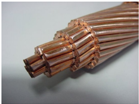
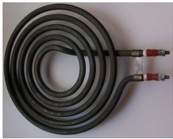

# 4.5 Medición de resistencia

Tags: #eli214
SECCIÓN 4.5

## Medición de resistencia

La medición de resistencia nace directamente de medir en un circuito de forma simultánea la tensión y la corriente en un resistor ( R x ). Esto se podría hacer en principio en el circuito original donde el yace, pero es muy complejo y puede introducir errores.

El método más común de medición es llevando al resistor R x a un circuito independiente y externo, donde solamente es desconocido el valor de la resistencia a medir. Así se evita alterar la lectura o medición producto del resto de los elementos presentes. Lo anterior tiene por complicación la necesidad de contar con una fuente externa que permita hacer circular corriente por el resistor en una magnitud acorde, tal que pueda ser medida junto a la diferencia de potencial que se produzca.

Recordando la propagación de errores, al medir resistencia por medio de la medición de dos variables, tensión y corriente , se requiere que las magnitudes de ambas variables estén en un rango adecuado con el menor error posible para que el valor calculado sea el menor posible.

En adelante, la metodología expuesta para medir resistencia se basa en usar un circuito externo de valores conocidos y con una fuente tal que permita la medición de la tensión y corriente.

