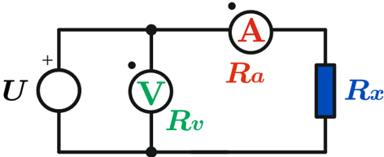
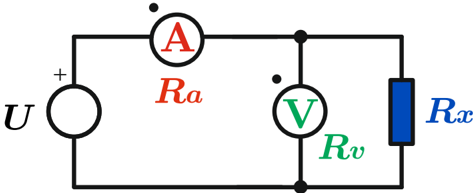
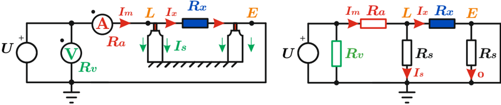
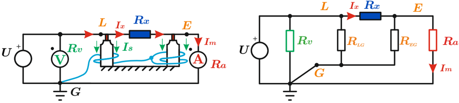
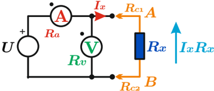
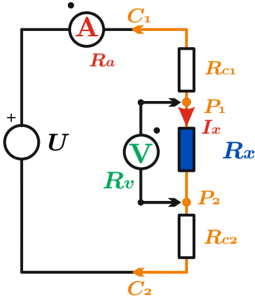

# 4.5.1 Medición por voltímetro-amperímetro

Tags: #eli214
## 4.5.1. Medición por voltímetro-amperímetro

Tal como su nombre lo indica, este tipo de medición busca según la configuración del circuito externo, la medición de la tensión y de la corriente para que en un postproceso determinar la resistencia R x por Ley de Ohm .

Para todos los casos se considerarán conocidos los valores de la resistencia del voltímetro ( R v ) y amperímetro ( R a ), no ideales.

## 4.5.1.1. Método de dos electrodos

Dado que los instrumentos de medición directa no son ideales, se reconocerán dos tipos de conexiones según la influencia que tienen los mismos instrumentos en la determinación posterior de R x .

Conexión amperimétrica: Conexión que deja en serie a la resistencia del amperímetro R a con la resistencia a medir R x , de este modo con la lectura de tensión del voltímetro ( V ) y del amperímetro ( A ) tendremos:

- a.- La tensión que lee el voltímetro cae sobre las dos resistencias serie:

$$( V ) = V _ { R _ { a } } + V _ { R _ { x } }$$

b.- La corriente del amperímetro es la corriente que circula por R x :

$$( A ) = I _ { R _ { x } } = I _ { R _ { a } }$$

$$R _ { x } = \frac { ( V ) } { ( A ) } - R _ { a } < \frac { ( V ) } { ( A ) }$$

Entonces:

Es decir, la resistencia calculada ( V ) ( A ) será siempre mayor que el verdadero valor de R x .

Conexión voltimétrica: Conexión que deja en paralelo a la resistencia del voltímetro R v con la resistencia a medir R x , de este modo con la lectura de tensión del voltímetro ( V ) y del amperímetro ( A ) tendremos:

- a.- La corriente que lee el amperímetro se reparte sobre las resistencias en paralelo, según:

$$( A ) = I _ { R _ { v } } + I _ { R _ { x } }$$

b.- La tensión del voltímetro es la tensión que hay en R x :

$$( V ) = V _ { R _ { x } } = V _ { R _ { v } }$$

Entonces, trabajando con conductancias tenemos:

$$\frac { 1 } { R _ { x } } = \frac { ( A ) } { ( V ) } - \frac { 1 } { R _ { v } }$$

Luego se reduce a:

$$R _ { x } = \frac { ( V ) } { ( A ) } \cdot \left ( \frac { 1 } { 1 - \frac { ( V ) / ( A ) } { R _ { v } } } \right ) > \frac { ( V ) } { ( A ) }$$

Es decir, la resistencia calculada ( V ) ( A ) será siempre menor que el verdadero valor de R x .

Si no se conocieran los valores de R v y R a , se podría acotar la determinación de R x por medio de Ley de Ohm , tomando como valores extremos los medidos en conexión voltimétrica y amperimétrica, realizadas de forma no simultánea, pero lo suficientemente seguida para que no interfieran factores externos:

$$\frac { ( V ) } { ( A ) } \left | _ { A p e r i m e t r i c a } > R _ { x } > \frac { ( V ) } { ( A ) } \right | _ { v o l t i m e t r i c a }$$

## 4.5.1.2. Método de tres electrodos

El método de los tres electrodos no difiere circuitalmente respecto al de dos electrodos en conexión amperimétrica . Sin embargo, su uso es conceptualmente distinto, donde ahora se tienen una resistencia R x alta, típicamente como las originadas en los sistemas de aislamiento ( &gt; 100 M Ω ).

Por ello, típicamente la fuente de tensión está por sobre 500V cc llegando incluso a valores de 10 . 000V cc y en casos específicos sobre 80kV cc . De este modo se hace imprescindible el considerar los soportes mecánicos que levantan del potencial de masa de la resistencia a medir ( R x ), lo cual trae consigo fugas de corriente que han de alterar principalmente el valor de la corriente medida. Se mantiene el hecho que la resistencia se obtiene como un postproceso .

De las figuras anteriores se aprecia el efecto de los soportes en R x y como el método tradicional de dos electrodos amperimétricos ( L y E ) mide una corriente mayor a la real, específicamente:

$$( A ) = I _ { m } = I _ { s } + I _ { x }$$

Notándose que se empeora aún más el resultado de aproximar ( V ) ( A ) ✚ ✚ ≈ R x .

De este modo es que se incorpora un tercer electrodo, denominado en la jerga como 'cable de guardia' , lo cual muestra como las corrientes de fuga son llevadas por un camino alternativo y no ser medidas por el amperímetro ( A ) , tal como se aprecia a continuación:

De este modo con los tres electrodos ( L , E y G ) se logra que:

$$( A ) = I _ { m } \approx I _ { x }$$

$$R _ { x } = \frac { ( V ) } { ( A ) } - R _ { a } < \frac { ( V ) } { ( A ) }$$

Por lo tanto:

## 4.5.1.3. Método de cuatro electrodos

El método de los cuatro electrodos es una variación del método de dos en modo voltimétrico de terminales A-B , para cuando la resistencia a medir R x es muy baja ( &lt; 500mΩ ).

Dado que R x es de pequeño valor la medición puede ser afectada por los terminales de conexión entre R x y el circuito activo de prueba, que para este caso se denominaron resistencias de contacto o de los cables 1 y 2 ( R c 1 y R c 2 ).

De este modo se tendrá con un error no despreciable que:

$$( V ) = ( R _ { x } + R _ { c 1 } + R _ { c 2 } ) I _ { x }$$

Por ello es que este circuito se expande, separando un par de electrodos para la medición de corriente ( C1-C2 ) y un par para la medición de potencial ( P1-P2) del siguiente modo:

De este modo se tiene que:

$$( V ) = I _ { x } \cdot R _ { x } \Leftrightarrow R _ { v } \gg R _ { x }$$

Con lo cual no influye el largo de los cables de la medición de tensión dado que siempre serán de resistencia muy baja comparados con R v .

