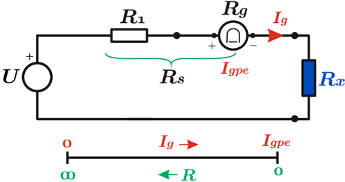
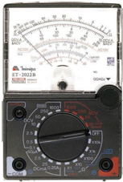
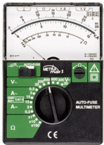
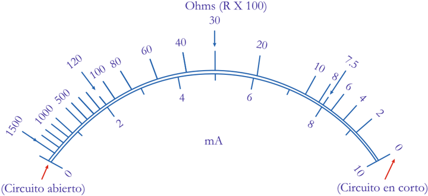
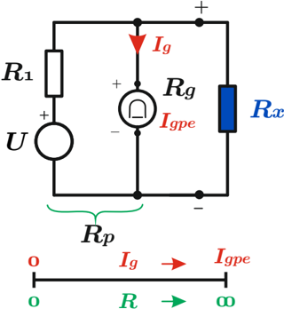

# 4.5.2 Óhmetro de bobina móvil

Tags: #eli214
## 4.5.2. Óhmetro de bobina móvil

El óhmetro de bobina móvil es dentro de esta metodología de ensayo, la forma donde se prescinde de la medición de tensión, y tan solo con la medición de la corriente del galvanómetro I g se calibra una escala graduada de resistencia equivalente, escala que se verá a continuación que es altamente no lineal.

## 4.5.2.1. Método serie

Este método viene del principio de medición amperimétrico, donde se tiene una fuente ideal en serie a una resistencia de calibración (que incluye las pérdidas reales de la fuente) junto al galvanómetro y finalmente a la resistencia a medir R x .

Se aprecia que cuando la resistencia R x → ∞ o el circuito está en vacío, no circulará corriente por el circuito, lo cual relacionará directamente un punto de conversión en la escala de medida.

Del mismo modo cuando R x → 0 se tendrá la corriente máxima por el galvanómetro I gpe = U/R s y a esa lectura máxima se la relacionará con la medición cero de resistencia. Así tendremos una escala inversa y no lineal que relaciona corriente medida con un valor de resistencia. Por consiguiente se tendrá en la escala de corriente el lugar geométrico de la resistencia R x cuya graduación corresponderá justamente al mapeo numérico de los valores.

Como ecuación descriptora se tendrá:

$$R _ { x } = \frac { U } { I _ { g } } - R _ { \mathfrak { S } }$$

## 4.5.2.2. Método shunt

La variación shunt es la aplicación del método voltimétrico, donde permanentemente se tiene al galvanómetro al potencial equivalente que cae producto del divisor de tensión, lo cual trae consigo un desgaste mayor de la fuente de energía dado que en vacío R x →∞ y se tendrá la corriente circulante máxima I gpe = U/ ( R 1 + R g ) .

El principal beneficio de este tipo de configuración es disponer de forma directa la relación que a R x →∞ se tendrá la máxima lectura y corriente y para R x → 0 la corriente no circulará por el galvanómetro y por lo tanto se tendrá una medición nula.

Igualmente, la escala si bien es directa es altamente no lineal y la graduación se obtiene mediante el debido mapeo de la siguiente función descriptora:

$$R _ { x } = \left ( \frac { 1 } { \frac { U } { I _ { g } R _ { 1 } R _ { g } } - \frac { 1 } { R _ { 1 } } - \frac { 1 } { R _ { g } } } \right )$$

