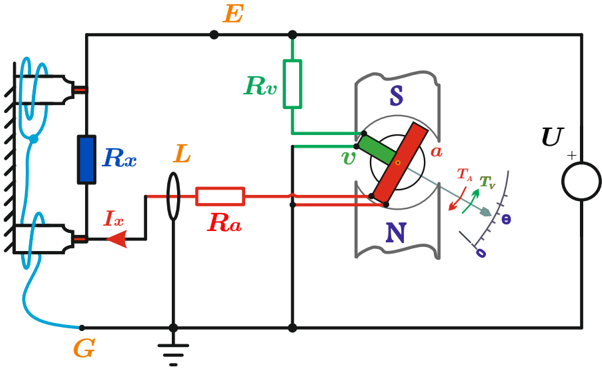
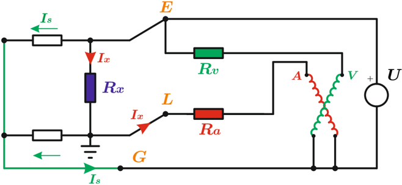

# 4.5.3 Óhmetro de bobinas cruzadas

Tags: #eli214
## 4.5.3. Óhmetro de bobinas cruzadas

El método de las bobinas cruzadas se usa para medir resistencias grandes, sobre 100MΩ típicas de los sistemas de aislamiento. Para ello se dispone de una fuente de tensión de un valor entre 500 a 10 . 000V cc que energiza un sistema de deflexión de aguja con dos bobinas distribuidas de forma adecuada a 90 o eléctricos.

De esta forma se tiene que al encender la fuente se energiza de forma directa la bobina de tensión, que por estar en paralelo a la fuente debe tener una alta resistencia de entrada, pero que por otro lado permita circular la máxima corriente acorde al torque electromagnético, que en equilibrio con el resorte, de la deflexión máxima como si la resistencia a medir R x fuese infinita.

La segunda bobina que corresponde a la de corriente, se conecta en serie a la resistencia a medir. Como las resistencias a medir son grandes, este devanado debe tener la sensibilidad adecuada para que la pequeña corriente produzca un torque electromagnético en sentido opuesto al de la bobina de tensión, restando indicación angular para dar la lectura correcta. A su vez se debe considerar que para ciertos niveles mínimos resistencias a medir ( R x ) según el rango, el torque de corriente al contrarrestar la fuerza del torque de tensión, de una indicación cercana a cero.

La relación entre R x y el ángulo de deflexión se obtiene aproximadamente de:

$$T _ { v } = K _ { v } \cdot U \cdot \cos ( \theta ) \ \wedge \ \ T _ { a } = K _ { a } \cdot I _ { x } \cdot \sin ( \theta )$$

$$R _ { x } \approx \frac { U } { I _ { x } } = K \cdot t a n ( \theta )$$

Por lo tanto:

Al tratarse de mediciones de resistencias grandes con tensiones no menores, igualmente se dispone la configuración de tres electrodos que permite con el cable de guardia eliminar las fugas de corriente no deseadas y mejorar el resultado de la medición.

