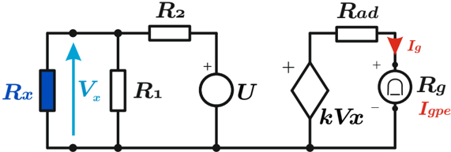
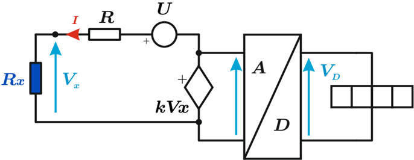

# 4.5.4 Óhmetro electrónico

Tags: #eli214
## 4.5.4. Óhmetro electrónico

Se dispone de una fuente que energiza un cierto circuito donde se conecta la resistencia a medir R x , donde el potencial que cae se amplifica y lleva ya sea a una lectura analógica o a una digital.

## 4.5.4.1. Método analógico

La fuente energiza un arreglo de resistores, donde el resistor R x se conecta en paralelo al circuito de medida. Ello produce una caída de potencial V x que es amplificada por una ganancia k y es la que alimenta un segundo circuito que solamente depende de la tensión V x alimentando a un galvanómetro de resistencia R g y a una resistencia de ajuste o calibración R ad .

De este modo se tiene que:

$$V _ { x } = U \frac { ( R _ { 1 } / / R _ { x } ) } { ( R _ { 1 } / / R _ { x } ) + R _ { 2 } }$$

Por lo tanto la corriente que medirá el galvanómetro será:

$$I _ { g } = \frac { k \cdot V _ { x } } { R _ { a d } + R _ { g } } = \left ( \frac { k } { R _ { a d } + R _ { g } } \right ) \cdot \left ( \frac { U } { 1 + \frac { R _ { 2 } } { R _ { x } } + \frac { R _ { 2 } } { R _ { 1 } } } \right )$$

Al igual que en casos anteriores, la indicación de resistencia será directa y no lineal, teniéndose que para R x → 0 la corriente del galvanómetro será I g = 0 y para R x →∞ la corriente del galvanómetro será la máxima corriente I gpe = ( k · U 1+ R 2 R 1 ) · ( 1 R ad + R g ) .

## 4.5.4.2. Método digital

Para este caso se busca llevar la lectura de tensión del resistor R x a un valor de tensión fijo, amplificado k · V x para luego ser procesador por un conversor analógico digital y de este modo indicar un valor numérico.

La principal ventaja de esta configuración es que la tensión de entrada al conversor A/D es:

$$V _ { x } = \frac { U } { ( 1 - \hbar { ) } ^ { 1 } + \frac { R } { R _ { x } } } = R _ { x } \cdot \left ( \frac { U } { R } \right ) \\$$

Y por lo tanto queda una escala lineal, lo cual debe ser así para el correcto proceso de digitalización en base al conteo de pulsos de reloj, según la magnitud de V x .

