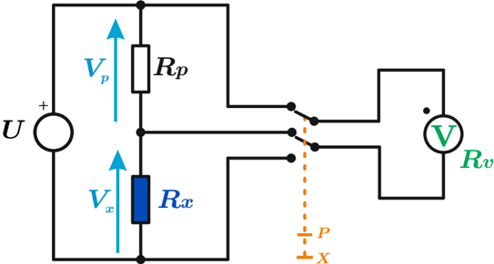

# 4.5.5 Medición por comparación

Tags: #eli214
## 4.5.5. Medición por comparación

La determinación de la resistencia de un elemento por medio del proceso de comparación requiere además de la fuente externa, un resistor patrón de valor conocido y dentro de un rango no muy distante del valor de la resistencia a medir R x .

El proceso se basa en que la fuente alimentará al resistor patrón R p en serie al resistor a medir R x , bajo el concepto que para cada valor de R x se tendrá una distribución de tensiones distinta entre los elementos.

Con un solo voltímetro y un selector se medirá la tensión en cada uno de los elementos, con lo cual se obtiene como postproceso el valor de R x según:

$$R _ { x } = R _ { p } \left ( \frac { V _ { x } } { V _ { p } } \right )$$

