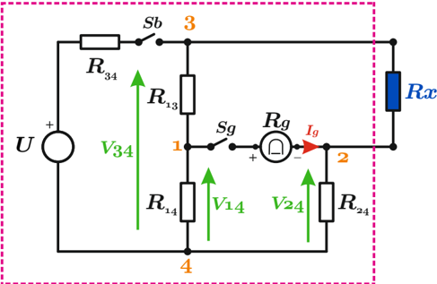
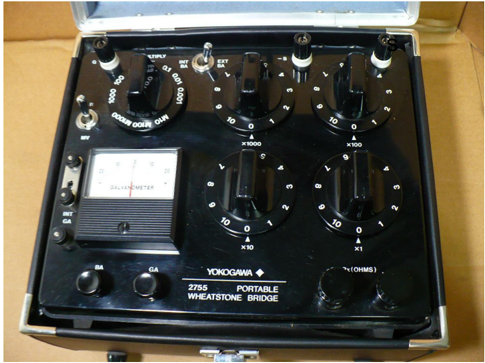
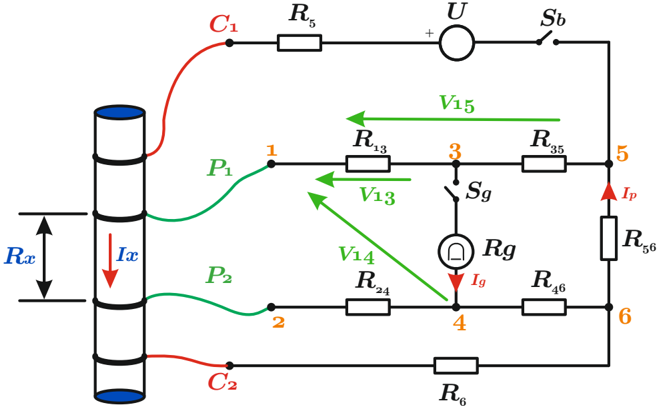
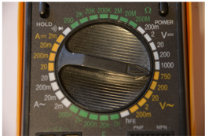
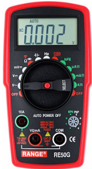
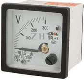

# 4.5.6 Medición por puente

Tags: #eli214
## 4.5.6. Medición por puente

Las mediciones tipo puente se basan en un proceso de comparación, pero elimina el medir dos variables y realizar un cálculo posterior, sino que se apoya en el valor de la corriente de un galvanómetro interno, prescindiendo de tener que hacer una graduación de la escala de corriente a escala de resistencia. Esto se debe a que en la gran mayoría de los casos, se busca que la corriente a medir sea nula.

## 4.5.6.1. Puente Wheatstone

El circuito puente que le da origen, se basa en una configuración tipo H de cuatro resistencias verticales, donde se sabe y se busca que no haya caída de potencial en el resistor horizontal que representa al galvanómetro y de ese modo que la corriente que pase por él sea nula.

La estrategia es que 3 de las resistencias verticales son conocidas y variables, mientras que la cuarta es el resistor a medir R x . Por tanto, con el ajuste de las resistencias se busca equilibrar el circuito puente obteniendo directamente el valor de R x .

En general se tiene en equilibrio que:

$$R _ { x } = \frac { R _ { 1 3 } \cdot R _ { 2 4 } } { R _ { 1 4 } }$$

## 4.5.6.2. Puente Kelvin

El puente de Kelvin es para medir resistencias bajas de niveles mucho menores a las que el puente Wheatstone puede llegar a medir.

El puente Kelvin usa el método de cuatro electrodos cuya configuración tiene por base el circuito H del puente Wheatstone pero en las partes superior e inferior una resistencia de valor bajo y la resistencia a medir R x dando lugar a los terminales de medición de potencial P1-P2 .

Por fuera se tiene una rama de inyección de corriente que trae por ventaja el despreciar el error cometido al usar terminales de gran longitud de resistencia comparable a R x .

En el equilibrio se tiene I x = I p :

$$V _ { 1 3 } = V _ { 1 5 } \frac { 1 } { R _ { 3 5 } / R _ { 1 3 } }$$

Luego,

Y finalmente:

$$V _ { 1 5 } = I _ { x } \left ( R _ { x } + R _ { 5 6 } + \frac { 1 } { \frac { 1 } { R _ { 6 } } + \frac { 1 } { R _ { 2 4 } + R _ { 4 6 } } } \right ) \\ V _ { 1 4 } = I _ { x } \left ( R _ { x } + \frac { R _ { 2 4 } R _ { 6 } } { R _ { 2 4 } + R _ { 6 } + R _ { 4 6 } } \right )$$

$$R _ { x } = R _ { 5 6 } \left ( \frac { R _ { 1 3 } } { R _ { 3 5 } } \right ) + \left ( \frac { R _ { 1 3 } } { R _ { 3 5 } } - \frac { R _ { 2 4 } } { R _ { 4 6 } } \right ) \cdot \left ( \frac { 1 } { \frac { 1 } { R _ { 6 } } + \frac { 1 } { R _ { 2 4 } + R _ { 4 6 } } } \right )$$

## CAPÍTULO 5

## MEDICIÓN DE TENSIÓN Y CORRIENTE ALTERNA

SECCIÓN 5.1

## Introducción y definiciones

Para medir una señal alterna, ya sea asociada a una diferencia de potencial o a una corriente, hay que considerar además del rango del instrumento, la frecuencia y la forma de onda de la señal a medir. Esto será lo que determine el tipo de instrumento a utilizar, junto a sus limitaciones y errores.

Con la tecnología actual, se puede a priori clasificar los instrumentos de alterna según su principio de funcionamiento y rango de frecuencia donde funcionará correctamente:

- a.Instrumentos electromagnéticos, tales como: Fierro móvil ( 25 -125Hz ), electrodinámico ( 10 -200Hz ).
- b.Instrumentos electrostáticos ( 0 , 010 -500kHz ).
- c.Instrumentos de bobina móvil con rectificador ( 10 -20kHz ).
- d.Instrumentos electrónicos ( 10 -10MHz ).

Por otro lado, los instrumentos de medición de señal alterna pueden a su vez clasificados en términos de la forma en que caracterizará la magnitud medida y la relación con el valor efectivo a informar:

- a.Aquellos que miden directamente el valor efectivo (verdadero) de la señal.
- b.Aquellos que miden el valor medio de la señal alterna en valor absoluto.

c.Aquellos que miden el valor máximo de la señal.

De lo anterior, se vislumbra que una mala selección de un instrumento puede ocasionar grandes errores aún cuando el instrumento en sí tenga una alta exactitud.

## 4.5.6. Medición por puente

Las mediciones tipo puente se basan en un proceso de comparación, pero elimina el medir dos variables y realizar un cálculo posterior, sino que se apoya en el valor de la corriente de un galvanómetro interno, prescindiendo de tener que hacer una graduación de la escala de corriente a escala de resistencia. Esto se debe a que en la gran mayoría de los casos, se busca que la corriente a medir sea nula.

## 4.5.6.1. Puente Wheatstone

El circuito puente que le da origen, se basa en una configuración tipo H de cuatro resistencias verticales, donde se sabe y se busca que no haya caída de potencial en el resistor horizontal que representa al galvanómetro y de ese modo que la corriente que pase por él sea nula.

La estrategia es que 3 de las resistencias verticales son conocidas y variables, mientras que la cuarta es el resistor a medir R x . Por tanto, con el ajuste de las resistencias se busca equilibrar el circuito puente obteniendo directamente el valor de R x .

En general se tiene en equilibrio que:

$$R _ { x } = \frac { R _ { 1 3 } \cdot R _ { 2 4 } } { R _ { 1 4 } }$$

## 4.5.6.2. Puente Kelvin

El puente de Kelvin es para medir resistencias bajas de niveles mucho menores a las que el puente Wheatstone puede llegar a medir.

El puente Kelvin usa el método de cuatro electrodos cuya configuración tiene por base el circuito H del puente Wheatstone pero en las partes superior e inferior una resistencia de valor bajo y la resistencia a medir R x dando lugar a los terminales de medición de potencial P1-P2 .

Por fuera se tiene una rama de inyección de corriente que trae por ventaja el despreciar el error cometido al usar terminales de gran longitud de resistencia comparable a R x .

En el equilibrio se tiene I x = I p :

$$V _ { 1 3 } = V _ { 1 5 } \frac { 1 } { R _ { 3 5 } / R _ { 1 3 } }$$

Luego,

Y finalmente:

$$V _ { 1 5 } = I _ { x } \left ( R _ { x } + R _ { 5 6 } + \frac { 1 } { \frac { 1 } { R _ { 6 } } + \frac { 1 } { R _ { 2 4 } + R _ { 4 6 } } } \right ) \\ V _ { 1 4 } = I _ { x } \left ( R _ { x } + \frac { R _ { 2 4 } R _ { 6 } } { R _ { 2 4 } + R _ { 6 } + R _ { 4 6 } } \right )$$

$$R _ { x } = R _ { 5 6 } \left ( \frac { R _ { 1 3 } } { R _ { 3 5 } } \right ) + \left ( \frac { R _ { 1 3 } } { R _ { 3 5 } } - \frac { R _ { 2 4 } } { R _ { 4 6 } } \right ) \cdot \left ( \frac { 1 } { \frac { 1 } { R _ { 6 } } + \frac { 1 } { R _ { 2 4 } + R _ { 4 6 } } } \right )$$

## CAPÍTULO 5

## MEDICIÓN DE TENSIÓN Y CORRIENTE ALTERNA

