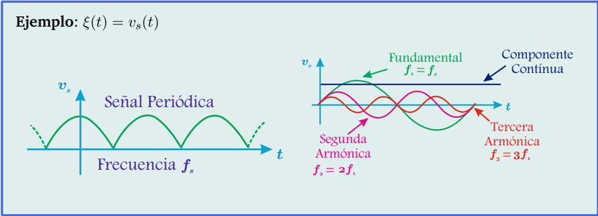
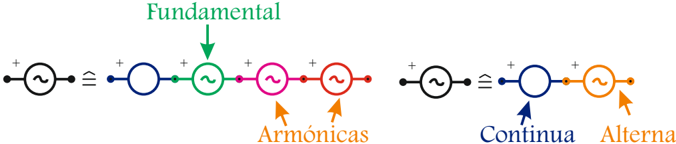
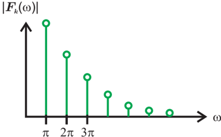
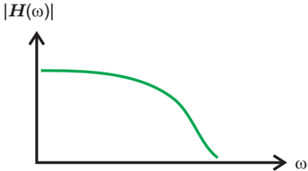

# 5.1.1 Espectro y respuesta en frecuencia

Tags: #eli214
## 5.1.1. Espectro y respuesta en frecuencia

Muchas veces las señales a medir no son puras en el sentido que no contienen una única frecuencia, y aunque los sistemas de generación y transporte procuran llevar a cada punto de consumo señales de tensión de frecuencia fundamental 50Hz con un THD 1 bajo, producto de la nolinealidad de las cargas, ya sea debido a la saturación de los materiales como la electrónica que se usa hoy en día, las señales de tensión y corriente se distorsionan en diferente cuantía, siendo normalmente la corriente la más afectada.

Gracias a la Serie de Fourier Trigonométrica (S.F.T.) , se puede aproximar cualquier señal periódica ( ξ ( t ) ) como una serie de funciones sinusoidales elementales ( ˜ ξ ( t ) ), cuyas frecuencias son múltiplos enteros de la frecuencia dominante ( fundamental ) a partir de:

$$\xi ( t ) \approx \tilde { \xi } ( t ) = a _ { 0 } + \sum _ { k = 1 } ^ { \infty } \left ( a _ { k } \cdot \cos ( k \omega _ { s } t ) + b _ { k } \cdot s e n ( k \omega _ { s } t ) \right )$$

Ejemplo :

ξ ( t ) = v s ( t )

Cuando una señal se descompone en sus señales elementales de frecuencias, siempre se puede obtener una representación para circuital que reproduzca tal sumatoria, como lo que obtendría en un modelo serie si la señal descompuesta es de tensión o en un modelo paralelo si la señal es de corriente.

## Ejemplo

:

Calcule la Serie de Fourier Trigonométrica para una fuente de tensión periódica, de forma diente de sierra, que se puede describir como ξ ( t ) = v ( t ) = t en el intervalo [ -1 , 1] .

1 Distorsión por armónicas de la fundamental 'Total Harmonic Distortion' .

## Respuesta:

Se tiene de los datos que: t 0 = -1 , t 1 = 1 T = 2 y ω 0 = π , por tanto los coeficientes de Fourier son:

$$a _ { 0 } = \frac { 1 } { 2 } \int _ { - 1 } ^ { 1 } t \cdot d t = 0$$

$$a _ { k } = \frac { 2 } { 2 } \int _ { - 1 } ^ { 1 } t \cdot \cos ( k \pi t ) \cdot d t = 0$$

$$b _ { k } = \frac { 2 } { 2 } \int _ { - 1 } ^ { 1 } t \cdot s i n ( k \pi t ) \cdot d t = - \frac { t } { k \pi } \cos ( k \pi t ) \Big | _ { - 1 } ^ { 1 } = \frac { - 2 } { k \pi } ( - 1 ) ^ { k }$$

Entonces la S.F.T. es:

$$v ( t ) = t \approx \tilde { v } ( t ) \equiv \frac { 2 } { \pi } s i n ( \pi t ) - \frac { 2 } { 2 \pi } s i n ( 2 \pi t ) + \frac { 2 } { 3 \pi } s i n ( 3 \pi t ) - \frac { 2 } { 4 \pi } s i n ( \pi t ) + \cdots$$

Si solamente se centra la atención a las líneas espectrales de magnitud de ˜ v ( t ) , las cuales requieren previamente ser descritas mediante la S.F. Exponencial , a partir de la relación de Euler para cada componente de igual frecuencia, tendremos:

$$| F _ { k } | = \frac { \sqrt { a _ { k } ^ { 2 } + b _ { k } ^ { 2 } } } { 2 } = \frac { 1 } { k \pi }$$

$$F _ { 0 } = 0 \\ \frac { \sqrt { a _ { k } ^ { 2 } + b _ { k } ^ { 2 } } } { 2 } = \frac { 1 } { k \pi }$$

Por consiguiente se puede graficar el espectro de magnitud de v ( t ) ⇔ V ( ω ) ≡ F k ( ω ) , que se aprecia con su forma hiperbólica:

Figura 5.1: Espectro de magnitud de v ( t ) = t ∈ [ -1; 1]

Lo cual indica que cada señal periódica tendrá un espectro de magnitud o simplemente espectro en frecuencias que indique la composición que tiene una cierta señal.

Cuando se quiere saber la forma en que responde un sistema o un circuito sujeto a una dinámica descrita por una ecuación diferencial ante una solicitación rica en frecuencias se habla de la respuesta en frecuencias de un sistema.

La respuesta en frecuencias se entiende como una modificación que sufre en estado estacionario la magnitud y ángulo de cada componente de frecuencia al pasar por un sistema lineal e invariante ( S.L.I. ) . Se puede entender como una ganancia compleja en función de la frecuencia H ( ω ) .

Ahora bien, no es necesario desde el punto de vista teórico hacer pasar cada frecuencia de forma individual, como una sinusoide pura, por el sistema y analizar su cambio de amplitud y fase, lo cual sería solamente prudente en el ambiente práctico de laboratorio . Para ello, se estudia directamente la función de transferencia H ( ω ) , graficando su comportamiento en módulo y ángulo en función de ω que en la práctica es recomendable que esté en escala logarítmica .

Figura 5.2: Resp. en frec. módulo de H ( ω ) .

## Nota:

H ( ω ) tiende a ser más parecido a una densidad espectral, dada por la Transformada de Fourier aplicada a un sistema, que a un espectro como el que se obtiene de la Serie de Fourier aplicada a una señal.

Para analizar de mejor forma el módulo de la función de transferencia | H ( ω ) | , es preferible analizarlo en decibeles ( dB ) .

