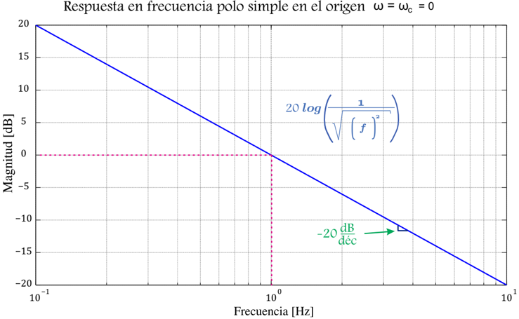
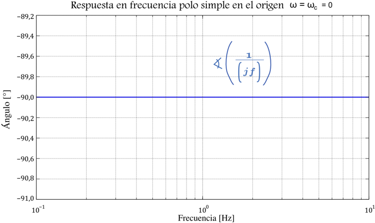
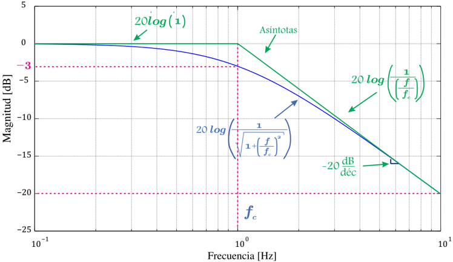
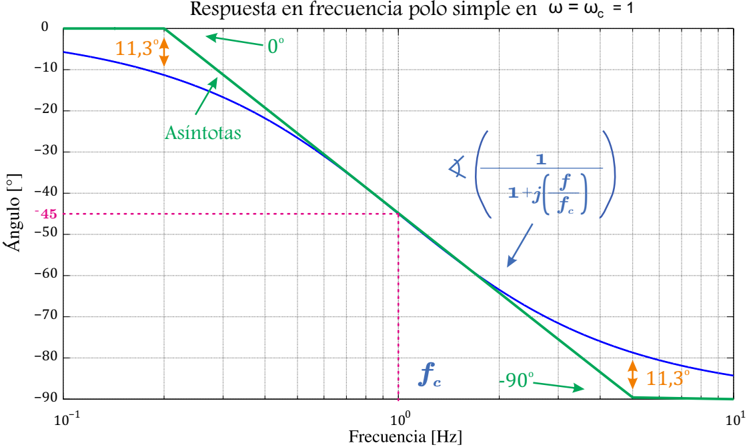
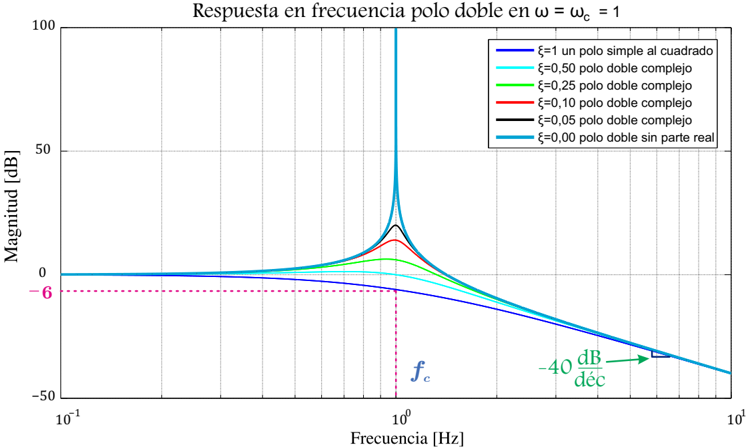
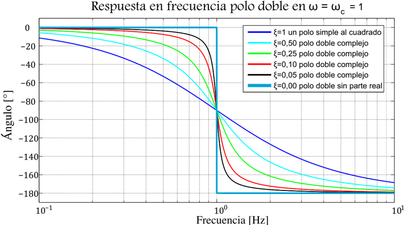
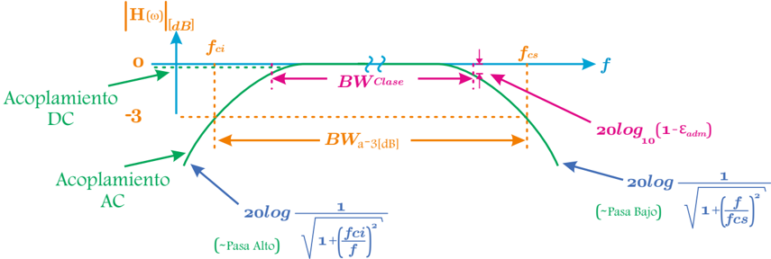
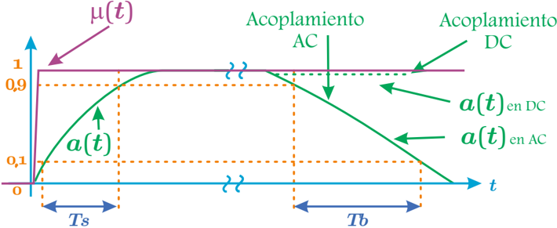
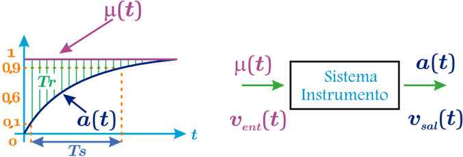
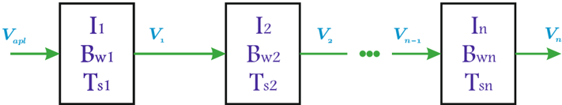

# 5.1.5 Diagrama de Bode para los factores elementales

Tags: #eli214
## 5.1.5. Diagrama de Bode para los factores elementales.

Los factores elementales de Bode son aquellos términos de magnitud en escala logarítmica y de fase, que son parte de la expresión en forma de 'sumatoria' que permiten obtener la función de transferencia total H ( ω ) , que justamente por simpleza se trabaja descomponiéndola en magnitud ‖ H ( ω ) ‖ dB (ecuación 5.6) y ángulo ∡ H ( ω ) (ecuación 5.4); sino se tendría que recurrir a las técnicas de los lugares geométricos que en este caso sería en función de la frecuencia ω ó f , al cual se le denomina Diagrama de Nyquist , y que no es simple en sistemas de orden mayor.

Los diagramas de Bode de los factores elementales son simplemente las trazas de las asíntotas que delimitan a la verdadera función , por lo cual en cada caso se ha de indicar el error que se comete en los puntos donde la curva real se aleja de la asíntota.

## 5.1.5.1. Ganancia de Bode

En este caso se considerará que la función de transferencia es H ( ω ) = K B :

## *Asíntotas de magnitud:

$$\| H ( \omega ) \| _ { d B } = 2 0 l o g ( \| K _ { B } \| ) = \| K _ { B } \| _ { d B } \colon \text { state}$$

Por tanto, es una recta horizontal de valor ‖ K B ‖ dB .

## *Asíntotas de fase:

$$\zeta \{ H ( \omega ) \} = \pm t a n ^ { - 1 } \left \{ \frac { 0 } { K _ { B } } \right \} = \left \{ \begin{array} { c c } 0 ^ { o } , & \text {si } K _ { B } > 0 ; \\ \pm 1 8 0 ^ { o } , & \text {si } K _ { B } < 0 . \end{array}$$

Esto es una horizontal en 0 o ó ± 180 o .

## 5.1.5.2. Cero o polo en el origen

En este caso se considerará que la función de transferencia es H ( ω ) = 1 ( jω ) q .

Para poder diferenciar los subcasos, se tiene que 1 ( jω ) q será un cero para todo entero q &lt; 0 y será un polo para todo entero q &gt; 0 . La descripción anterior es principalmente por la naturaleza física de los sistemas donde es más probable tener un polo en el origen ( integrador ) que un cero en el origen ( derivador ), junto al mismo hecho que en general los sistemas tienen más polos que ceros . Si q = 0 , desaparece el presente análisis y se interpreta como una ganancia de Bode unitaria .

Dado lo anterior, se tiene que por simpleza el desarrollo se dejará en términos del signo y valor entero q .

## *Asíntotas de magnitud:

$$\| H ( \omega ) \| _ { d B } = 2 0 l o g \left ( \frac { 1 } { \omega ^ { q } } \right ) = - q \cdot 2 0 \cdot l o g ( \omega )$$

Esto es una recta de pendiente -q · 20 [ dB dec ] , es decir , que pasa por 0 dB en ω = 1 .

## *Asíntotas de fase:

$$\triangle \{ H ( \omega ) \} = - q \cdot 9 0 ^ { o }$$

Esto es una recta horizontal en -q · 90 o .

## 5.1.5.3. Cero o polo de multiplicidad m

En este caso se considerará que la función de transferencia es H ( ω ) = ( 1 ( jω/ω c )+1 ) m , donde para valores negativos de m se tendrán m ceros y para valores positivos de m se tendrán m polos repetidos. Para los casos que se tenga o requiera de un cero o polo simple , se tendrá que considerar m = ± 1 .

## *Asíntotas de magnitud:

$$\| H \omega \| _ { d B } = - m \cdot 2 0 \cdot \log \left ( \sqrt { \frac { \omega ^ { 2 } } { \omega _ { c } ^ { 2 } } + 1 } \right ) \approx \left \{ \begin{array} { l l } { 0 _ { d B } , } & { \quad \text {si } \omega \ll \| \omega _ { c } \| ; } \\ { - m \cdot 2 0 \cdot \log \left ( \frac { \omega } { \| \omega _ { c } \| } \right ) , } & { \quad \text {si } \omega \gg \| \omega _ { c } \| . } \end{array}$$

Esto es, en 'bajas' frecuencias, se tendrá a una recta horizontal en 0 [ dB ] . En 'altas' frecuencias, se tendrá una recta de pendiente -m · 20 [ dB dec ] .

Ambas asíntotas se cruzan en ω = ‖ ω c ‖ , conocida como frecuencia de quiebre o corte , cuyo error respecto a la curva real será aproximadamente de -3 · m [ dB ] .

Respuesta en frecuencia polo simple en ω = ω = 1 c

## *Asíntotas de fase:

$$\langle \{ H ( \omega ) \} = - m \cdot t a n ^ { - 1 } \left ( \frac { \omega } { \omega _ { c } } \right ) \approx \left \{ \begin{array} { l l } { 0 ^ { 0 } , } & { \text {si } \omega \ll \omega _ { c } \| ; } \\ { - m \cdot 9 0 ^ { 0 } , } & { \text {si } \omega \gg \| \omega _ { c } \| \, y \, \omega _ { c } > 0 \, ; } \\ { m \cdot 9 0 ^ { 0 } , } & { \text {si } \omega \gg \| \omega _ { c } \| \, y \, \omega _ { c } < 0 \, . } \end{array}$$

Esto es, en 'bajas' frecuencias, se tendrá recta horizontal en 0 0 . En 'altas' frecuencias, una recta horizontal en ∓ m · 90 0 .

Si se usa recta desde 0 , 2 ‖ ω c ‖ hasta 5 , 0 ‖ ω c ‖ para conectar ambas asíntotas se tendrá una buena aproximación con error &lt; m 11 , 3 o .

## 5.1.5.4. Cero o polo doble de multiplicidad m

En este caso se considerará que la función de transferencia es H ( ω ) = ( 1 ( jω ωc ) 2 +2 ξ ( jω ωc )+1 ) m , el cual es un cero o polo doble de multiplicidad m , donde la definición de cero será cuando m sea entero negativo y el de polo cuando m sea entero positivo .

La parte cuadrática o doble se asume no puede ser separada en dos polos simples distintos, ni en un polo simple de multiplicidad 2, es decir, que se tiene un polinomio cuadrático en jω de raíces complejas. En efecto, se puede demostrar que si el coeficiente ξ es igual o mayor que 1, la forma cuadrática podrá ser separada en dos formas simples, por ello se establece que 0 ⩽ ξ &lt; 1 .

## *Asíntotas de magnitud:

$$\| H ( \omega ) \| _ { d B } = - m \cdot 2 \cdot \log \left ( \sqrt { \left ( 1 - \frac { \omega ^ { 2 } } { \omega _ { c } ^ { 2 } } \right ) ^ { 2 } + \frac { 4 \xi ^ { 2 } \omega ^ { 2 } } { \omega _ { c } ^ { 2 } } } \right ) \approx \left \{ \begin{array} { l l } { 0 _ { d B } , } & { \quad \text {si } \omega \ll \omega _ { c } \| \omega _ { c } \| ; } \\ { - m \cdot 4 0 \cdot \log \left ( \frac { \omega } { \| \omega _ { c } \| } \right ) , } & { \quad \text {si } \omega \gg \| \omega _ { c } \| . } \end{array}$$

Esto es, en 'bajas' frecuencias, una recta horizontal en 0 [ dB ] . En 'altas' frecuencias, una recta de pendiente -m · 40 [ dB dec ] . Ambas asíntotas se cruzan en ω = ‖ ω c ‖ .

Existe un extremo si sólo si 0 ⩽ ξ ⩽ √ 2 2 , igual a -m · 20 · log (2 ξ √ 1 -ξ 2 ) dB en ω = ‖ ω c ‖ √ 1 -2 ξ 2 , cuyo efecto es despegar a la curva real de las asíntotas ya sea con un máximo positivo o negativo, siempre en sentido opuesto a la pendiente de frecuencias altas.

## *Asíntotas de fase:

$$\triangleleft \{ H ( \omega ) \} = - m \cdot t a n ^ { - 1 } \left ( \frac { \frac { 2 \xi \omega } { \omega _ { c } } } { 1 - \frac { \omega ^ { 2 } } { \omega _ { c } ^ { 2 } } } \right ) \approx \begin{cases} 0 ^ { 0 } , & \text {si } \omega \ll \omega _ { c } | | \omega _ { c } | ; \\ - m \cdot 1 8 0 ^ { 0 } , & \text {si } \omega \gg | \omega _ { c } | \ y \omega _ { c } > 0 \ ; \\ m \cdot 1 8 0 ^ { 0 } , & \text {si } \omega \gg | \omega _ { c } | \ y \omega _ { c } < 0 \ . \end{cases}$$

Esto es, en 'bajas' frecuencias, una recta horizontal en 0 o . En 'altas' frecuencias, una recta horizontal en ∓ m · 180 o . En ω = ‖ ω c ‖ , la fase es igual a ∓ 90 o .

Cerca de ω = ‖ ω c ‖ , la transición es más brusca si el amortiguamiento ξ es menor. Si ξ = 0 , el ángulo de un par de polos imaginarios conjugados se define como -180 o para que sea congruente con el ángulo de un polo doble en el origen.

En general, la construcción del diagrama de fase es más rápida pero sólo cualitativa, porque las asíntotas no aportan tanto como en el diagrama de magnitud .

SECCIÓN 5.2

## Respuesta en frecuencia de un instrumento

En lo que se refiere a un instrumento, siempre se tendrá una magnitud de entrada, que es justamente la variable que se desea medir y por otro lado se tendrá una magnitud de salida que es la lectura o interpretación de la magnitud medida. Esto da origen a una función de transferencia 'salida/entrada' H ( ω ) , típicamente con una característica pasa banda , que a su vez define un ancho de banda ( BW bandwidth ).

En la figura anterior se aprecia a un instrumento que con acoplamiento AC tiene un ancho de banda ( BW ) definido como el rango en frecuencias ( BW = f cs -f ci ) donde el instrumento presenta un máximo en su respuesta o ganancia, que en el mejor de los casos ésta corresponde a ganancia unitaria o a una ganancia cero si se le expresa en en decibeles.

Claramente el definir un BW es subjetivo si no se indican niveles de referencia para la pérdida de ganancia o atenuación. Normalmente se definen los anchos de banda en función del error admisible, pero si no se conocen se puede tolerar un ancho de banda mayor, con un error también mayor si se consideran atenuaciones de 3dB .

Cuando un instrumento tiene acoplamiento DC , su respuesta en frecuencias se traduce en un comportamiento 'pasa bajos' , es decir, que la frecuencia de corte inferior es cero ( f ci = 0 ) y con ello el ancho de banda se define solo en términos de la frecuencia de corte superior BW = f cs .

Siempre será más sencillo para un instrumento AC/DC , disponer un diseño que permita medir en un amplio rango de frecuencias que incluya la componente continua ( DC ) y por medio de un selector, incorporar en cascada un filtro que anule tal componente si se desea medir solamente en AC .

Implícitamente se ha demostrado la necesidad de poder disponer o conocer la función de transferencia del instrumento o sistema, llamada típicamente H ( ω ) , para así analizar el comportamiento del mismo. Sin embargo, el obtener experimentalmente H ( ω ) por el método de variar la frecuencia de la señal de entrada, ir midiendo la respuesta y construir ‖ H ( ω ) ‖ punto a punto como función de ω ó f , resulta tedioso y otras veces resulta imposible.

Un método alternativo para conocer la respuesta de un instrumento y su BW , consiste en aplicar como señal de entrada un escalón K · µ ( t -to ) , que experimentalmente por la invariancia de los sistemas se ajusta t 0 = 0 y para expresar los resultados en 'por unidad' se ajusta K = 1 . Como experimentalmente también es complejo generar un escalón ideal, se fija como criterio que el tiempo de subida o constante de tiempo del escalón µ ( t ) sea entre 1 / 9 a 1 / 7 de la respuesta que se espera obtener a la salida del instrumento o sistema. De este modo se busca medir la 'respuesta a escalón a ( t ) ' .

A partir de la respuesta a escalón a ( t ) , se mide su tiempo de subida T s definido como la diferencia de tiempo que existe cuando la señal se encuentra entre el 10 y 90 % de su valor final estacionario. Si la respuesta del sistema tuviera acoplamiento AC , es decir, que elimina el modo forzado del escalón, tendremos que la repuesta no podrá llegar a un valor estacionario. Por lo cual, desde la máxima respuesta medida se define el tiempo de bajada T b como la diferencia de tiempo que existe cuando la señal se encuentra entre el 90 y 10 % de este valor máximo.

De la misma respuesta a ( t ) se define el tiempo de respuesta T r según:

$$T _ { r } = \int _ { 0 } ^ { \infty } \left ( 1 - a ( t ) \right ) d t$$

Si la respuesta a escalón tiene la forma a ( t ) = 1 -e -t/τ , se tienen entonces las siguientes relaciones:

## Ejemplo:

Determine T r , T s y BW de un fi ltro pasa bajos de primer orden R -C .

Lo anterior corresponde a un sistema R -C serie donde la entrada es la fuente de tensión y la salida la tensión del capacitor, con lo cual v sal ( t ) = a ( t ) = V 0 (1 -e -t/RC ) si v ent ( t ) = V 0 µ ( t ) , por lo tanto:

$$T _ { r } = \int _ { 0 } ^ { \infty } e ^ { - t / R C } d t = R C = \tau = 1 / \omega _ { c }$$

Luego,

$$T _ { s } = t _ { a = 0 , 9 } - t _ { a = 0 , 1 } = \tau ( \ln ( 1 0 / 1 ) - \ln ( 1 0 / 9 ) ) = \tau \ln ( 9 ) = 2 , 1 9 7 \tau \approx 2 , 2 T _ { r }$$

Por tanto el ancho de banda de un pasa bajos :

$$B W = f _ { c } = \frac { \omega _ { c } } { 2 \pi } = \frac { 1 } { 2 \pi T _ { r } } = \frac { 2 , 2 } { 2 \pi T _ { s } } = \frac { 0 , 3 5 } { T _ { s } }$$

Cuando se conectan sistemas o instrumentos en cascada, donde cada instrumento tiene su función de transferencia H i ( ω ) se puede obtener la función de transferencia total como:

$$H _ { T } ( \omega ) = \prod _ { i } ^ { n } H _ { i } ( \omega )$$

Si por la técnica de la respuesta a escalón se determinaron previamente los tiempo de subida T si de cada uno de los sistemas o instrumentos, que idealmente tienen comportamiento pasa bajos de primer orden, se puede obtener el tiempo de subida total T sT como:

$$T _ { s T } \approx \sqrt { \sum _ { i } ^ { n } \left ( T _ { s i } \right ) ^ { 2 } }$$

Esto implica que el tiempo de subida total será más lento que el más lento de los instrumentos o sistemas y como el ancho de banda BW se comporta de forma inversa a T s en un pasa bajos , se llega a que el BW total se verá reducido siendo aproximadamente de valor igual al menor BW i presente en la cascada.

$$T _ { s } = 2 , 2 \cdot T _ { r } \ y \ B W = \frac { 0 , 3 5 } { T _ { s } }$$

## Ejemplo:

Se dispone de un osciloscopio de BW 1 = 10MHz y una punta de osciloscopio de BW 2 = 70MHz , determine el BW T del sistema.

Del osciloscopio tenemos T s 1 = 35ns y de la punta T s 2 = 5ns , por tanto el tiempo de subida total:

$$T _ { s T } = \sqrt { 3 5 ^ { 2 } + 5 ^ { 2 } } = 3 5 , 3 6 n s \Rightarrow B W _ { T } = 9 , 9 M H z$$

Por tanto, si no se desea degradar el ancho de banda el instrumento principal (osciloscopio), la punta debe tener al menos un ancho de banda 7 veces más grande.

SECCIÓN 5.3

## Instrumento de fierro móvil

Es un instrumento sensible al valor efectivo de la corriente , usado ampliamente como voltímetro y/o amperímetro de frecuencia industrial 50 ó 60Hz .

## 5.1.5. Diagrama de Bode para los factores elementales.

Los factores elementales de Bode son aquellos términos de magnitud en escala logarítmica y de fase, que son parte de la expresión en forma de 'sumatoria' que permiten obtener la función de transferencia total H ( ω ) , que justamente por simpleza se trabaja descomponiéndola en magnitud ‖ H ( ω ) ‖ dB (ecuación 5.6) y ángulo ∡ H ( ω ) (ecuación 5.4); sino se tendría que recurrir a las técnicas de los lugares geométricos que en este caso sería en función de la frecuencia ω ó f , al cual se le denomina Diagrama de Nyquist , y que no es simple en sistemas de orden mayor.

Los diagramas de Bode de los factores elementales son simplemente las trazas de las asíntotas que delimitan a la verdadera función , por lo cual en cada caso se ha de indicar el error que se comete en los puntos donde la curva real se aleja de la asíntota.

## 5.1.5.1. Ganancia de Bode

En este caso se considerará que la función de transferencia es H ( ω ) = K B :

## *Asíntotas de magnitud:

$$\| H ( \omega ) \| _ { d B } = 2 0 l o g ( \| K _ { B } \| ) = \| K _ { B } \| _ { d B } \colon \text { state}$$

Por tanto, es una recta horizontal de valor ‖ K B ‖ dB .

## *Asíntotas de fase:

$$\zeta \{ H ( \omega ) \} = \pm t a n ^ { - 1 } \left \{ \frac { 0 } { K _ { B } } \right \} = \left \{ \begin{array} { c c } 0 ^ { o } , & \text {si } K _ { B } > 0 ; \\ \pm 1 8 0 ^ { o } , & \text {si } K _ { B } < 0 . \end{array}$$

Esto es una horizontal en 0 o ó ± 180 o .

## 5.1.5.2. Cero o polo en el origen

En este caso se considerará que la función de transferencia es H ( ω ) = 1 ( jω ) q .

Para poder diferenciar los subcasos, se tiene que 1 ( jω ) q será un cero para todo entero q &lt; 0 y será un polo para todo entero q &gt; 0 . La descripción anterior es principalmente por la naturaleza física de los sistemas donde es más probable tener un polo en el origen ( integrador ) que un cero en el origen ( derivador ), junto al mismo hecho que en general los sistemas tienen más polos que ceros . Si q = 0 , desaparece el presente análisis y se interpreta como una ganancia de Bode unitaria .

Dado lo anterior, se tiene que por simpleza el desarrollo se dejará en términos del signo y valor entero q .

## *Asíntotas de magnitud:

$$\| H ( \omega ) \| _ { d B } = 2 0 l o g \left ( \frac { 1 } { \omega ^ { q } } \right ) = - q \cdot 2 0 \cdot l o g ( \omega )$$

Esto es una recta de pendiente -q · 20 [ dB dec ] , es decir , que pasa por 0 dB en ω = 1 .

## *Asíntotas de fase:

$$\triangle \{ H ( \omega ) \} = - q \cdot 9 0 ^ { o }$$

Esto es una recta horizontal en -q · 90 o .

## 5.1.5.3. Cero o polo de multiplicidad m

En este caso se considerará que la función de transferencia es H ( ω ) = ( 1 ( jω/ω c )+1 ) m , donde para valores negativos de m se tendrán m ceros y para valores positivos de m se tendrán m polos repetidos. Para los casos que se tenga o requiera de un cero o polo simple , se tendrá que considerar m = ± 1 .

## *Asíntotas de magnitud:

$$\| H \omega \| _ { d B } = - m \cdot 2 0 \cdot \log \left ( \sqrt { \frac { \omega ^ { 2 } } { \omega _ { c } ^ { 2 } } + 1 } \right ) \approx \left \{ \begin{array} { l l } { 0 _ { d B } , } & { \quad \text {si } \omega \ll \| \omega _ { c } \| ; } \\ { - m \cdot 2 0 \cdot \log \left ( \frac { \omega } { \| \omega _ { c } \| } \right ) , } & { \quad \text {si } \omega \gg \| \omega _ { c } \| . } \end{array}$$

Esto es, en 'bajas' frecuencias, se tendrá a una recta horizontal en 0 [ dB ] . En 'altas' frecuencias, se tendrá una recta de pendiente -m · 20 [ dB dec ] .

Ambas asíntotas se cruzan en ω = ‖ ω c ‖ , conocida como frecuencia de quiebre o corte , cuyo error respecto a la curva real será aproximadamente de -3 · m [ dB ] .

Respuesta en frecuencia polo simple en ω = ω = 1 c

## *Asíntotas de fase:

$$\langle \{ H ( \omega ) \} = - m \cdot t a n ^ { - 1 } \left ( \frac { \omega } { \omega _ { c } } \right ) \approx \left \{ \begin{array} { l l } { 0 ^ { 0 } , } & { \text {si } \omega \ll \omega _ { c } \| ; } \\ { - m \cdot 9 0 ^ { 0 } , } & { \text {si } \omega \gg \| \omega _ { c } \| \, y \, \omega _ { c } > 0 \, ; } \\ { m \cdot 9 0 ^ { 0 } , } & { \text {si } \omega \gg \| \omega _ { c } \| \, y \, \omega _ { c } < 0 \, . } \end{array}$$

Esto es, en 'bajas' frecuencias, se tendrá recta horizontal en 0 0 . En 'altas' frecuencias, una recta horizontal en ∓ m · 90 0 .

Si se usa recta desde 0 , 2 ‖ ω c ‖ hasta 5 , 0 ‖ ω c ‖ para conectar ambas asíntotas se tendrá una buena aproximación con error &lt; m 11 , 3 o .

## 5.1.5.4. Cero o polo doble de multiplicidad m

En este caso se considerará que la función de transferencia es H ( ω ) = ( 1 ( jω ωc ) 2 +2 ξ ( jω ωc )+1 ) m , el cual es un cero o polo doble de multiplicidad m , donde la definición de cero será cuando m sea entero negativo y el de polo cuando m sea entero positivo .

La parte cuadrática o doble se asume no puede ser separada en dos polos simples distintos, ni en un polo simple de multiplicidad 2, es decir, que se tiene un polinomio cuadrático en jω de raíces complejas. En efecto, se puede demostrar que si el coeficiente ξ es igual o mayor que 1, la forma cuadrática podrá ser separada en dos formas simples, por ello se establece que 0 ⩽ ξ &lt; 1 .

## *Asíntotas de magnitud:

$$\| H ( \omega ) \| _ { d B } = - m \cdot 2 \cdot \log \left ( \sqrt { \left ( 1 - \frac { \omega ^ { 2 } } { \omega _ { c } ^ { 2 } } \right ) ^ { 2 } + \frac { 4 \xi ^ { 2 } \omega ^ { 2 } } { \omega _ { c } ^ { 2 } } } \right ) \approx \left \{ \begin{array} { l l } { 0 _ { d B } , } & { \quad \text {si } \omega \ll \omega _ { c } \| \omega _ { c } \| ; } \\ { - m \cdot 4 0 \cdot \log \left ( \frac { \omega } { \| \omega _ { c } \| } \right ) , } & { \quad \text {si } \omega \gg \| \omega _ { c } \| . } \end{array}$$

Esto es, en 'bajas' frecuencias, una recta horizontal en 0 [ dB ] . En 'altas' frecuencias, una recta de pendiente -m · 40 [ dB dec ] . Ambas asíntotas se cruzan en ω = ‖ ω c ‖ .

Existe un extremo si sólo si 0 ⩽ ξ ⩽ √ 2 2 , igual a -m · 20 · log (2 ξ √ 1 -ξ 2 ) dB en ω = ‖ ω c ‖ √ 1 -2 ξ 2 , cuyo efecto es despegar a la curva real de las asíntotas ya sea con un máximo positivo o negativo, siempre en sentido opuesto a la pendiente de frecuencias altas.

## *Asíntotas de fase:

$$\triangleleft \{ H ( \omega ) \} = - m \cdot t a n ^ { - 1 } \left ( \frac { \frac { 2 \xi \omega } { \omega _ { c } } } { 1 - \frac { \omega ^ { 2 } } { \omega _ { c } ^ { 2 } } } \right ) \approx \begin{cases} 0 ^ { 0 } , & \text {si } \omega \ll \omega _ { c } | | \omega _ { c } | ; \\ - m \cdot 1 8 0 ^ { 0 } , & \text {si } \omega \gg | \omega _ { c } | \ y \omega _ { c } > 0 \ ; \\ m \cdot 1 8 0 ^ { 0 } , & \text {si } \omega \gg | \omega _ { c } | \ y \omega _ { c } < 0 \ . \end{cases}$$

Esto es, en 'bajas' frecuencias, una recta horizontal en 0 o . En 'altas' frecuencias, una recta horizontal en ∓ m · 180 o . En ω = ‖ ω c ‖ , la fase es igual a ∓ 90 o .

Cerca de ω = ‖ ω c ‖ , la transición es más brusca si el amortiguamiento ξ es menor. Si ξ = 0 , el ángulo de un par de polos imaginarios conjugados se define como -180 o para que sea congruente con el ángulo de un polo doble en el origen.

En general, la construcción del diagrama de fase es más rápida pero sólo cualitativa, porque las asíntotas no aportan tanto como en el diagrama de magnitud .

