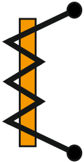

Tags: #eli214
## 5.3.1. Principio de funcionamiento

Su principio de funcionamiento se basa en la deflexión de la aguja indicadora por medio de la atracción o repulsión que experimenta un fi erro móvil ubicado en el núcleo de una bobina fija .

El torque eléctrico T E se produce porque se tiene una corriente i ( t ) en una bobina que produce un flujo magnético atraviesa un fierro móvil, que al acoplarse se producen fuerzas y generan el movimiento del fierro móvil y la aguja indicadora, cambiando así el valor de la inductancia mutua. El torque puede ser calculado por medio de los trabajos virtuales al considerar la energía electromagnética almacenada por la inductancia W E ante un movimiento infinitesimal angular θ :

$$T _ { E } = \frac { \partial W _ { E } } { \partial \theta } = \frac { 1 } { 2 } \frac { \partial L } { \partial \theta } \cdot ( i ( t ) ) ^ { 2 } \ \ [ N m ]$$

Se aprecia que la corriente i ( t ) es independiente del movimiento angular, pero no puede ser continua, dado que se necesita una corriente que varíe en el tiempo para que se produzca inducción en el fierro de acuerdo a la ley de Faraday . Si la corriente es alterna de la forma i ( t ) = √ 2 I ef cos ( ωt ) el torque queda expresado como:

$$T _ { E } = \frac { 1 } { 2 } \frac { \partial L } { \partial \theta } \cdot ( I _ { e f } ) ^ { 2 } \cdot \left ( \cos ^ { 2 } ( \omega t ) \right ) = \frac { 1 } { 2 } \frac { \partial L } { \partial \theta } 2 \cdot ( I _ { e f } ) ^ { 2 } \cdot ( 1 + \cos ( 2 \omega t ) ) \quad [ N m ]$$

Para resolver la ecuación y despejar el ángulo, se iguala el torque eléctrico T E al torte mecánico T M , tal que:

$$T _ { E } = T _ { M } \equiv k _ { r } \theta + D \frac { d \theta } { d t } + J \frac { d ^ { 2 } \theta } { d t ^ { 2 } } \\$$

En estado estacionario, se obtiene la siguiente expresión para el ángulo:

$$\theta ( t ) = \frac { 1 } { 2 } \frac { \partial L } { \partial \theta } \cdot \frac { ( I _ { e f } ) ^ { 2 } } { k _ { r } } + \hat { \theta } \left ( \cos ( 2 \omega t + \varphi ) \right )$$

donde:

- 1.Componente oscilatoria angular:

$$\hat { \theta } = \frac { 1 } { 2 } \frac { \partial L } { \partial \theta } \cdot \frac { ( I _ { e f } ) ^ { 2 } } { k _ { r } } \cdot \frac { 1 } { \sqrt { ( ( \frac { 2 \omega } { \omega _ { o } } ) ^ { 2 } - 1 ) ^ { 2 } + ( 4 \frac { \omega } { \omega _ { o } } \frac { D } { D _ { c } } ) ^ { 2 } } }$$

- 2.Coeficiente de amortiguamiento crítico:

$$D _ { c } = 2 \sqrt { k _ { r } J }$$

- 3.Frecuencia natural del sistema mecánico:

$$\omega _ { o } = \sqrt { k _ { r } / J }$$

- 4.Factor de reluctancia/permeancia magnética, supuesto constante:

$$\frac { \partial L } { \partial \theta } = c t e$$

Si se desea hacer un análisis de la solución estacionaria, se tiene que en torno al valor constante angular hay una oscilación del doble de la frecuencia de la red ponderada por ˆ θ . Si la frecuencia de la red ω es muy superior a la frecuencia natural mecánica ω o , ˆ θ -→ 0 que físicamente es la imposibilidad del sistema o instrumento de seguir con su mecánica el comportamiento de la variable eléctrica. Por lo tanto, si además se supone constante los cambios de la inductancia en función del ángulo o factor de reluctancia, se llega a:

$$\theta = K \cdot I _ { e f } ^ { 2 }$$

Por ello se tiene a grandes rasgos que:

1. Los instrumentos de fierro móvil tienen una ley de escala cuadrática , sensible al valor efectivo de la corriente.
2. En los casos donde el factor de reluctancia no puede ser supuesto constante , simplemente se busca y define por la geometría otra ley de escala.
3. Este instrumento permite exactitudes entre las clases 0 , 5 y 2 , 5 .
4. También es posible que con corriente continua se produzca deflexión, aunque no es recomendable porque puede hacer que el fierro se 'imante' (por histéresis) y se pierda exactitud .
5. El rango de frecuencias típicas de uso está entre 25 a 125Hz . No se recomienda su uso en frecuencias mayores por los niveles de corrientes parásitas y pérdidas.

## 5.3.1. Principio de funcionamiento

Su principio de funcionamiento se basa en lw1a deflexión de la aguja indicadora por medio de la atracción o repulsión que experimenta un fi erro móvil ubicado en el núcleo de una bobina fija .

El torque eléctrico T E se produce porque se tiene una corriente i ( t ) en una bobina que produce un flujo magnético atraviesa un fierro móvil, que al acoplarse se producen fuerzas y generan el movimiento del fierro móvil y la aguja indicadora, cambiando así el valor de la inductancia mutua. El torque puede ser calculado por medio de los trabajos virtuales al considerar la energía electromagnética almacenada por la inductancia W E ante un movimiento infinitesimal angular θ :

$$T _ { E } = \frac { \partial W _ { E } } { \partial \theta } = \frac { 1 } { 2 } \frac { \partial L } { \partial \theta } \cdot ( i ( t ) ) ^ { 2 } \ \ [ N m ]$$

Se aprecia que la corriente i ( t ) es independiente del movimiento angular, pero no puede ser continua, dado que se necesita una corriente que varíe en el tiempo para que se produzca inducción en el fierro de acuerdo a la ley de Faraday . Si la corriente es alterna de la forma i ( t ) = √ 2 I ef cos ( ωt ) el torque queda expresado como:

$$T _ { E } = \frac { 1 } { 2 } \frac { \partial L } { \partial \theta } \cdot ( I _ { e f } ) ^ { 2 } \cdot \left ( \cos ^ { 2 } ( \omega t ) \right ) = \frac { 1 } { 2 } \frac { \partial L } { \partial \theta } 2 \cdot ( I _ { e f } ) ^ { 2 } \cdot ( 1 + \cos ( 2 \omega t ) ) \quad [ N m ]$$

Para resolver la ecuación y despejar el ángulo, se iguala el torque eléctrico T E al torte mecánico T M , tal que:

$$T _ { E } = T _ { M } \equiv k _ { r } \theta + D \frac { d \theta } { d t } + J \frac { d ^ { 2 } \theta } { d t ^ { 2 } } \\$$

En estado estacionario, se obtiene la siguiente expresión para el ángulo:

$$\theta ( t ) = \frac { 1 } { 2 } \frac { \partial L } { \partial \theta } \cdot \frac { ( I _ { e f } ) ^ { 2 } } { k _ { r } } + \hat { \theta } \left ( \cos ( 2 \omega t + \varphi ) \right )$$

donde:

- 1.Componente oscilatoria angular:

$$\hat { \theta } = \frac { 1 } { 2 } \frac { \partial L } { \partial \theta } \cdot \frac { ( I _ { e f } ) ^ { 2 } } { k _ { r } } \cdot \frac { 1 } { \sqrt { ( ( \frac { 2 \omega } { \omega _ { o } } ) ^ { 2 } - 1 ) ^ { 2 } + ( 4 \frac { \omega } { \omega _ { o } } \frac { D } { D _ { c } } ) ^ { 2 } } }$$

- 2.Coeficiente de amortiguamiento crítico:

$$D _ { c } = 2 \sqrt { k _ { r } J }$$

- 3.Frecuencia natural del sistema mecánico:

$$\omega _ { o } = \sqrt { k _ { r } / J }$$

- 4.Factor de reluctancia/permeancia magnética, supuesto constante:

$$\frac { \partial L } { \partial \theta } = c t e$$

Si se desea hacer un análisis de la solución estacionaria, se tiene que en torno al valor constante angular hay una oscilación del doble de la frecuencia de la red ponderada por ˆ θ . Si la frecuencia de la red ω es muy superior a la frecuencia natural mecánica ω o , ˆ θ -→ 0 que físicamente es la imposibilidad del sistema o instrumento de seguir con su mecánica el comportamiento de la variable eléctrica. Por lo tanto, si además se supone constante los cambios de la inductancia en función del ángulo o factor de reluctancia, se llega a:

$$\theta = K \cdot I _ { e f } ^ { 2 }$$

Por ello se tiene a grandes rasgos que:

1. Los instrumentos de fierro móvil tienen una ley de escala cuadrática , sensible al valor efectivo de la corriente.
2. En los casos donde el factor de reluctancia no puede ser supuesto constante , simplemente se busca y define por la geometría otra ley de escala.
3. Este instrumento permite exactitudes entre las clases 0 , 5 y 2 , 5 .
4. También es posible que con corriente continua se produzca deflexión, aunque no es recomendable porque puede hacer que el fierro se 'imante' (por histéresis) y se pierda exactitud .
5. El rango de frecuencias típicas de uso está entre 25 a 125Hz . No se recomienda su uso en frecuencias mayores por los niveles de corrientes parásitas y pérdidas.

