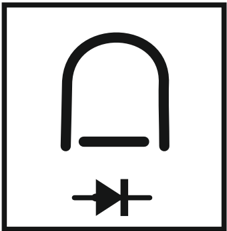

# 5.3.2 Voltímetro y amperímetro de fierro móvil

Tags: #eli214
## 5.3.2. Voltímetro y amperímetro de fierro móvil

Para construir un voltímetro se añade en serie a la bobina una resistencia que permita obtener el rango deseado en función de la corriente I ef nominal ( similar al galvanómetro ). Las sensibilidades típicas son de 100Ω / V con tensiones hasta 750V . En los casos donde se requieren medir tensiones mayores, se emplean típicamente transformadores de tensión ( TP ) en cascada al voltímetro.

Para construir un amperímetro , no es necesario añadir resistencias ya que como se tiene una configuración de bobina fija, basta el simple hecho de seleccionar adecuadamente la sección del conductor. Los rangos típicos están desde 10mA hasta 60A . Si se desean rangos mayores de corriente, lo usual es emplear previamente un transformador de corriente ( TC ) en cascada al amperímetro. Normalmente la salida del TC es para 5A nominales.

## Notas:

Este instrumento permite exactitudes entre las clases 0 , 5 y 2 , 5 . También es posible que con corriente continua se produzca deflexión, aunque no es recomendable porque puede hacer que el fierro se 'imante' (por histéresis) y se pierda exactitud.

El rango de frecuencias típicas de uso está entre 25 a 125Hz . No se recomienda su uso en frecuencias mayores por los niveles de corrientes parásitas y pérdidas.

## SECCIÓN 5.4 Instrumento de bobina móvil con rectificador

Son aquellos instrumentos que permiten aprovechar la alta sensibilidad de los instrumentos de bobina móvil para medir tensiones y corrientes alternas con un ancho de banda cercano a los 20kHz . La estrategia a seguir, como su nombre lo indica, es rectificar la señal alterna para que así pase por el galvanómetro una corriente i ( t ) con valor medio distinto de cero. Este valor medio medido, por medio de una ganancia externa se ajusta para que sea interpretado o leído directamente como un valor efectivo. Claro está que la ganancia dependerá de la topología del rectificador.

Esta metodología ha sido ampliamente empleada en los multímetros por su bajo costo. Sin embargo, su principal desventaja radica en el error cometido si la variable a medir, ya sea tensión o corriente, tiene una forma de onda que difiere de la sinusoidal 3 dado que normalmente la ganancia de corrección se ajusta a señales sinusoidales puras .

3 Por ejemplo: Señal sinusoidal con armónicas, señal cuadrada, señal triangular, etc.

