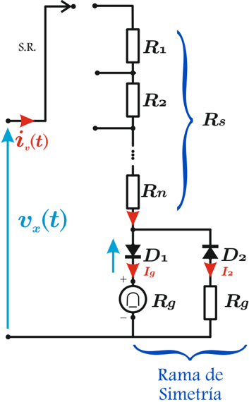
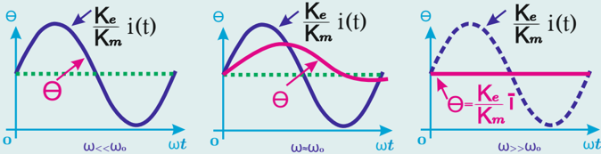

# 5.4.1 Instrumento con rectificador media de onda

Tags: #eli214
## 5.4.1. Instrumento con rectificador media de onda

Según el esquema simplificado de un instrumento de bobina móvil con rectificador de media onda, se aprecia:

1. En el semiciclo positivo el diodo D 1 conduce y por tanto la corriente i g ( t ) circula por el galvanómetro y es la corriente medida i ( t ) .
2. En el semiciclo negativo conduce el diodo D 2 , haciendo nula la lectura por el galvanómetro i g ( t ) = 0 .
3. La función de la rama con el diodo D 2 es proteger al diodo D 1 de la tensión inversa que recibiría en el semiciclo negativo si D 2 no estuviese, también esta rama permite hacer simétrica la corriente de entrada del instrumento, así el instrumento reduce el impacto sobre la red al conectarse.

Definición:

'Factor de forma'

El factor de forma ( K esc ) es el valor numérico que tiene la ganancia del instrumento para corregir la magnitud medida respecto a la leída cuando la forma de onda medida es distinta a la aplicada, estableciendo una relación funcional biyectiva.

Por tanto y en término simples, si la corriente que entra al instrumento es i ( t ) = I 0 · sin ( 2 π T · t ) el valor de la corriente que mide el galvanómetro será ¯ i g , tal que:

$$\bar { i } _ { g } = I _ { g } = \frac { 1 } { T } \int _ { 0 } ^ { T / 2 } I _ { 0 } \cdot s i n \left ( \frac { 2 \pi } { T } \cdot t \right ) d t = \frac { I _ { 0 } } { \pi } \ \ [ A ]$$

Sin embargo, la corriente que debiera informar es su valor efectivo I ef = I rms , dado por:

$$I _ { e f } = \sqrt { \frac { 1 } { T } \int _ { 0 } ^ { T } I _ { 0 } ^ { 2 } \cdot s i n ^ { 2 } \left ( \frac { 2 \pi } { T } \cdot t \right ) d t } = \frac { I _ { 0 } } { \sqrt { 2 } } \ \ [ A ]$$

Luego, si se concibe la relación entre lo que el instrumento debe leer versus lo que realmente mide, se tendrá:

$$I _ { e f } = K _ { e s c } \cdot \bar { i } _ { g } \longrightarrow K _ { e s c } = \frac { I _ { e f } } { \bar { i } _ { g } } = \frac { \pi } { \sqrt { 2 } } \approx 2 , 2 2 \approx \frac { 1 } { 0 , 4 5 }$$

Nota: Si la frecuencia de la red fuese mucho más lenta que la frecuencia natural del sistema electromecánico del instrumento, sin dudas que la aguja tendería a seguir la forma de onda medida, pero como en realidad la frecuencia es mucho mayor, la aguja solo ve el valor medio de la señal.

Si el instrumento en vez de indicar una corriente, indicase una tensión, ésta quedaría definida por las resistencias del circuito de adaptación equivalente R s y la resistencia del galvanómetro R g , tal que:

$$V _ { e f } = ( R _ { s } + R _ { g } ) \cdot I _ { e f } = K _ { e s c } \cdot ( R _ { s } + R _ { g } ) \cdot \bar { i } _ { g } \approx 2 , 2 2 \cdot ( R _ { s } + R _ { g } ) \cdot \bar { i } _ { g } \ \ [ V ]$$

A continuación se presenta en la tabla 5.1 los errores que cometen los instrumentos de bobina móvil con rectificador de media onda, cuando se aplican formas de onda como triangular y cuadrada y su factor de forma fue concebido para medición sinusoidal.

Tabla 5.1: Error cometido por instrumentos de bobina móvil con rectificador de media onda para distintas formas de onda.

| Forma de onda   | Amplitud   | Valor efectivo    | Valor indicado                  | Error %   |
|-----------------|------------|-------------------|---------------------------------|-----------|
| Sinusoidal      | A          | A √ 2 = 0 , 707 A | ( π √ 2 ) × { A π } = 0 , 707 A | 0%        |
| Cuadrada        | A          | A                 | ( π √ 2 ) × { A 2 } = 1 , 11 A  | +11%      |
| Triangular      | A          | A √ 3 = 0 , 577 A | ( π √ 2 ) × { A 4 } = 0 , 555 A | - 3 , 8%  |

Desde el punto de vista de la sensibilidad , se tendrá para el instrumento de alterna s i ca ó s v ca las siguientes relaciones en términos de la sensibilidad propia en continua del galvanómetro s i cc ó s v cc 4 :

4 El subíndice 'M' denota la máxima corriente que el galvanómetro puede soportar, para no generar confusión con los valore máximos temporales de una forma de onda cualquiera.

## Sensibilidad de corriente:

$$s _ { i _ { c a } } = I _ { e f _ { M } } = \frac { \pi } { \sqrt { 2 } } \bar { i } _ { g _ { M } } \simeq 2 , 2 2 \cdot s _ { i _ { c c } } \ [ A ]$$

## Sensibilidad de tensión:

$$t e n s i o n \colon & & 1 & = \frac { \sqrt { 2 } } { \pi } \frac { 1 } { \bar { i } _ { g _ { M } } } \simeq 0 , 4 5 \cdot s _ { v _ { c c } } \quad [ \Omega / V ]$$

